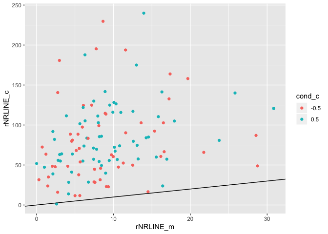
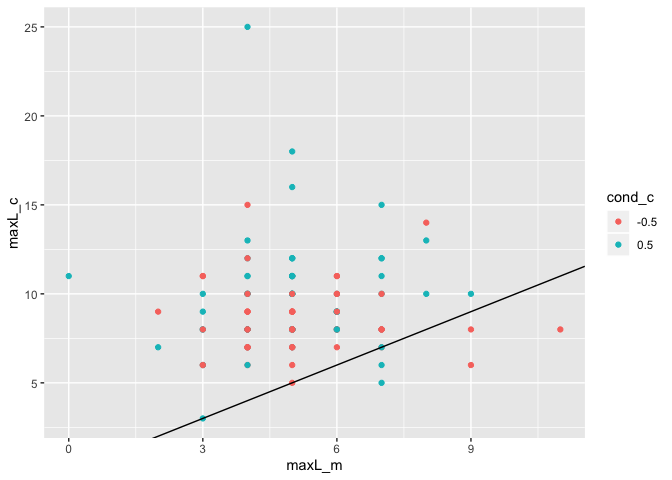
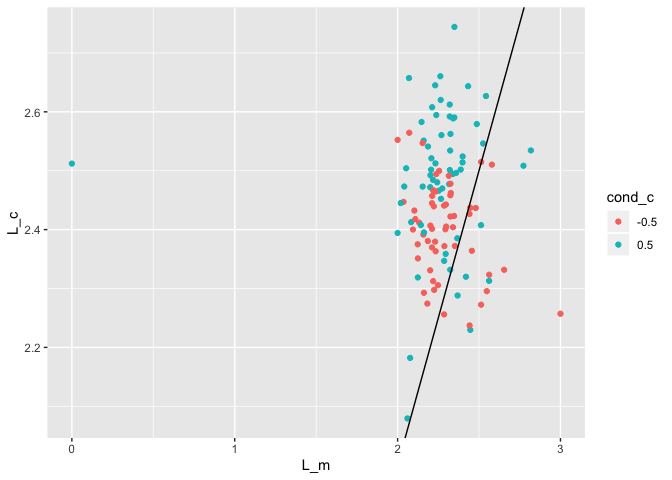
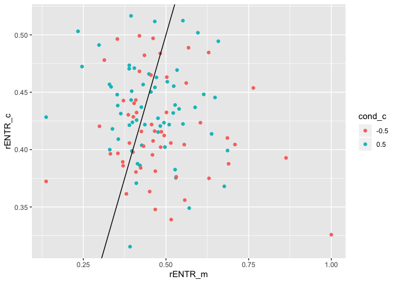

This R markdown provides the data preparation for our forthcoming manuscript.

To run this from scratch, you will need the following files:

* The data is accessible in our OSF project (https://osf.io/3jx2g/). Please create a folder called data, with a subfolder LIWC-results, with a subfolder RQA with two sub-folders monologues and conversations in your working directory. Add the data from OSF to the monologue and conversation folders.
* `./scripts/bc-libraries_and_functions.r`: Loads in necessary libraries and
creates new functions for our analyses.

**Code written by**: L. C. Mueller-Frommeyer (Technische Universitaet
Braunschweig) & A. Paxton (University of Connecticut)

**Date last modified**: 04 February 2020


***

# Preliminaries


```r
# clear everything
rm(list=ls())

# load libraries and add new functions
source('./scripts/bc-libraries_and_functions.r')
```

***

# Data preparation

***

## Recurrence quantification analysis: Monologues


```r
# read in all monologue files
mon_files = list.files('./data/LIWC-results/RQA/Monologues',
                       pattern = ".txt", full.names = TRUE)
mon_dfs = plyr::ldply(mon_files,
                      read.table, sep="\t", dec = ",", header=TRUE) #added decimal to get numbers instead of characters
```


```r
# prepare monologues for RQA
mon_dfs = mon_dfs %>%
  
  # separate 'Filename' column into separate columns
  tidyr::separate(Filename,
                  into = c("dyad_id", "dyad_position", "speaker_code"),
                  sep = '_',
                  remove = FALSE,
                  extra = "drop",
                  fill = "warn") %>%
  
  
  # extract speaker number ID and conversation type from variable
  mutate(cond = gsub("[[:digit:]]+","",dyad_id)) %>%
  
  # create new variable function_contrast with all 0 replaced by -1
  dplyr::rename(function_words = function.) %>%
  mutate(function_contrast = dplyr::if_else(function_words==0,
                                            -1,
                                            function_words)) %>%
  
  #add new variable specifying conversation type
  mutate(conv.type = "M")
```


```r
# split dataframe by monologue
split_mon = split(mon_dfs, list(mon_dfs$Filename))

# cycle through the individual monologues
rqa_mon = data.frame()
for (next_mon in split_mon){
  
  # run (auto-)recurrence
  rqa_for_mon = crqa(ts1=next_mon$function_words,
                     ts2=next_mon$function_contrast,
                     delay=1,
                     embed=1,
                     r=0.1,
                     normalize=0,
                     rescale=0,
                     mindiagline=2,
                     minvertline=2,
                     tw=1, # exclude line of identity
                     whiteline=FALSE,
                     recpt=FALSE)
  
  # save plot-level information to dataframe
  dyad_id = unique(next_mon$dyad_id)
  speaker_code = unique(next_mon$speaker_code)
  cond = NA   #changed it to NA as there was no condition in the monologue
  conv.type = unique(next_mon$conv.type)
  next_data_line = data.frame(dyad_id,  
                              speaker_code,
                              conv.type,
                              cond,
                              rqa_for_mon[1:9]) %>%
    mutate(rNRLINE = NRLINE / dim(next_mon)[1]) # normalize NRLINE by number of words
  rqa_mon = rbind.data.frame(rqa_mon,next_data_line)
  
  # save the RPs -- including LOI/LOS for plotting
  # rqa_for_mon = crqa(ts1=next_mon$function_words,
  #                    ts2=next_mon$function_contrast,
  #                    delay=1,
  #                    embed=1,
  #                    r=0.1,
  #                    normalize=0,
  #                    rescale=0,
  #                    mindiagline=2,
  #                    minvertline=2,
  #                    tw=0, # include LOI/LOS
  #                    whiteline=FALSE,
  #                    recpt=FALSE)
  # png(filename = paste0('./figures/monologue/rp-speaker_',speaker_code,'-monologue.png'))
  # plotRP(rqa_for_mon$RP,
  #        list(unit = 2, labelx = "Speaker A", labely = "Speaker A",
  #             cols = "black", pcex = .5))
  # dev.off()
}

# clean up what we don't need
rm(split_mon, next_mon, rqa_for_mon,
   dyad_id, speaker_code, cond, conv.type, next_data_line)
```

***

## Recurrrence quantification analysis: Conversations


```r
# read in all conversation files
conv_files = list.files('./data/LIWC-results/RQA/Conversations-1',
                        pattern = ".txt", full.names = TRUE)
conv_dfs = plyr::ldply(conv_files,
                       read.table, sep="\t", dec = ",", header=TRUE)
```


```r
# prepare conversations for RQA
conv_dfs = conv_dfs %>%
  
  # separate 'Filename' column into separate columns
  tidyr::separate(Filename,
                  into = c("dyad_id", "dyad_position", "speaker_code"),
                  sep = '_',
                  remove = FALSE,
                  extra = "drop",
                  fill = "warn") %>%
  
  # extract speaker number ID and conversation type from variable
  mutate(cond = gsub("[[:digit:]]+","",dyad_id)) %>%
  
  # create new variable function_contrast with all 0 replaced by -1
  dplyr::rename(function_words = function.) %>%
  mutate(function_contrast = dplyr::if_else(function_words==0,
                                            -1,
                                            function_words)) %>%
  
  # add new variable specifying conversation type
  mutate(conv.type = "C")
```


```r
# split dataframe by conversation
split_conv = split(conv_dfs, list(conv_dfs$Filename))

# cycle through the individual conversations
rqa_conv = data.frame()
for (next_conv in split_conv){
  
  # run recurrence
  rqa_for_conv = crqa(ts1=next_conv$function_words,
                      ts2=next_conv$function_contrast,
                      delay=1,
                      embed=1,
                      r=0.1,
                      normalize=0,
                      rescale=0,
                      mindiagline=2,
                      minvertline=2,
                      tw=1, # exclude line of identity
                      whiteline=FALSE,
                      recpt=FALSE)
  
  # save plot-level information to dataframe
  dyad_id = unique(next_conv$dyad_id)
  speaker_code = unique(next_conv$speaker_code)
  conv.type = unique(next_conv$conv.type)
  cond = unique(next_conv$cond)
  next_data_line = data.frame(dyad_id,  
                              speaker_code,
                              conv.type,
                              cond,
                              rqa_for_conv[1:9]) %>%
    mutate(rNRLINE = NRLINE / dim(next_conv)[1]) # normalize NRLINE by number of words
  rqa_conv = rbind.data.frame(rqa_conv,next_data_line)
  
  # # plot the RPs -- include LOI/LOS
  # rqa_for_conv = crqa(ts1=next_conv$function_words,
  #                     ts2=next_conv$function_contrast,
  #                     delay=1,
  #                     embed=1,
  #                     r=0.1,
  #                     normalize=0,
  #                     rescale=0,
  #                     mindiagline=2,
  #                     minvertline=2,
  #                     tw=0, # retain LOI for plotting only
  #                     whiteline=FALSE,
  #                     recpt=FALSE)
  # png(filename = paste0('./figures/conversation/rp-speaker_',speaker_code,'-conversation.png'))
  # plotRP(rqa_for_conv$RP,
  #        list(unit = 2, labelx = "Speaker A", labely = "Speaker A",
  #             cols = "black", pcex = .01))
  # dev.off()
}

# clean up what we don't need
rm(split_conv, next_conv, rqa_for_conv,
   dyad_id, speaker_code, conv.type, cond, next_data_line)
```


```r
split_mon = split(mon_dfs, list(mon_dfs$Filename))

FW_freq_mon = data.frame()
for (next_mon in split_mon) {
  
  #count frequency of function words
  freq = sum(next_mon$function_words == 100)
  wc = sum(next_mon$WC == 1)
  
  speaker_code = unique(next_mon$speaker_code)
  data_temp = data.frame(freq, wc, speaker_code)
  
  
  FW_freq_mon = rbind.data.frame(FW_freq_mon, data_temp)}
  FW_freq_mon$prop = FW_freq_mon$freq/FW_freq_mon$wc


split_conv = split(conv_dfs, list(conv_dfs$Filename))

FW_freq_conv = data.frame()

for (next_conv in split_conv) {
  
  #count frequency of function words
  freq = sum(next_conv$function_words == 100)
  wc = sum(next_conv$WC == 1)
  speaker_code = unique(next_conv$speaker_code)
  data_temp = data.frame(freq, wc, speaker_code)
  
  
  FW_freq_conv = rbind.data.frame(FW_freq_conv, data_temp)}
  FW_freq_conv$prop = FW_freq_conv$freq/FW_freq_conv$wc


fw_freq = rbind(FW_freq_mon, FW_freq_conv)
```
***

## Create dataframes

We'll need to create two dataframes: an unstandardized dataframe
(`analysis_df`) and a standardized one (`standardized_df`).


```r
#bring together monologue rqa and freq data
data_mon = dplyr::left_join(rqa_mon, FW_freq_mon, by = "speaker_code")

#bring togehter conversation rqa and freq data
data_conv = dplyr::left_join(rqa_conv, FW_freq_conv, by = "speaker_code")

# bring together the monologue and conversation data
analysis_df = rbind(data_mon, data_conv) %>%
  
  # update coding for conversation type and condition
  mutate(conv.type = as.factor(dplyr::if_else(conv.type == "M",
                                              -.5,
                                              .5)),
         cond = as.factor(dplyr::if_else(cond == "P",
                                         -.5,
                                         .5)))

# save dataframe to file
write.table(analysis_df, './data/analysis_df.csv', 
            sep=",", row.names=FALSE, col.names=TRUE)
```


```r
# standardize the analysis dataframe
standardized_df = analysis_df %>%
  
  # convert things as needed to numeric
  mutate(dyad_id = as.numeric(as.factor(dyad_id)),
         speaker_code = as.numeric(as.factor(speaker_code))) %>%
  
  # standardize
  mutate_all(funs(as.numeric(scale(as.numeric(.))))) %>%
  
  # convert to factors as needed
  mutate(dyad_id = as.factor(dyad_id),
         speaker_code = as.factor(speaker_code),
         conv.type = as.factor(conv.type),
         cond = as.factor(cond))
```

```
## Warning: funs() is soft deprecated as of dplyr 0.8.0
## Please use a list of either functions or lambdas: 
## 
##   # Simple named list: 
##   list(mean = mean, median = median)
## 
##   # Auto named with `tibble::lst()`: 
##   tibble::lst(mean, median)
## 
##   # Using lambdas
##   list(~ mean(., trim = .2), ~ median(., na.rm = TRUE))
## This warning is displayed once per session.
```

```r
# save dataframe to file
write.table(standardized_df, './data/standardized_df.csv', 
            sep=",", row.names=FALSE, col.names=TRUE)
```

***

# Data analysis

***

## Power analyses

First, we run a power analysis for our model using recommendations from 
Brysbaert and Stevens (2018). We use the power analysis for the standardized
model.


```r
# power analyses for the standardized model
planned_analyses_st <- lmer(RR ~ conv.type + (1|speaker_code),
                            data = standardized_df, REML = FALSE)

# change the fixed effect to the assumed effect size of .4 (Brysbaert & Stevens, 2018)
#   (although with a negative sign)
fixef(planned_analyses_st)["conv.type0.997879106838302"] = -0.4

# run power analysis for our current sample, with a default significance 
#   criterion of .05 and an effect size of .4
power <- powerSim(planned_analyses_st,
                  nsim = 1000)
```


```
## Power for predictor 'conv.type', (95% confidence interval):
##       96.00% (94.59, 97.13)
## 
## Test: Likelihood ratio
## 
## Based on 1000 simulations, (13 warnings, 0 errors)
## alpha = 0.05, nrow = 236
## 
## Time elapsed: 0 h 1 m 12 s
```

***

## Descriptives and correlation tables

Here we generate descriptive statistics and intercorrelations for our
variables, separated by monologue and conversation. Data are saved to
files and reported as Supplementary Materials for the paper.


```r
# Prepare data for descriptive analysis - only leave numerical elements in data frame
Descriptives_mon =  data_mon %>%
 select(-dyad_id, -speaker_code, -conv.type, -cond, -freq, -wc, -NRLINE, -ENTR)
Descriptives_conv =  data_conv %>%
 select(-dyad_id, -speaker_code, -conv.type, -cond, -freq, -wc, -NRLINE, -ENTR)

# Mean, Min, Max for monologues and dialogues
mean_mon = psych::describe(Descriptives_mon)
mean_conv = psych::describe(Descriptives_conv)

# write descriptives to files
write.table(mean_mon, './data/mean_mon.csv', 
            sep=",", row.names=FALSE, col.names=TRUE)
write.table(mean_conv, './data/mean_conv.csv', 
            sep=",", row.names=FALSE, col.names=TRUE)

# Intercorrelations for monologues
p_cor_mon = rcorr(as.matrix(Descriptives_mon))
p_mon = p_cor_mon$P
r_mon = p_cor_mon$r

# Intercorrelations for dialogues
p_cor_conv = rcorr(as.matrix(Descriptives_conv))
p_conv = p_cor_conv$P
r_conv = p_cor_conv$r

# save intercorelations to file
write.table(p_mon, './data/p_mon.csv', 
            sep=",", row.names=FALSE, col.names=TRUE)
write.table(r_mon, './data/r_mon.csv', 
            sep=",", row.names=FALSE, col.names=TRUE)
write.table(p_conv, './data/p_conv.csv', 
            sep=",", row.names=FALSE, col.names=TRUE)
write.table(r_conv, './data/r_conv.csv', 
            sep=",", row.names=FALSE, col.names=TRUE)
```

***

## Planned analysis

Here, we perform a linear mixed-effects model to analyze how conversation
setting---whether a monologue (M) or conversation (C)---changes a person's
language style, specifically looking at their use of function words (often a
measure of syntactic complexity and structure).

We attempted to analyze the data using maximal random effects structures and
an uncorrelated random intercept within the random slope, but both models
failed to converge. As a result, we use only the random intercept in our 
models. We include both raw and standardized models below.

***

### RR: Raw model


```r
# raw: does linguistic style change based on the conversation setting?
planned_analyses_raw <- lmer(RR ~ conv.type + (1|speaker_code),
                             data = analysis_df, REML = FALSE)

# calculate 95% CI for model
CI_planned_analyses_raw <- confint(planned_analyses_raw)


# calculate effect size for model
es_planned_analyses_raw <- lme.dscore(planned_analyses_raw, 
                                      data = analysis_df, type = "lme4")
```


```
## Linear mixed model fit by maximum likelihood . t-tests use
##   Satterthwaite's method [lmerModLmerTest]
## Formula: RR ~ conv.type + (1 | speaker_code)
##    Data: analysis_df
## 
##      AIC      BIC   logLik deviance df.resid 
##   1470.0   1483.8   -731.0   1462.0      232 
## 
## Scaled residuals: 
##     Min      1Q  Median      3Q     Max 
## -3.6419 -0.5827 -0.0083  0.6212  2.6381 
## 
## Random effects:
##  Groups       Name        Variance Std.Dev.
##  speaker_code (Intercept)  5.627   2.372   
##  Residual                 23.621   4.860   
## Number of obs: 236, groups:  speaker_code, 118
## 
## Fixed effects:
##              Estimate Std. Error       df t value Pr(>|t|)    
## (Intercept)   29.3813     0.4979 227.5761  59.015  < 2e-16 ***
## conv.type0.5   4.7168     0.6327 117.9998   7.455 1.65e-11 ***
## ---
## Signif. codes:  0 '***' 0.001 '**' 0.01 '*' 0.05 '.' 0.1 ' ' 1
## 
## Correlation of Fixed Effects:
##             (Intr)
## conv.typ0.5 -0.635
```

```
##                     t       df        d
## conv.type0.5 7.422877 116.9998 1.372492
```

```
##                   2.5 %    97.5 %
## .sig01        0.7130132  3.399938
## .sigma        4.3003473  5.552880
## (Intercept)  28.4014071 30.361278
## conv.type0.5  3.4664829  5.967112
```


|      &nbsp;      | Estimate | Std..Error |  df   | t.value |   p    | p_adj  | sig |
|:----------------:|:--------:|:----------:|:-----:|:-------:|:------:|:------:|:---:|
| **(Intercept)**  |  29.38   |   0.4979   | 227.6 |  59.01  | 0.0001 | 0.0001 | *** |
| **conv.type0.5** |  4.717   |   0.6327   |  118  |  7.455  | 0.0001 | 0.0001 | *** |

***

### RR: Standardized model


```r
# standardized: does linguistic style change based on the conversation setting?
planned_analyses_st <- lmer(RR ~ conv.type + (1|speaker_code),
                            data = standardized_df, REML = FALSE)

# calculate 95%CI for model
CI_planned_analyses_st <- confint(planned_analyses_st)

# calculate effect size for model
es_planned_analyses_st <- lme.dscore(planned_analyses_st, 
                                     data = standardized_df, type = "lme4")
```


```
## Linear mixed model fit by maximum likelihood . t-tests use
##   Satterthwaite's method [lmerModLmerTest]
## Formula: RR ~ conv.type + (1 | speaker_code)
##    Data: standardized_df
## 
##      AIC      BIC   logLik deviance df.resid 
##    631.2    645.1   -311.6    623.2      232 
## 
## Scaled residuals: 
##     Min      1Q  Median      3Q     Max 
## -3.6419 -0.5827 -0.0083  0.6212  2.6381 
## 
## Random effects:
##  Groups       Name        Variance Std.Dev.
##  speaker_code (Intercept) 0.1610   0.4012  
##  Residual                 0.6757   0.8220  
## Number of obs: 236, groups:  speaker_code, 118
## 
## Fixed effects:
##                            Estimate Std. Error       df t value
## (Intercept)                 -0.3989     0.0842 227.5761  -4.737
## conv.type0.997879106838302   0.7977     0.1070 117.9998   7.455
##                                   Pr(>|t|)    
## (Intercept)                0.0000038179014 ***
## conv.type0.997879106838302 0.0000000000165 ***
## ---
## Signif. codes:  0 '***' 0.001 '**' 0.01 '*' 0.05 '.' 0.1 ' ' 1
## 
## Correlation of Fixed Effects:
##             (Intr)
## c.0.9978791 -0.635
```

```
##                                   t       df        d
## conv.type0.997879106838302 7.422877 116.9998 1.372492
```

```
##                                 2.5 %     97.5 %
## .sig01                      0.1205920  0.5750321
## .sigma                      0.7273184  0.9391594
## (Intercept)                -0.5646130 -0.2331397
## conv.type0.997879106838302  0.5862868  1.0092185
```


|             &nbsp;             | Estimate | Std..Error |  df   | t.value |   p    | p_adj  | sig |
|:------------------------------:|:--------:|:----------:|:-----:|:-------:|:------:|:------:|:---:|
|        **(Intercept)**         | -0.3989  |   0.0842   | 227.6 | -4.737  | 0.0001 | 0.0001 | *** |
| **conv.type0.997879106838302** |  0.7978  |   0.107    |  118  |  7.455  | 0.0001 | 0.0001 | *** |

As predicted, we do see a difference in linguistic style between conversations
and monologues. Specifically, we find that conversations tend to have more
structure in their use of function words than monologues do.

***

### Validating RR against proportion

To validate the use of RQA (dynamic) metrics against standard (static) 
metrics, we next build a similar model predicting proportion with 
conversation type. If RR and proportion tap into similar underlying 
dynamics, we would expect to see congruent results between the two
methods.

##### Raw model


```r
# raw: does linguistic style change based on the conversation setting?
exploratory_analyses_raw_prop <- lmer(prop ~ conv.type + (1|speaker_code),
                             data = analysis_df, REML = FALSE)

# calculate 95% CI for model
CI_exploratory_analyses_raw_prop <- confint(exploratory_analyses_raw_prop)


# calculate effect size for model
es_exploratory_analyses_raw_prop <- lme.dscore(exploratory_analyses_raw_prop, 
                                      data = analysis_df, type = "lme4")
```


```
## Linear mixed model fit by maximum likelihood . t-tests use
##   Satterthwaite's method [lmerModLmerTest]
## Formula: prop ~ conv.type + (1 | speaker_code)
##    Data: analysis_df
## 
##      AIC      BIC   logLik deviance df.resid 
##   -755.1   -741.3    381.6   -763.1      232 
## 
## Scaled residuals: 
##     Min      1Q  Median      3Q     Max 
## -3.8212 -0.5559  0.0246  0.6374  2.4913 
## 
## Random effects:
##  Groups       Name        Variance  Std.Dev.
##  speaker_code (Intercept) 0.0004302 0.02074 
##  Residual                 0.0019175 0.04379 
## Number of obs: 236, groups:  speaker_code, 118
## 
## Fixed effects:
##                Estimate Std. Error         df t value             Pr(>|t|)
## (Intercept)    0.544571   0.004460 228.333848 122.089 < 0.0000000000000002
## conv.type0.5   0.038265   0.005701 117.999786   6.712       0.000000000707
##                 
## (Intercept)  ***
## conv.type0.5 ***
## ---
## Signif. codes:  0 '***' 0.001 '**' 0.01 '*' 0.05 '.' 0.1 ' ' 1
## 
## Correlation of Fixed Effects:
##             (Intr)
## conv.typ0.5 -0.639
```

```
##                     t       df        d
## conv.type0.5 6.683584 116.9998 1.235796
```

```
##                    2.5 %     97.5 %
## .sig01       0.002307412 0.03007312
## .sigma       0.038745409 0.05003022
## (Intercept)  0.535791810 0.55335036
## conv.type0.5 0.026999823 0.04953007
```


|      &nbsp;      | Estimate | Std..Error |  df   | t.value |   p    | p_adj  | sig |
|:----------------:|:--------:|:----------:|:-----:|:-------:|:------:|:------:|:---:|
| **(Intercept)**  |  0.5446  |  0.00446   | 228.3 |  122.1  | 0.0001 | 0.0001 | *** |
| **conv.type0.5** | 0.03826  |  0.005701  |  118  |  6.712  | 0.0001 | 0.0001 | *** |

##### Standardized model


```r
# standardized: does linguistic style change based on the conversation setting?
exploratory_analyses_st_prop <- lmer(prop ~ conv.type + (1|speaker_code),
                            data = standardized_df, REML = FALSE)

# calculate 95%CI for model
CI_exploratory_analyses_st_prop <- confint(exploratory_analyses_st_prop)

# calculate effect size for model
es_exploratory_analyses_st_prop <- lme.dscore(exploratory_analyses_st_prop, 
                                     data = standardized_df, type = "lme4")
```


```
## Linear mixed model fit by maximum likelihood . t-tests use
##   Satterthwaite's method [lmerModLmerTest]
## Formula: prop ~ conv.type + (1 | speaker_code)
##    Data: standardized_df
## 
##      AIC      BIC   logLik deviance df.resid 
##    638.5    652.4   -315.3    630.5      232 
## 
## Scaled residuals: 
##     Min      1Q  Median      3Q     Max 
## -3.8212 -0.5559  0.0246  0.6374  2.4913 
## 
## Random effects:
##  Groups       Name        Variance Std.Dev.
##  speaker_code (Intercept) 0.1578   0.3973  
##  Residual                 0.7036   0.8388  
## Number of obs: 236, groups:  speaker_code, 118
## 
## Fixed effects:
##                             Estimate Std. Error        df t value
## (Intercept)                 -0.36649    0.08544 228.33385  -4.289
## conv.type0.997879106838302   0.73298    0.10920 117.99979   6.712
##                                  Pr(>|t|)    
## (Intercept)                0.000026462838 ***
## conv.type0.997879106838302 0.000000000707 ***
## ---
## Signif. codes:  0 '***' 0.001 '**' 0.01 '*' 0.05 '.' 0.1 ' ' 1
## 
## Correlation of Fixed Effects:
##             (Intr)
## c.0.9978791 -0.639
```

```
##                                   t       df        d
## conv.type0.997879106838302 6.683584 116.9998 1.235796
```

```
##                                 2.5 %     97.5 %
## .sig01                      0.0441996  0.5760654
## .sigma                      0.7421874  0.9583535
## (Intercept)                -0.5346632 -0.1983206
## conv.type0.997879106838302  0.5171949  0.9487729
```


|             &nbsp;             | Estimate | Std..Error |  df   | t.value |   p    | p_adj  | sig |
|:------------------------------:|:--------:|:----------:|:-----:|:-------:|:------:|:------:|:---:|
|        **(Intercept)**         | -0.3665  |  0.08544   | 228.3 | -4.289  | 0.0001 | 0.0001 | *** |
| **conv.type0.997879106838302** |  0.733   |   0.1092   |  118  |  6.712  | 0.0001 | 0.0001 | *** |

The congruence between proportion-based models and RR-based models support
the validity of the latter. However, while proportion can only give a single
value of similarity, we can tap into other RQA metrics to understand the
structure of those patterns.

***

## Additional exploratory analyses

Next, we repreat our analyses for all available RQA parameters to exploratorily 
investigate the influence of conversational setting on aspects of language style 
structure in addition to RR.

***

#### DET: Exploratory analyses

##### Raw model


```r
# raw: does linguistic style change based on the conversation setting?
exploratory_analyses_raw_DET <- lmer(DET ~ conv.type + (1|speaker_code),
                             data = analysis_df, REML = FALSE)

# calculate 95% CI for model
CI_exploratory_analyses_raw_DET <- confint(exploratory_analyses_raw_DET)


# calculate effect size for model
es_exploratory_analyses_raw_DET <- lme.dscore(exploratory_analyses_raw_DET, 
                                      data = analysis_df, type = "lme4")
```


```
## Linear mixed model fit by maximum likelihood . t-tests use
##   Satterthwaite's method [lmerModLmerTest]
## Formula: DET ~ conv.type + (1 | speaker_code)
##    Data: analysis_df
## 
##      AIC      BIC   logLik deviance df.resid 
##   1724.8   1738.6   -858.4   1716.8      231 
## 
## Scaled residuals: 
##     Min      1Q  Median      3Q     Max 
## -4.2264 -0.5226  0.0869  0.5316  2.6415 
## 
## Random effects:
##  Groups       Name        Variance Std.Dev.
##  speaker_code (Intercept) 22.17    4.708   
##  Residual                 67.74    8.230   
## Number of obs: 235, groups:  speaker_code, 118
## 
## Fixed effects:
##              Estimate Std. Error       df t value             Pr(>|t|)    
## (Intercept)   47.4584     0.8764 222.0860  54.153 < 0.0000000000000002 ***
## conv.type0.5   9.3213     1.0743 118.0736   8.676   0.0000000000000262 ***
## ---
## Signif. codes:  0 '***' 0.001 '**' 0.01 '*' 0.05 '.' 0.1 ' ' 1
## 
## Correlation of Fixed Effects:
##             (Intr)
## conv.typ0.5 -0.616
```

```
##                     t       df        d
## conv.type0.5 8.639275 117.0697 1.596927
```

```
##                  2.5 %    97.5 %
## .sig01        2.497910  6.392605
## .sigma        7.280670  9.405337
## (Intercept)  45.733293 49.183545
## conv.type0.5  7.198505 11.444304
```


|      &nbsp;      | Estimate | Std..Error |  df   | t.value |   p    | p_adj  | sig |
|:----------------:|:--------:|:----------:|:-----:|:-------:|:------:|:------:|:---:|
| **(Intercept)**  |  47.46   |   0.8764   | 222.1 |  54.15  | 0.0001 | 0.0001 | *** |
| **conv.type0.5** |  9.321   |   1.074    | 118.1 |  8.676  | 0.0001 | 0.0001 | *** |

##### Standardized model


```r
# standardized: does linguistic style change based on the conversation setting?
exploratory_analyses_st_DET <- lmer(DET ~ conv.type + (1|speaker_code),
                            data = standardized_df, REML = FALSE)

# calculate 95%CI for model
CI_exploratory_analyses_st_DET <- confint(exploratory_analyses_st_DET)

# calculate effect size for model
es_exploratory_analyses_st_DET <- lme.dscore(exploratory_analyses_st_DET, 
                                     data = standardized_df, type = "lme4")
```


```
## Linear mixed model fit by maximum likelihood . t-tests use
##   Satterthwaite's method [lmerModLmerTest]
## Formula: DET ~ conv.type + (1 | speaker_code)
##    Data: standardized_df
## 
##      AIC      BIC   logLik deviance df.resid 
##    615.6    629.5   -303.8    607.6      231 
## 
## Scaled residuals: 
##     Min      1Q  Median      3Q     Max 
## -4.2264 -0.5226  0.0869  0.5316  2.6415 
## 
## Random effects:
##  Groups       Name        Variance Std.Dev.
##  speaker_code (Intercept) 0.1977   0.4446  
##  Residual                 0.6040   0.7772  
## Number of obs: 235, groups:  speaker_code, 118
## 
## Fixed effects:
##                             Estimate Std. Error        df t value
## (Intercept)                 -0.44188    0.08276 222.08597  -5.339
## conv.type0.997879106838302   0.88023    0.10145 118.07363   8.676
##                                      Pr(>|t|)    
## (Intercept)                0.0000002301176448 ***
## conv.type0.997879106838302 0.0000000000000262 ***
## ---
## Signif. codes:  0 '***' 0.001 '**' 0.01 '*' 0.05 '.' 0.1 ' ' 1
## 
## Correlation of Fixed Effects:
##             (Intr)
## c.0.9978791 -0.616
```

```
##                                   t       df        d
## conv.type0.997879106838302 8.639275 117.0697 1.596927
```

```
##                                 2.5 %     97.5 %
## .sig01                      0.2358847  0.6036715
## .sigma                      0.6875340  0.8881723
## (Intercept)                -0.6047807 -0.2789638
## conv.type0.997879106838302  0.6797749  1.0807176
```


|             &nbsp;             | Estimate | Std..Error |  df   | t.value |   p    | p_adj  | sig |
|:------------------------------:|:--------:|:----------:|:-----:|:-------:|:------:|:------:|:---:|
|        **(Intercept)**         | -0.4419  |  0.08276   | 222.1 | -5.339  | 0.0001 | 0.0001 | *** |
| **conv.type0.997879106838302** |  0.8802  |   0.1015   | 118.1 |  8.676  | 0.0001 | 0.0001 | *** |

***

#### rNRLINE: Exploratory analyses 

##### Raw model


```r
# raw: does linguistic style change based on the conversation setting?
exploratory_analyses_raw_rNRLINE <- lmer(rNRLINE ~ conv.type + (1|speaker_code),
                             data = analysis_df, REML = FALSE)

# calculate 95% CI for model
CI_exploratory_analyses_raw_rNRLINE <- confint(exploratory_analyses_raw_rNRLINE)


# calculate effect size for model
es_exploratory_analyses_raw_rNRLINE <- lme.dscore(exploratory_analyses_raw_rNRLINE, 
                                      data = analysis_df, type = "lme4")
```


```
## Linear mixed model fit by maximum likelihood . t-tests use
##   Satterthwaite's method [lmerModLmerTest]
## Formula: rNRLINE ~ conv.type + (1 | speaker_code)
##    Data: analysis_df
## 
##      AIC      BIC   logLik deviance df.resid 
##   2327.1   2340.9  -1159.5   2319.1      232 
## 
## Scaled residuals: 
##     Min      1Q  Median      3Q     Max 
## -2.3511 -0.3017 -0.0510  0.1613  4.6574 
## 
## Random effects:
##  Groups       Name        Variance Std.Dev.
##  speaker_code (Intercept)   71.02   8.427  
##  Residual                 1015.67  31.870  
## Number of obs: 236, groups:  speaker_code, 118
## 
## Fixed effects:
##              Estimate Std. Error      df t value             Pr(>|t|)    
## (Intercept)     9.172      3.035 234.996   3.022              0.00279 ** 
## conv.type0.5   72.349      4.149 118.000  17.437 < 0.0000000000000002 ***
## ---
## Signif. codes:  0 '***' 0.001 '**' 0.01 '*' 0.05 '.' 0.1 ' ' 1
## 
## Correlation of Fixed Effects:
##             (Intr)
## conv.typ0.5 -0.684
```

```
##                     t       df        d
## conv.type0.5 17.36345 116.9999 3.210504
```

```
##                  2.5 %   97.5 %
## .sig01        0.000000 16.73296
## .sigma       28.198525 35.94352
## (Intercept)   3.199781 15.14425
## conv.type0.5 64.150553 80.54784
```


|      &nbsp;      | Estimate | Std..Error | df  | t.value |   p    | p_adj  | sig |
|:----------------:|:--------:|:----------:|:---:|:-------:|:------:|:------:|:---:|
| **(Intercept)**  |  9.172   |   3.035    | 235 |  3.022  | 0.003  | 0.003  | **  |
| **conv.type0.5** |  72.35   |   4.149    | 118 |  17.44  | 0.0001 | 0.0001 | *** |

##### Standardized model


```r
# standardized: does linguistic style change based on the conversation setting?
exploratory_analyses_st_rNRLINE <- lmer(rNRLINE ~ conv.type + (1|speaker_code),
                            data = standardized_df, REML = FALSE)

# calculate 95%CI for model
CI_exploratory_analyses_st_rNRLINE <- confint(exploratory_analyses_st_rNRLINE)

# calculate effect size for model
es_exploratory_analyses_st_rNRLINE <- lme.dscore(exploratory_analyses_st_rNRLINE, 
                                     data = standardized_df, type = "lme4")
```


```
## Linear mixed model fit by maximum likelihood . t-tests use
##   Satterthwaite's method [lmerModLmerTest]
## Formula: rNRLINE ~ conv.type + (1 | speaker_code)
##    Data: standardized_df
## 
##      AIC      BIC   logLik deviance df.resid 
##    489.7    503.6   -240.9    481.7      232 
## 
## Scaled residuals: 
##     Min      1Q  Median      3Q     Max 
## -2.3511 -0.3017 -0.0510  0.1613  4.6574 
## 
## Random effects:
##  Groups       Name        Variance Std.Dev.
##  speaker_code (Intercept) 0.02952  0.1718  
##  Residual                 0.42223  0.6498  
## Number of obs: 236, groups:  speaker_code, 118
## 
## Fixed effects:
##                             Estimate Std. Error        df t value
## (Intercept)                 -0.73757    0.06187 234.99627  -11.92
## conv.type0.997879106838302   1.47514    0.08460 117.99995   17.44
##                                       Pr(>|t|)    
## (Intercept)                <0.0000000000000002 ***
## conv.type0.997879106838302 <0.0000000000000002 ***
## ---
## Signif. codes:  0 '***' 0.001 '**' 0.01 '*' 0.05 '.' 0.1 ' ' 1
## 
## Correlation of Fixed Effects:
##             (Intr)
## c.0.9978791 -0.684
```

```
##                                   t       df        d
## conv.type0.997879106838302 17.36345 116.9999 3.210504
```

```
##                                 2.5 %     97.5 %
## .sig01                      0.0000000  0.3411707
## .sigma                      0.5749438  0.7328577
## (Intercept)                -0.8593379 -0.6158004
## conv.type0.997879106838302  1.3079750  1.6423017
```


|             &nbsp;             | Estimate | Std..Error | df  | t.value |   p    | p_adj  | sig |
|:------------------------------:|:--------:|:----------:|:---:|:-------:|:------:|:------:|:---:|
|        **(Intercept)**         | -0.7376  |  0.06187   | 235 | -11.92  | 0.0001 | 0.0001 | *** |
| **conv.type0.997879106838302** |  1.475   |   0.0846   | 118 |  17.44  | 0.0001 | 0.0001 | *** |

***

#### MaxL: Exploratory analyses

##### Raw model


```r
# raw: does linguistic style change based on the conversation setting?
exploratory_analyses_raw_maxL <- lmer(maxL ~ conv.type + (1|speaker_code),
                             data = analysis_df, REML = FALSE)

# calculate 95% CI for model
CI_exploratory_analyses_raw_maxL <- confint(exploratory_analyses_raw_maxL)


# calculate effect size for model
es_exploratory_analyses_raw_maxL <- lme.dscore(exploratory_analyses_raw_maxL, 
                                      data = analysis_df, type = "lme4")
```


```
## Linear mixed model fit by maximum likelihood . t-tests use
##   Satterthwaite's method [lmerModLmerTest]
## Formula: maxL ~ conv.type + (1 | speaker_code)
##    Data: analysis_df
## 
##      AIC      BIC   logLik deviance df.resid 
##   1054.4   1068.3   -523.2   1046.4      232 
## 
## Scaled residuals: 
##     Min      1Q  Median      3Q     Max 
## -2.7527 -0.5527 -0.0654  0.4022  7.0169 
## 
## Random effects:
##  Groups       Name        Variance Std.Dev.
##  speaker_code (Intercept) 0.1275   0.3571  
##  Residual                 4.8074   2.1926  
## Number of obs: 236, groups:  speaker_code, 118
## 
## Fixed effects:
##              Estimate Std. Error       df t value            Pr(>|t|)    
## (Intercept)    5.1017     0.2045 235.8425   24.95 <0.0000000000000002 ***
## conv.type0.5   4.1441     0.2854 117.9998   14.52 <0.0000000000000002 ***
## ---
## Signif. codes:  0 '***' 0.001 '**' 0.01 '*' 0.05 '.' 0.1 ' ' 1
## 
## Correlation of Fixed Effects:
##             (Intr)
## conv.typ0.5 -0.698
```

```
##                     t  df        d
## conv.type0.5 14.45602 117 2.672919
```

```
##                 2.5 %   97.5 %
## .sig01       0.000000 1.030856
## .sigma       1.940023 2.435622
## (Intercept)  4.699237 5.504153
## conv.type0.5 3.580014 4.708122
```


|      &nbsp;      | Estimate | Std..Error |  df   | t.value |   p    | p_adj  | sig |
|:----------------:|:--------:|:----------:|:-----:|:-------:|:------:|:------:|:---:|
| **(Intercept)**  |  5.102   |   0.2045   | 235.8 |  24.95  | 0.0001 | 0.0001 | *** |
| **conv.type0.5** |  4.144   |   0.2854   |  118  |  14.52  | 0.0001 | 0.0001 | *** |

##### Standardized model


```r
# standardized: does linguistic style change based on the conversation setting?
exploratory_analyses_st_maxL <- lmer(maxL ~ conv.type + (1|speaker_code),
                            data = standardized_df, REML = FALSE)

# calculate 95%CI for model
CI_exploratory_analyses_st_maxL <- confint(exploratory_analyses_st_maxL)

# calculate effect size for model
es_exploratory_analyses_st_maxL <- lme.dscore(exploratory_analyses_st_maxL, 
                                     data = standardized_df, type = "lme4")
```


```
## Linear mixed model fit by maximum likelihood . t-tests use
##   Satterthwaite's method [lmerModLmerTest]
## Formula: maxL ~ conv.type + (1 | speaker_code)
##    Data: standardized_df
## 
##      AIC      BIC   logLik deviance df.resid 
##    528.9    542.8   -260.5    520.9      232 
## 
## Scaled residuals: 
##     Min      1Q  Median      3Q     Max 
## -2.7527 -0.5527 -0.0654  0.4022  7.0169 
## 
## Random effects:
##  Groups       Name        Variance Std.Dev.
##  speaker_code (Intercept) 0.01376  0.1173  
##  Residual                 0.51874  0.7202  
## Number of obs: 236, groups:  speaker_code, 118
## 
## Fixed effects:
##                             Estimate Std. Error        df t value
## (Intercept)                 -0.68063    0.06718 235.84250  -10.13
## conv.type0.997879106838302   1.36127    0.09377 117.99755   14.52
##                                       Pr(>|t|)    
## (Intercept)                <0.0000000000000002 ***
## conv.type0.997879106838302 <0.0000000000000002 ***
## ---
## Signif. codes:  0 '***' 0.001 '**' 0.01 '*' 0.05 '.' 0.1 ' ' 1
## 
## Correlation of Fixed Effects:
##             (Intr)
## c.0.9978791 -0.698
```

```
##                                   t  df        d
## conv.type0.997879106838302 14.45602 117 2.672919
```

```
##                                 2.5 %     97.5 %
## .sig01                      0.0000000  0.3386220
## .sigma                      0.6372709  0.8000683
## (Intercept)                -0.8128366 -0.5484329
## conv.type0.997879106838302  1.1759854  1.5465534
```


|             &nbsp;             | Estimate | Std..Error |  df   | t.value |   p    | p_adj  | sig |
|:------------------------------:|:--------:|:----------:|:-----:|:-------:|:------:|:------:|:---:|
|        **(Intercept)**         | -0.6806  |  0.06718   | 235.8 | -10.13  | 0.0001 | 0.0001 | *** |
| **conv.type0.997879106838302** |  1.361   |  0.09377   |  118  |  14.52  | 0.0001 | 0.0001 | *** |

***

#### L: Exploratory analyses

##### Raw model


```r
# raw: does linguistic style change based on the conversation setting?
exploratory_analyses_raw_L <- lmer(L ~ conv.type + (1|speaker_code),
                             data = analysis_df, REML = FALSE)

# calculate 95% CI for model
CI_exploratory_analyses_raw_L <- confint(exploratory_analyses_raw_L)


# calculate effect size for model
es_exploratory_analyses_raw_L <- lme.dscore(exploratory_analyses_raw_L, 
                                      data = analysis_df, type = "lme4")
```


```
## Linear mixed model fit by maximum likelihood . t-tests use
##   Satterthwaite's method [lmerModLmerTest]
## Formula: L ~ conv.type + (1 | speaker_code)
##    Data: analysis_df
## 
##      AIC      BIC   logLik deviance df.resid 
##    -71.8    -57.9     39.9    -79.8      232 
## 
## Scaled residuals: 
##      Min       1Q   Median       3Q      Max 
## -11.1025  -0.3495  -0.0038   0.3568   3.5781 
## 
## Random effects:
##  Groups       Name        Variance Std.Dev.
##  speaker_code (Intercept) 0.00000  0.0000  
##  Residual                 0.04176  0.2044  
## Number of obs: 236, groups:  speaker_code, 118
## 
## Fixed effects:
##               Estimate Std. Error        df t value             Pr(>|t|)
## (Intercept)    2.26881    0.01881 236.00000 120.604 < 0.0000000000000002
## conv.type0.5   0.17696    0.02660 236.00000   6.651         0.0000000002
##                 
## (Intercept)  ***
## conv.type0.5 ***
## ---
## Signif. codes:  0 '***' 0.001 '**' 0.01 '*' 0.05 '.' 0.1 ' ' 1
## 
## Correlation of Fixed Effects:
##             (Intr)
## conv.typ0.5 -0.707
## convergence code: 0
## boundary (singular) fit: see ?isSingular
```

```
##                     t  df         d
## conv.type0.5 6.623194 234 0.8659435
```

```
##                  2.5 %     97.5 %
## .sig01       0.0000000 0.07873474
## .sigma       0.1839970 0.22426994
## (Intercept)  2.2317901 2.30583302
## conv.type0.5 0.1246002 0.22931275
```


|      &nbsp;      | Estimate | Std..Error | df  | t.value |   p    | p_adj  | sig |
|:----------------:|:--------:|:----------:|:---:|:-------:|:------:|:------:|:---:|
| **(Intercept)**  |  2.269   |  0.01881   | 236 |  120.6  | 0.0001 | 0.0001 | *** |
| **conv.type0.5** |  0.177   |   0.0266   | 236 |  6.651  | 0.0001 | 0.0001 | *** |

##### Standardized model


```r
# standardized: does linguistic style change based on the conversation setting?
exploratory_analyses_st_L <- lmer(L ~ conv.type + (1|speaker_code),
                            data = standardized_df, REML = FALSE)

# calculate 95%CI for model
CI_exploratory_analyses_st_L <- confint(exploratory_analyses_st_L)

# calculate effect size for model
es_exploratory_analyses_st_L <- lme.dscore(exploratory_analyses_st_L, 
                                     data = standardized_df, type = "lme4")
```


```
## Linear mixed model fit by maximum likelihood . t-tests use
##   Satterthwaite's method [lmerModLmerTest]
## Formula: L ~ conv.type + (1 | speaker_code)
##    Data: standardized_df
## 
##      AIC      BIC   logLik deviance df.resid 
##    636.2    650.0   -314.1    628.2      232 
## 
## Scaled residuals: 
##      Min       1Q   Median       3Q      Max 
## -11.1025  -0.3495  -0.0038   0.3568   3.5781 
## 
## Random effects:
##  Groups       Name        Variance Std.Dev.
##  speaker_code (Intercept) 0.0000   0.0000  
##  Residual                 0.8386   0.9157  
## Number of obs: 236, groups:  speaker_code, 118
## 
## Fixed effects:
##                            Estimate Std. Error       df t value
## (Intercept)                 -0.3965     0.0843 236.0000  -4.703
## conv.type0.997879106838302   0.7930     0.1192 236.0000   6.651
##                                Pr(>|t|)    
## (Intercept)                0.0000043588 ***
## conv.type0.997879106838302 0.0000000002 ***
## ---
## Signif. codes:  0 '***' 0.001 '**' 0.01 '*' 0.05 '.' 0.1 ' ' 1
## 
## Correlation of Fixed Effects:
##             (Intr)
## c.0.9978791 -0.707
## convergence code: 0
## boundary (singular) fit: see ?isSingular
```

```
##                                   t  df         d
## conv.type0.997879106838302 6.623194 234 0.8659435
```

```
##                                 2.5 %     97.5 %
## .sig01                      0.0000000  0.3528307
## .sigma                      0.8245205  1.0049902
## (Intercept)                -0.5623847 -0.2305861
## conv.type0.997879106838302  0.5583537  1.0275878
```


|             &nbsp;             | Estimate | Std..Error | df  | t.value |   p    | p_adj  | sig |
|:------------------------------:|:--------:|:----------:|:---:|:-------:|:------:|:------:|:---:|
|        **(Intercept)**         | -0.3965  |   0.0843   | 236 | -4.703  | 0.0001 | 0.0001 | *** |
| **conv.type0.997879106838302** |  0.793   |   0.1192   | 236 |  6.651  | 0.0001 | 0.0001 | *** |

***

#### rENTR: Exploratory analyses

##### Raw model


```r
# raw: does linguistic style change based on the conversation setting?
exploratory_analyses_raw_rENTR <- lmer(rENTR ~ conv.type + (1|speaker_code),
                             data = analysis_df, REML = FALSE)

# calculate 95% CI for model
CI_exploratory_analyses_raw_rENTR <- confint(exploratory_analyses_raw_rENTR)


# calculate effect size for model
es_exploratory_analyses_raw_rENTR <- lme.dscore(exploratory_analyses_raw_rENTR, 
                                      data = analysis_df, type = "lme4")
```


```
## Linear mixed model fit by maximum likelihood . t-tests use
##   Satterthwaite's method [lmerModLmerTest]
## Formula: rENTR ~ conv.type + (1 | speaker_code)
##    Data: analysis_df
## 
##      AIC      BIC   logLik deviance df.resid 
##   -435.5   -421.7    221.7   -443.5      229 
## 
## Scaled residuals: 
##     Min      1Q  Median      3Q     Max 
## -3.5306 -0.5088 -0.0596  0.4028  5.7029 
## 
## Random effects:
##  Groups       Name        Variance Std.Dev.
##  speaker_code (Intercept) 0.000000 0.00000 
##  Residual                 0.008727 0.09342 
## Number of obs: 233, groups:  speaker_code, 118
## 
## Fixed effects:
##                Estimate Std. Error         df t value             Pr(>|t|)
## (Intercept)    0.467234   0.008711 233.000000  53.635 < 0.0000000000000002
## conv.type0.5  -0.039887   0.012241 233.000000  -3.258              0.00129
##                 
## (Intercept)  ***
## conv.type0.5 ** 
## ---
## Signif. codes:  0 '***' 0.001 '**' 0.01 '*' 0.05 '.' 0.1 ' ' 1
## 
## Correlation of Fixed Effects:
##             (Intr)
## conv.typ0.5 -0.712
## convergence code: 0
## boundary (singular) fit: see ?isSingular
```

```
##                      t  df          d
## conv.type0.5 -3.244427 231 -0.4269353
```

```
##                    2.5 %      97.5 %
## .sig01        0.00000000  0.03133250
## .sigma        0.08515431  0.10258872
## (Intercept)   0.45008963  0.48437903
## conv.type0.5 -0.06397911 -0.01579577
```


|      &nbsp;      | Estimate | Std..Error | df  | t.value |   p    | p_adj  | sig |
|:----------------:|:--------:|:----------:|:---:|:-------:|:------:|:------:|:---:|
| **(Intercept)**  |  0.4672  |  0.008711  | 233 |  53.63  | 0.0001 | 0.0001 | *** |
| **conv.type0.5** | -0.03989 |  0.01224   | 233 | -3.258  | 0.001  | 0.001  | **  |

##### Standardized model


```r
# standardized: does linguistic style change based on the conversation setting?
exploratory_analyses_st_rENTR <- lmer(rENTR ~ conv.type + (1|speaker_code),
                            data = standardized_df, REML = FALSE)

# calculate 95%CI for model
CI_exploratory_analyses_st_rENTR <- confint(exploratory_analyses_st_rENTR)

# calculate effect size for model
es_exploratory_analyses_st_rENTR <- lme.dscore(exploratory_analyses_st_rENTR, 
                                     data = standardized_df, type = "lme4")
```


```
## Linear mixed model fit by maximum likelihood . t-tests use
##   Satterthwaite's method [lmerModLmerTest]
## Formula: rENTR ~ conv.type + (1 | speaker_code)
##    Data: standardized_df
## 
##      AIC      BIC   logLik deviance df.resid 
##    657.8    671.6   -324.9    649.8      229 
## 
## Scaled residuals: 
##     Min      1Q  Median      3Q     Max 
## -3.5306 -0.5088 -0.0596  0.4028  5.7029 
## 
## Random effects:
##  Groups       Name        Variance Std.Dev.
##  speaker_code (Intercept) 0.0000   0.0000  
##  Residual                 0.9523   0.9759  
## Number of obs: 233, groups:  speaker_code, 118
## 
## Fixed effects:
##                            Estimate Std. Error       df t value Pr(>|t|)
## (Intercept)                  0.2110     0.0910 233.0000   2.319  0.02127
## conv.type0.997879106838302  -0.4167     0.1279 233.0000  -3.258  0.00129
##                              
## (Intercept)                * 
## conv.type0.997879106838302 **
## ---
## Signif. codes:  0 '***' 0.001 '**' 0.01 '*' 0.05 '.' 0.1 ' ' 1
## 
## Correlation of Fixed Effects:
##             (Intr)
## c.0.9978791 -0.712
## convergence code: 0
## boundary (singular) fit: see ?isSingular
```

```
##                                    t  df          d
## conv.type0.997879106838302 -3.244427 231 -0.4269353
```

```
##                                  2.5 %     97.5 %
## .sig01                      0.00000000  0.3273007
## .sigma                      0.88952546  1.0716460
## (Intercept)                 0.03192105  0.3901096
## conv.type0.997879106838302 -0.66832838 -0.1650033
```


|             &nbsp;             | Estimate | Std..Error | df  | t.value |   p   | p_adj | sig |
|:------------------------------:|:--------:|:----------:|:---:|:-------:|:-----:|:-----:|:---:|
|        **(Intercept)**         |  0.211   |   0.091    | 233 |  2.319  | 0.021 | 0.021 |  *  |
| **conv.type0.997879106838302** | -0.4167  |   0.1279   | 233 | -3.258  | 0.001 | 0.003 | **  |

***

#### LAM: Exploratory analyses 

##### Raw model


```r
# raw: does linguistic style change based on the conversation setting?
exploratory_analyses_raw_LAM <- lmer(LAM ~ conv.type + (1|speaker_code),
                             data = analysis_df, REML = FALSE)

# calculate 95% CI for model
CI_exploratory_analyses_raw_LAM <- confint(exploratory_analyses_raw_LAM)


# calculate effect size for model
es_exploratory_analyses_raw_LAM <- lme.dscore(exploratory_analyses_raw_LAM, 
                                      data = analysis_df, type = "lme4")
```


```
## Linear mixed model fit by maximum likelihood . t-tests use
##   Satterthwaite's method [lmerModLmerTest]
## Formula: LAM ~ conv.type + (1 | speaker_code)
##    Data: analysis_df
## 
##      AIC      BIC   logLik deviance df.resid 
##   1674.3   1688.1   -833.1   1666.3      232 
## 
## Scaled residuals: 
##     Min      1Q  Median      3Q     Max 
## -8.7913 -0.3461  0.1107  0.4462  1.8357 
## 
## Random effects:
##  Groups       Name        Variance Std.Dev.
##  speaker_code (Intercept) 11.07    3.327   
##  Residual                 58.03    7.618   
## Number of obs: 236, groups:  speaker_code, 118
## 
## Fixed effects:
##              Estimate Std. Error       df t value             Pr(>|t|)    
## (Intercept)   77.6765     0.7653 230.0939  101.50 < 0.0000000000000002 ***
## conv.type0.5   5.7923     0.9918 118.0000    5.84         0.0000000469 ***
## ---
## Signif. codes:  0 '***' 0.001 '**' 0.01 '*' 0.05 '.' 0.1 ' ' 1
## 
## Correlation of Fixed Effects:
##             (Intr)
## conv.typ0.5 -0.648
```

```
##                     t  df       d
## conv.type0.5 5.815681 117 1.07532
```

```
##                  2.5 %    97.5 %
## .sig01        0.000000  4.988818
## .sigma        6.740323  8.703910
## (Intercept)  76.170363 79.182666
## conv.type0.5  3.832589  7.752050
```


|      &nbsp;      | Estimate | Std..Error |  df   | t.value |   p    | p_adj  | sig |
|:----------------:|:--------:|:----------:|:-----:|:-------:|:------:|:------:|:---:|
| **(Intercept)**  |  77.68   |   0.7653   | 230.1 |  101.5  | 0.0001 | 0.0001 | *** |
| **conv.type0.5** |  5.792   |   0.9918   |  118  |  5.84   | 0.0001 | 0.0001 | *** |

##### Standardized model


```r
# standardized: does linguistic style change based on the conversation setting?
exploratory_analyses_st_LAM <- lmer(LAM ~ conv.type + (1|speaker_code),
                            data = standardized_df, REML = FALSE)

# calculate 95%CI for model
CI_exploratory_analyses_st_LAM <- confint(exploratory_analyses_st_LAM)

# calculate effect size for model
es_exploratory_analyses_st_LAM <- lme.dscore(exploratory_analyses_st_LAM, 
                                     data = standardized_df, type = "lme4")
```


```
## Linear mixed model fit by maximum likelihood . t-tests use
##   Satterthwaite's method [lmerModLmerTest]
## Formula: LAM ~ conv.type + (1 | speaker_code)
##    Data: standardized_df
## 
##      AIC      BIC   logLik deviance df.resid 
##    646.6    660.5   -319.3    638.6      232 
## 
## Scaled residuals: 
##     Min      1Q  Median      3Q     Max 
## -8.7913 -0.3461  0.1107  0.4462  1.8357 
## 
## Random effects:
##  Groups       Name        Variance Std.Dev.
##  speaker_code (Intercept) 0.1423   0.3772  
##  Residual                 0.7457   0.8635  
## Number of obs: 236, groups:  speaker_code, 118
## 
## Fixed effects:
##                             Estimate Std. Error        df t value
## (Intercept)                 -0.32831    0.08675 230.09391  -3.785
## conv.type0.997879106838302   0.65661    0.11242 117.99999   5.840
##                                Pr(>|t|)    
## (Intercept)                    0.000196 ***
## conv.type0.997879106838302 0.0000000469 ***
## ---
## Signif. codes:  0 '***' 0.001 '**' 0.01 '*' 0.05 '.' 0.1 ' ' 1
## 
## Correlation of Fixed Effects:
##             (Intr)
## c.0.9978791 -0.648
```

```
##                                   t  df       d
## conv.type0.997879106838302 5.815681 117 1.07532
```

```
##                                 2.5 %     97.5 %
## .sig01                      0.0000000  0.5655272
## .sigma                      0.7640761  0.9866663
## (Intercept)                -0.4990415 -0.1575699
## conv.type0.997879106838302  0.4344583  0.8787644
```


|             &nbsp;             | Estimate | Std..Error |  df   | t.value |   p    | p_adj  | sig |
|:------------------------------:|:--------:|:----------:|:-----:|:-------:|:------:|:------:|:---:|
|        **(Intercept)**         | -0.3283  |  0.08675   | 230.1 | -3.785  | 0.0002 | 0.0002 | *** |
| **conv.type0.997879106838302** |  0.6566  |   0.1124   |  118  |  5.84   | 0.0001 | 0.0001 | *** |

***

#### TT: Exploratory analyses

Due to convergence issues, the random effect on speaker must be removed.

##### Raw model


```r
# raw: does linguistic style change based on the conversation setting?
exploratory_analyses_raw_TT <- lm(TT ~ conv.type,
                             data = analysis_df)

# calculate 95% CI for model
CI_exploratory_analyses_raw_TT <- confint(exploratory_analyses_raw_TT)


# # calculate effect size for model
es_exploratory_analyses_raw_TT <- cohensD(TT ~ conv.type, data = analysis_df)
```


```
## 
## Call:
## lm(formula = TT ~ conv.type, data = analysis_df)
## 
## Residuals:
##      Min       1Q   Median       3Q      Max 
## -2.85309 -0.15697  0.00213  0.16182  1.11187 
## 
## Coefficients:
##              Estimate Std. Error t value             Pr(>|t|)    
## (Intercept)   2.85309    0.03277  87.056 < 0.0000000000000002 ***
## conv.type0.5  0.39068    0.04635   8.429  0.00000000000000358 ***
## ---
## Signif. codes:  0 '***' 0.001 '**' 0.01 '*' 0.05 '.' 0.1 ' ' 1
## 
## Residual standard error: 0.356 on 234 degrees of freedom
## Multiple R-squared:  0.2329,	Adjusted R-squared:  0.2296 
## F-statistic: 71.05 on 1 and 234 DF,  p-value: 0.000000000000003578
```

```
## [1] 1.097405
```

```
##                  2.5 %    97.5 %
## (Intercept)  2.7885239 2.9176603
## conv.type0.5 0.2993715 0.4819979
```


|      &nbsp;      | Estimate | Std..Error | t.value |   p    | p_adj  | sig |
|:----------------:|:--------:|:----------:|:-------:|:------:|:------:|:---:|
| **(Intercept)**  |  2.853   |  0.03277   |  87.06  | 0.0001 | 0.0001 | *** |
| **conv.type0.5** |  0.3907  |  0.04635   |  8.429  | 0.0001 | 0.0001 | *** |

##### Standardized model


```r
library(lsr)

# standardized: does linguistic style change based on the conversation setting?
exploratory_analyses_st_TT <- lm(TT ~ conv.type,
                            data = standardized_df)

# calculate 95%CI for model
CI_exploratory_analyses_st_TT <- confint(exploratory_analyses_st_TT)

# calculate effect size for model
es_exploratory_analyses_st_TT <- cohensD(TT ~ conv.type, data = standardized_df)
```


```
## 
## Call:
## lm(formula = TT ~ conv.type, data = standardized_df)
## 
## Residuals:
##     Min      1Q  Median      3Q     Max 
## -7.0340 -0.3870  0.0053  0.3989  2.7412 
## 
## Coefficients:
##                            Estimate Std. Error t value            Pr(>|t|)
## (Intercept)                 -0.4816     0.0808  -5.960 0.00000000919066193
## conv.type0.997879106838302   0.9632     0.1143   8.429 0.00000000000000358
##                               
## (Intercept)                ***
## conv.type0.997879106838302 ***
## ---
## Signif. codes:  0 '***' 0.001 '**' 0.01 '*' 0.05 '.' 0.1 ' ' 1
## 
## Residual standard error: 0.8777 on 234 degrees of freedom
## Multiple R-squared:  0.2329,	Adjusted R-squared:  0.2296 
## F-statistic: 71.05 on 1 and 234 DF,  p-value: 0.000000000000003578
```

```
##                                 2.5 %     97.5 %
## (Intercept)                -0.6407819 -0.3224098
## conv.type0.997879106838302  0.7380685  1.1883147
```


|             &nbsp;             | Estimate | Std..Error | t.value |   p    | p_adj  | sig |
|:------------------------------:|:--------:|:----------:|:-------:|:------:|:------:|:---:|
|        **(Intercept)**         | -0.4816  |   0.0808   |  -5.96  | 0.0001 | 0.0001 | *** |
| **conv.type0.997879106838302** |  0.9632  |   0.1143   |  8.429  | 0.0001 | 0.0001 | *** |

***

<!-- ## Model comparisons -->

<!-- **Lena**: We can't compare the RR, proportion, and DET, due to unequal sample sizes. -->

<!-- ```{r model comparison static and dynamic} -->

<!-- # compare AIC -->
<!-- AIC(planned_analyses_raw, exploratory_analyses_raw_prop) -->

<!-- # Model comparison proportion + RR -->
<!-- anRR_prop = anova(exploratory_analyses_raw_prop, planned_analyses_raw) -->
<!-- anRR_prop -->

<!-- ``` -->

<!-- *** -->

## Post-hoc analyses

Next, we perform several post-hoc analyses to explore whether the changes 
observed in the planned model depend on the conversation type (i.e., personal 
topics versus conflict).

Again, we do so by creating a series of linear models to analyze whether 
conversation type---whether a personal conversation topic (P) or conflict
conversation topic (K)---is connected to the amount of change in a person's 
language style from monologue to conversation.

Because each individual contributes only one datapoint to the planned dataset,
we cannot include participant identifier as a random effect in the model. As
a result, we do not include any random effects in the model.

***

### Data preparation

First, we'll need to prepare the data by converting it from long- to wide-form.


```r
# preparing data for Post-hoc analyses - Bring data into wide format
rqa_mon_post = rqa_mon %>%
  dplyr::rename(conv.type_m = conv.type,
                RR_m = RR,
                DET_m = DET,
                NRLINE_m = NRLINE,
                maxL_m = maxL,
                L_m = L,
                ENTR_m = ENTR,
                rENTR_m = rENTR,
                LAM_m = LAM,
                TT_m = TT,
                rNRLINE_m = rNRLINE)
rqa_conv_post = rqa_conv  %>%
  dplyr::rename(conv.type_c = conv.type,
                cond_c = cond,
                RR_c = RR,
                DET_c = DET,
                NRLINE_c = NRLINE,
                maxL_c = maxL,
                L_c = L,
                ENTR_c = ENTR,
                rENTR_c = rENTR,
                LAM_c = LAM,
                TT_c = TT,
                rNRLINE_c = rNRLINE)

# Calculate difference scores
post_hoc_df = full_join(rqa_mon_post, rqa_conv_post,
                        by=c("dyad_id", "speaker_code")) %>%
  mutate(Diff_RR = RR_m - RR_c,           # positive means higher RR in mon
         Diff_DET = DET_m - DET_c,        # positive means more DET in mon
         Diff_rNRLINE = rNRLINE_m - rNRLINE_c, # positive means more lines in monologue
         Diff_maxL = maxL_m - maxL_c, # positive means a longer  maximal line in monologue
         Diff_L = L_m - L_c, # positive means on average longer lines in monologue
         Diff_rENTR = rENTR_m - rENTR_c,  # positive means more line diversity in monologue
         Diff_LAM = LAM_m - LAM_c, # positive means proportion of points on vertical line is higher in monologue
         Diff_TT = TT_m - TT_c) %>% #positive means on average longer vertical lines in monologue
        
  
  # drop uninformative variables
  select(-conv.type_c, -conv.type_m, -cond) %>%
  
  # update coding for condition
  mutate(cond_c = as.factor(dplyr::if_else(cond_c == "P",
                                           -.5,
                                           .5)))

# save dataframe to file
write.table(post_hoc_df, './data/post_hoc_df.csv', 
            sep=",", row.names=FALSE, col.names=TRUE)

# clean up what we don't need
rm(rqa_mon_post, rqa_conv_post)
```

We'll then go ahead and create the raw and standardized dataframes.


```r
# standardize the analysis dataframe
post_hoc_standardized_df = post_hoc_df %>%
  
  # convert things as needed to numeric
  mutate(dyad_id = as.numeric(as.factor(dyad_id)),
         speaker_code = as.numeric(as.factor(speaker_code))) %>%
  
  # standardize
  mutate_all(funs(as.numeric(scale(as.numeric(.))))) %>%
  
  # convert to factors as needed
  mutate(dyad_id = as.factor(dyad_id),
         speaker_code = as.factor(speaker_code),
         cond_c = as.factor(cond_c))

# save dataframe to file
write.table(post_hoc_standardized_df, './data/post_hoc_standardized_df.csv', 
            sep=",", row.names=FALSE, col.names=TRUE)
```

***

### RR: Post-hoc analysis

#### Raw model


```r
# raw: do changes in linguistic style between monologues and dialogues 
#       differ by conversation type?
post_hoc_RR_raw = lm(Diff_RR ~ cond_c,
                     data = post_hoc_df)

# calculate 95% CI
CI_posthoc_RR_raw <- confint(post_hoc_RR_raw)

# calculate effect size for model
es_post_hoc_RR_raw <- cohensD(x = Diff_RR~cond_c, 
                              data = post_hoc_df)
```


```
## 
## Call:
## lm(formula = Diff_RR ~ cond_c, data = post_hoc_df)
## 
## Residuals:
##      Min       1Q   Median       3Q      Max 
## -23.0275  -4.1330   0.7886   4.5077  16.6707 
## 
## Coefficients:
##             Estimate Std. Error t value  Pr(>|t|)    
## (Intercept)   -1.735      0.844  -2.056    0.0421 *  
## cond_c0.5     -5.675      1.164  -4.874 0.0000035 ***
## ---
## Signif. codes:  0 '***' 0.001 '**' 0.01 '*' 0.05 '.' 0.1 ' ' 1
## 
## Residual standard error: 6.316 on 116 degrees of freedom
## Multiple R-squared:   0.17,	Adjusted R-squared:  0.1628 
## F-statistic: 23.76 on 1 and 116 DF,  p-value: 0.000003496
```

```
##                 2.5 %      97.5 %
## (Intercept) -3.406464 -0.06330535
## cond_c0.5   -7.981321 -3.36918526
```

```
## [1] 0.8986007
```


|     &nbsp;      | Estimate | Std..Error | t.value |   p    | sig |
|:---------------:|:--------:|:----------:|:-------:|:------:|:---:|
| **(Intercept)** |  -1.735  |   0.844    | -2.056  | 0.042  |  *  |
|  **cond_c0.5**  |  -5.675  |   1.164    | -4.874  | 0.0001 | *** |

#### Standardized model


```r
# standardized: do changes in linguistic style between monologues and dialogues 
#       differ by conversation type?
post_hoc_RR_st = lm(Diff_RR ~ cond_c,
                    data = post_hoc_standardized_df)

# calculate 95% CI
CI_posthoc_RR_st <- confint(post_hoc_RR_st)

# calculate effect size for model
es_post_hoc_RR_st <- cohensD(x = Diff_RR~cond_c, 
                             data = post_hoc_standardized_df)
```


```
## 
## Call:
## lm(formula = Diff_RR ~ cond_c, data = post_hoc_standardized_df)
## 
## Residuals:
##     Min      1Q  Median      3Q     Max 
## -3.3360 -0.5988  0.1143  0.6530  2.4151 
## 
## Coefficients:
##                         Estimate Std. Error t value  Pr(>|t|)    
## (Intercept)               0.4320     0.1223   3.533   0.00059 ***
## cond_c0.946346316347633  -0.8222     0.1687  -4.874 0.0000035 ***
## ---
## Signif. codes:  0 '***' 0.001 '**' 0.01 '*' 0.05 '.' 0.1 ' ' 1
## 
## Residual standard error: 0.915 on 116 degrees of freedom
## Multiple R-squared:   0.17,	Adjusted R-squared:  0.1628 
## F-statistic: 23.76 on 1 and 116 DF,  p-value: 0.000003496
```

```
##                              2.5 %     97.5 %
## (Intercept)              0.1898306  0.6741604
## cond_c0.946346316347633 -1.1562695 -0.4881004
```

```
## [1] 0.8986007
```


|           &nbsp;            | Estimate | Std..Error | t.value |   p    | sig |
|:---------------------------:|:--------:|:----------:|:-------:|:------:|:---:|
|       **(Intercept)**       |  0.432   |   0.1223   |  3.533  | 0.001  | **  |
| **cond_c0.946346316347633** | -0.8222  |   0.1687   | -4.874  | 0.0001 | *** |

We do see that there are significant effects in the change in the overall
amount of recurrence (RR) by conversation type: The change in language style 
from monologues to conversation is significantly *lower* when having a friendly
conversation about personal topics (compared to having a conflict conversation
about political topics). In other words, people are *less likely* to change 
their language style when having a friendly conversation compared to an 
argument. 

<!-- -->

***

### DET: Post-hoc analysis

#### Raw model


```r
# raw: do changes in structure of linguistic style between monologues and dialogues
#      differ by conversation type?
post_hoc_DET_raw = lm(Diff_DET ~ cond_c,
                      data = post_hoc_df)

# calculate 95% CI
CI_posthoc_DET_raw <- confint(post_hoc_DET_raw)

# calculate effect size
es_post_hoc_DET_raw <- cohensD(x = Diff_DET~cond_c, 
                               data = post_hoc_df)
```


```
## 
## Call:
## lm(formula = Diff_DET ~ cond_c, data = post_hoc_df)
## 
## Residuals:
##     Min      1Q  Median      3Q     Max 
## -33.125  -7.420  -0.410   7.736  34.060 
## 
## Coefficients:
##             Estimate Std. Error t value  Pr(>|t|)    
## (Intercept)   -7.064      1.544  -4.575 0.0000121 ***
## cond_c0.5     -4.315      2.139  -2.018    0.0459 *  
## ---
## Signif. codes:  0 '***' 0.001 '**' 0.01 '*' 0.05 '.' 0.1 ' ' 1
## 
## Residual standard error: 11.56 on 115 degrees of freedom
##   (1 observation deleted due to missingness)
## Multiple R-squared:  0.03419,	Adjusted R-squared:  0.02579 
## F-statistic: 4.071 on 1 and 115 DF,  p-value: 0.04594
```

```
##                  2.5 %      97.5 %
## (Intercept) -10.122863 -4.00525509
## cond_c0.5    -8.551501 -0.07903851
```

```
## [1] 0.373426
```


|     &nbsp;      | Estimate | Std..Error | t.value |   p    | sig |
|:---------------:|:--------:|:----------:|:-------:|:------:|:---:|
| **(Intercept)** |  -7.064  |   1.544    | -4.575  | 0.0001 | *** |
|  **cond_c0.5**  |  -4.315  |   2.139    | -2.018  | 0.046  |  *  |

#### Standardized model


```r
# standardized: do changes in structure of linguistic style between monologues and dialogues
#      differ by conversation type?
post_hoc_DET_st = lm(Diff_DET ~ cond_c,
                     data = post_hoc_standardized_df)

# calculate 95% CI
CI_posthoc_DET_st <- confint(post_hoc_DET_st)

# calculate effect size
es_post_hoc_DET_st <- cohensD(x = Diff_DET~cond_c, 
                              data = post_hoc_standardized_df)
```


```
## 
## Call:
## lm(formula = Diff_DET ~ cond_c, data = post_hoc_standardized_df)
## 
## Residuals:
##      Min       1Q   Median       3Q      Max 
## -2.82930 -0.63378 -0.03499  0.66075  2.90917 
## 
## Coefficients:
##                         Estimate Std. Error t value Pr(>|t|)  
## (Intercept)               0.1922     0.1319   1.457   0.1479  
## cond_c0.946346316347633  -0.3686     0.1827  -2.018   0.0459 *
## ---
## Signif. codes:  0 '***' 0.001 '**' 0.01 '*' 0.05 '.' 0.1 ' ' 1
## 
## Residual standard error: 0.987 on 115 degrees of freedom
##   (1 observation deleted due to missingness)
## Multiple R-squared:  0.03419,	Adjusted R-squared:  0.02579 
## F-statistic: 4.071 on 1 and 115 DF,  p-value: 0.04594
```

```
##                               2.5 %       97.5 %
## (Intercept)             -0.06909559  0.453425201
## cond_c0.946346316347633 -0.73040592 -0.006750885
```

```
## [1] 0.373426
```


|           &nbsp;            | Estimate | Std..Error | t.value |   p   | sig |
|:---------------------------:|:--------:|:----------:|:-------:|:-----:|:---:|
|       **(Intercept)**       |  0.1922  |   0.1319   |  1.457  | 0.148 |     |
| **cond_c0.946346316347633** | -0.3686  |   0.1827   | -2.018  | 0.046 |  *  |

We also see that there are significant effects in the change in the determinism
(DET) by conversation---in other words, the structure in the patterns of
recurrence. Specifically, we see that the change in language style structure
from monologues to conversation is significantly *lower* when followed by a
friendly conversation (compared to a conflict conversation). In other words,
people are *less likely* to change the structure in their language style when
having a friendly conversation as compared to an argumentative one---consistent
with the results found in the post-hoc analysis of RR.


```
## Warning: Removed 1 rows containing missing values (geom_point).
```

<!-- -->

***

### rNRLINE: Post-hoc analysis

#### Raw model


```r
# raw: do changes in amount of structure of linguistic style between 
#      monologues and dialogues differ by conversation type?
post_hoc_NRLINE_raw = lm(Diff_rNRLINE ~ cond_c,
                         data = post_hoc_df)

# calculate 95% CI
CI_posthoc_NRLINE_raw <- confint(post_hoc_NRLINE_raw)

# calculate effect size
es_post_hoc_NRLINE_raw <- cohensD(x = Diff_rNRLINE~cond_c, 
                                  data = post_hoc_df)
```


```
## 
## Call:
## lm(formula = Diff_rNRLINE ~ cond_c, data = post_hoc_df)
## 
## Residuals:
##     Min      1Q  Median      3Q     Max 
## -152.12  -22.44   11.07   30.62   76.78 
## 
## Coefficients:
##             Estimate Std. Error t value            Pr(>|t|)    
## (Intercept)  -68.932      6.059 -11.377 <0.0000000000000002 ***
## cond_c0.5     -6.504      8.358  -0.778               0.438    
## ---
## Signif. codes:  0 '***' 0.001 '**' 0.01 '*' 0.05 '.' 0.1 ' ' 1
## 
## Residual standard error: 45.34 on 116 degrees of freedom
## Multiple R-squared:  0.005193,	Adjusted R-squared:  -0.003383 
## F-statistic: 0.6055 on 1 and 116 DF,  p-value: 0.4381
```

```
##                 2.5 %    97.5 %
## (Intercept) -80.93178 -56.93182
## cond_c0.5   -23.05894  10.05078
```

```
## [1] 0.1434544
```


|     &nbsp;      | Estimate | Std..Error | t.value |   p    | sig |
|:---------------:|:--------:|:----------:|:-------:|:------:|:---:|
| **(Intercept)** |  -68.93  |   6.059    | -11.38  | 0.0001 | *** |
|  **cond_c0.5**  |  -6.504  |   8.358    | -0.7781 |  0.44  |     |

#### Standardized model


```r
# standardized: do changes in amount of structure of linguistic style between 
#      monologues and dialogues differ by conversation type?
post_hoc_NRLINE_st = lm(Diff_rNRLINE ~ cond_c,
                        data = post_hoc_standardized_df)

# calculate 95% CI
CI_posthoc_NRLINE_st <- confint(post_hoc_NRLINE_st)

# calculate effect size
es_post_hoc_NRLINE_st <- cohensD(x = Diff_rNRLINE~cond_c, 
                                 data = post_hoc_standardized_df)
```


```
## 
## Call:
## lm(formula = Diff_rNRLINE ~ cond_c, data = post_hoc_df)
## 
## Residuals:
##     Min      1Q  Median      3Q     Max 
## -152.12  -22.44   11.07   30.62   76.78 
## 
## Coefficients:
##             Estimate Std. Error t value            Pr(>|t|)    
## (Intercept)  -68.932      6.059 -11.377 <0.0000000000000002 ***
## cond_c0.5     -6.504      8.358  -0.778               0.438    
## ---
## Signif. codes:  0 '***' 0.001 '**' 0.01 '*' 0.05 '.' 0.1 ' ' 1
## 
## Residual standard error: 45.34 on 116 degrees of freedom
## Multiple R-squared:  0.005193,	Adjusted R-squared:  -0.003383 
## F-statistic: 0.6055 on 1 and 116 DF,  p-value: 0.4381
```

```
##                              2.5 %    97.5 %
## (Intercept)             -0.1896179 0.3406214
## cond_c0.946346316347633 -0.5094491 0.2220554
```

```
## [1] 0.1434544
```


|           &nbsp;            | Estimate | Std..Error | t.value |  p   | sig |
|:---------------------------:|:--------:|:----------:|:-------:|:----:|:---:|
|       **(Intercept)**       |  0.0755  |   0.1339   | 0.5641  | 0.57 |     |
| **cond_c0.946346316347633** | -0.1437  |   0.1847   | -0.7781 | 0.44 |     |

<!-- -->

In contrast with RR and DET, we do not see a 
difference in the number of lines on the RP by conversation type. Essentially,
this is another measure of continued structure within a system by capturing
the total number of lines in the plot.

***
### MaxL: Post-hoc analysis

#### Raw model


```r
# raw: do changes in uniformity of structure of linguistic style between monologues
#       and dialogues differ by conversation type?
post_hoc_maxL_raw = lm(Diff_maxL ~ cond_c,
                        data = post_hoc_df)

# calculate 95% CI
CI_posthoc_maxL_raw <- confint(post_hoc_maxL_raw)

# calculate effect size
es_post_hoc_maxL_raw <- cohensD(x = Diff_maxL~cond_c, 
                                 data = post_hoc_standardized_df)
```


```
## 
## Call:
## lm(formula = Diff_maxL ~ cond_c, data = post_hoc_df)
## 
## Residuals:
##      Min       1Q   Median       3Q      Max 
## -16.2581  -1.2581  -0.2581   1.7419   6.7419 
## 
## Coefficients:
##             Estimate Std. Error t value           Pr(>|t|)    
## (Intercept)  -3.4821     0.4092  -8.509 0.0000000000000714 ***
## cond_c0.5    -1.2598     0.5646  -2.231             0.0276 *  
## ---
## Signif. codes:  0 '***' 0.001 '**' 0.01 '*' 0.05 '.' 0.1 ' ' 1
## 
## Residual standard error: 3.062 on 116 degrees of freedom
## Multiple R-squared:  0.04116,	Adjusted R-squared:  0.03289 
## F-statistic: 4.979 on 1 and 116 DF,  p-value: 0.02757
```

```
##                 2.5 %     97.5 %
## (Intercept) -4.292664 -2.6716212
## cond_c0.5   -2.377968 -0.1416177
```

```
## [1] 0.4113798
```


|     &nbsp;      | Estimate | Std..Error | t.value |   p    | sig |
|:---------------:|:--------:|:----------:|:-------:|:------:|:---:|
| **(Intercept)** |  -3.482  |   0.4092   | -8.509  | 0.0001 | *** |
|  **cond_c0.5**  |  -1.26   |   0.5646   | -2.231  | 0.028  |  *  |

#### Standardized model


```r
# standardized: do changes in uniformity of structure of linguistic style between monologues
#       and dialogues differ by conversation type?
post_hoc_maxL_st = lm(Diff_maxL ~ cond_c,
                       data = post_hoc_standardized_df)

# calculate 95% CI
CI_posthoc_maxL_st <- confint(post_hoc_maxL_st)

# calculate effect size
es_post_hoc_maxL_st <- cohensD(x = Diff_maxL~cond_c, 
                                data = post_hoc_standardized_df)
```


```
## 
## Call:
## lm(formula = Diff_maxL ~ cond_c, data = post_hoc_standardized_df)
## 
## Residuals:
##     Min      1Q  Median      3Q     Max 
## -5.2210 -0.4040 -0.0829  0.5594  2.1650 
## 
## Coefficients:
##                         Estimate Std. Error t value Pr(>|t|)  
## (Intercept)               0.2126     0.1314   1.618   0.1085  
## cond_c0.946346316347633  -0.4046     0.1813  -2.231   0.0276 *
## ---
## Signif. codes:  0 '***' 0.001 '**' 0.01 '*' 0.05 '.' 0.1 ' ' 1
## 
## Residual standard error: 0.9834 on 116 degrees of freedom
## Multiple R-squared:  0.04116,	Adjusted R-squared:  0.03289 
## F-statistic: 4.979 on 1 and 116 DF,  p-value: 0.02757
```

```
##                               2.5 %      97.5 %
## (Intercept)             -0.04771886  0.47284684
## cond_c0.946346316347633 -0.76363685 -0.04547769
```

```
## [1] 0.4113798
```


|           &nbsp;            | Estimate | Std..Error | t.value |   p   | sig |
|:---------------------------:|:--------:|:----------:|:-------:|:-----:|:---:|
|       **(Intercept)**       |  0.2126  |   0.1314   |  1.618  | 0.108 |     |
| **cond_c0.946346316347633** | -0.4046  |   0.1813   | -2.231  | 0.028 |  *  |

Here, we see that there are significant effects in the change in the longest
diagonal line segment (maxL). Specifically, we see that the change in 
sequential patterns of function word use is significantly *lower* when followed
by a friendly conversation. Put togehter, the change in the longest sequence of 
function words is smaller when having a friendly conversation as compared to an 
argumentative one.


<!-- -->

***

### L: Post-hoc analysis

#### Raw model


```r
# raw: do changes in uniformity of structure of linguistic style between monologues
#       and dialogues differ by conversation type?
post_hoc_L_raw = lm(Diff_L ~ cond_c,
                        data = post_hoc_df)

# calculate 95% CI
CI_posthoc_L_raw <- confint(post_hoc_L_raw)

# calculate effect size
es_post_hoc_L_raw <- cohensD(x = Diff_L~cond_c, 
                                 data = post_hoc_standardized_df)
```


```
## 
## Call:
## lm(formula = Diff_L ~ cond_c, data = post_hoc_df)
## 
## Residuals:
##      Min       1Q   Median       3Q      Max 
## -2.27645 -0.11972 -0.01486  0.11788  0.85480 
## 
## Coefficients:
##             Estimate Std. Error t value Pr(>|t|)   
## (Intercept) -0.11199    0.03888  -2.880  0.00473 **
## cond_c0.5   -0.12364    0.05364  -2.305  0.02294 * 
## ---
## Signif. codes:  0 '***' 0.001 '**' 0.01 '*' 0.05 '.' 0.1 ' ' 1
## 
## Residual standard error: 0.291 on 116 degrees of freedom
## Multiple R-squared:  0.0438,	Adjusted R-squared:  0.03556 
## F-statistic: 5.313 on 1 and 116 DF,  p-value: 0.02294
```

```
##                  2.5 %      97.5 %
## (Intercept) -0.1890006 -0.03498456
## cond_c0.5   -0.2298792 -0.01740267
```

```
## [1] 0.4249471
```


|     &nbsp;      | Estimate | Std..Error | t.value |   p   | sig |
|:---------------:|:--------:|:----------:|:-------:|:-----:|:---:|
| **(Intercept)** |  -0.112  |  0.03888   |  -2.88  | 0.005 | **  |
|  **cond_c0.5**  | -0.1236  |  0.05364   | -2.305  | 0.023 |  *  |

#### Standardized model


```r
# standardized: do changes in uniformity of structure of linguistic style between monologues
#       and dialogues differ by conversation type?
post_hoc_L_st = lm(Diff_L ~ cond_c,
                       data = post_hoc_standardized_df)

# calculate 95% CI
CI_posthoc_L_st <- confint(post_hoc_L_st)

# calculate effect size
es_post_hoc_L_st <- cohensD(x = Diff_L~cond_c, 
                                data = post_hoc_standardized_df)
```


```
## 
## Call:
## lm(formula = Diff_L ~ cond_c, data = post_hoc_standardized_df)
## 
## Residuals:
##     Min      1Q  Median      3Q     Max 
## -7.6837 -0.4041 -0.0501  0.3979  2.8852 
## 
## Coefficients:
##                         Estimate Std. Error t value Pr(>|t|)  
## (Intercept)               0.2193     0.1312   1.671   0.0974 .
## cond_c0.946346316347633  -0.4173     0.1810  -2.305   0.0229 *
## ---
## Signif. codes:  0 '***' 0.001 '**' 0.01 '*' 0.05 '.' 0.1 ' ' 1
## 
## Residual standard error: 0.9821 on 116 degrees of freedom
## Multiple R-squared:  0.0438,	Adjusted R-squared:  0.03556 
## F-statistic: 5.313 on 1 and 116 DF,  p-value: 0.02294
```

```
##                              2.5 %      97.5 %
## (Intercept)             -0.0406524  0.47919648
## cond_c0.946346316347633 -0.7759093 -0.05873907
```

```
## [1] 0.4249471
```


|           &nbsp;            | Estimate | Std..Error | t.value |   p   | sig |
|:---------------------------:|:--------:|:----------:|:-------:|:-----:|:---:|
|       **(Intercept)**       |  0.2193  |   0.1312   |  1.671  | 0.097 |  .  |
| **cond_c0.946346316347633** | -0.4173  |   0.181    | -2.305  | 0.023 |  *  |

We see that there are significant effects in the change in the average line
lenght (L). Specifically, we see that the change in average line length 
(sequences of uninterrupted function word use) is significantly *lower* when 
followed by a friendly conversation. In other words, the change in the average 
uninterrupted sequence of function word use is smaller when having a friendly 
conversation as compared to an argumentative one.

<!-- -->

***

### rENTR: Post-hoc analysis

#### Raw model


```r
# raw: do changes in uniformity of structure of linguistic style between monologues
#       and dialogues differ by conversation type?
post_hoc_rENTR_raw = lm(Diff_rENTR ~ cond_c,
                        data = post_hoc_df)

# calculate 95% CI
CI_posthoc_rENTR_raw <- confint(post_hoc_rENTR_raw)

# calculate effect size
es_post_hoc_rENTR_raw <- cohensD(x = Diff_rENTR~cond_c, 
                                 data = post_hoc_standardized_df)
```


```
## 
## Call:
## lm(formula = Diff_rENTR ~ cond_c, data = post_hoc_df)
## 
## Residuals:
##      Min       1Q   Median       3Q      Max 
## -0.30906 -0.08633 -0.01154  0.06998  0.60921 
## 
## Coefficients:
##             Estimate Std. Error t value Pr(>|t|)    
## (Intercept)  0.06499    0.01866   3.484 0.000705 ***
## cond_c0.5   -0.04670    0.02583  -1.808 0.073249 .  
## ---
## Signif. codes:  0 '***' 0.001 '**' 0.01 '*' 0.05 '.' 0.1 ' ' 1
## 
## Residual standard error: 0.1384 on 113 degrees of freedom
##   (3 observations deleted due to missingness)
## Multiple R-squared:  0.02812,	Adjusted R-squared:  0.01952 
## F-statistic: 3.269 on 1 and 113 DF,  p-value: 0.07325
```

```
##                   2.5 %      97.5 %
## (Intercept)  0.02802731 0.101949081
## cond_c0.5   -0.09786996 0.004470106
```

```
## [1] 0.3375332
```


|     &nbsp;      | Estimate | Std..Error | t.value |   p   | sig |
|:---------------:|:--------:|:----------:|:-------:|:-----:|:---:|
| **(Intercept)** | 0.06499  |  0.01866   |  3.484  | 0.001 | **  |
|  **cond_c0.5**  | -0.0467  |  0.02583   | -1.808  | 0.073 |  .  |

#### Standardized model


```r
# standardized: do changes in uniformity of structure of linguistic style between monologues
#       and dialogues differ by conversation type?
post_hoc_rENTR_st = lm(Diff_rENTR ~ cond_c,
                       data = post_hoc_standardized_df)

# calculate 95% CI
CI_posthoc_rENTR_st <- confint(post_hoc_rENTR_st)

# calculate effect size
es_post_hoc_rENTR_st <- cohensD(x = Diff_rENTR~cond_c, 
                                data = post_hoc_standardized_df)
```


```
## 
## Call:
## lm(formula = Diff_rENTR ~ cond_c, data = post_hoc_standardized_df)
## 
## Residuals:
##     Min      1Q  Median      3Q     Max 
## -2.2119 -0.6178 -0.0826  0.5009  4.3600 
## 
## Coefficients:
##                         Estimate Std. Error t value Pr(>|t|)  
## (Intercept)               0.1744     0.1335   1.306   0.1942  
## cond_c0.946346316347633  -0.3342     0.1848  -1.808   0.0732 .
## ---
## Signif. codes:  0 '***' 0.001 '**' 0.01 '*' 0.05 '.' 0.1 ' ' 1
## 
## Residual standard error: 0.9902 on 113 degrees of freedom
##   (3 observations deleted due to missingness)
## Multiple R-squared:  0.02812,	Adjusted R-squared:  0.01952 
## F-statistic: 3.269 on 1 and 113 DF,  p-value: 0.07325
```

```
##                               2.5 %     97.5 %
## (Intercept)             -0.09014526 0.43889978
## cond_c0.946346316347633 -0.70043793 0.03199176
```

```
## [1] 0.3375332
```


|           &nbsp;            | Estimate | Std..Error | t.value |   p   | sig |
|:---------------------------:|:--------:|:----------:|:-------:|:-----:|:---:|
|       **(Intercept)**       |  0.1744  |   0.1335   |  1.306  | 0.194 |     |
| **cond_c0.946346316347633** | -0.3342  |   0.1848   | -1.808  | 0.073 |  .  |

Unlike RR and DET, we do not see a difference in normalized entropy by
conversation type. Normalized entropy essentially captures the degree to which
the structure of the line lengths are uniform (i.e., lower variety in line
lengths means lower rENTR) or more heterogenous (i.e., higher variety in line
lengths means higher rENTR).


```
## Warning: Removed 3 rows containing missing values (geom_point).
```

<!-- -->
***

### LAM: Post-hoc analysis

#### Raw model


```r
# raw: do changes in amount of structure of linguistic style between 
#      monologues and dialogues differ by conversation type?
post_hoc_LAM_raw = lm(Diff_LAM ~ cond_c,
                         data = post_hoc_df)

# calculate 95% CI
CI_posthoc_LAM_raw <- confint(post_hoc_LAM_raw)

# calculate effect size
es_post_hoc_LAM_raw <- cohensD(x = Diff_LAM~cond_c, 
                                  data = post_hoc_df)
```


```
## 
## Call:
## lm(formula = Diff_LAM ~ cond_c, data = post_hoc_df)
## 
## Residuals:
##     Min      1Q  Median      3Q     Max 
## -76.490  -4.191   0.915   5.365  38.857 
## 
## Coefficients:
##             Estimate Std. Error t value Pr(>|t|)   
## (Intercept)   -4.316      1.440  -2.998  0.00332 **
## cond_c0.5     -2.809      1.986  -1.414  0.15995   
## ---
## Signif. codes:  0 '***' 0.001 '**' 0.01 '*' 0.05 '.' 0.1 ' ' 1
## 
## Residual standard error: 10.77 on 116 degrees of freedom
## Multiple R-squared:  0.01695,	Adjusted R-squared:  0.008476 
## F-statistic:     2 on 1 and 116 DF,  p-value: 0.16
```

```
##                 2.5 %    97.5 %
## (Intercept) -7.167827 -1.465097
## cond_c0.5   -6.742561  1.124781
```

```
## [1] 0.2607296
```


|     &nbsp;      | Estimate | Std..Error | t.value |   p   | sig |
|:---------------:|:--------:|:----------:|:-------:|:-----:|:---:|
| **(Intercept)** |  -4.316  |    1.44    | -2.998  | 0.003 | **  |
|  **cond_c0.5**  |  -2.809  |   1.986    | -1.414  | 0.16  |     |

#### Standardized model


```r
# standardized: do changes in amount of structure of linguistic style between 
#      monologues and dialogues differ by conversation type?
post_hoc_LAM_st = lm(Diff_LAM ~ cond_c,
                        data = post_hoc_standardized_df)

# calculate 95% CI
CI_posthoc_LAM_st <- confint(post_hoc_LAM_st)

# calculate effect size
es_post_hoc_LAM_st <- cohensD(x = Diff_LAM~cond_c, 
                                 data = post_hoc_standardized_df)
```


```
## 
## Call:
## lm(formula = Diff_LAM ~ cond_c, data = post_hoc_df)
## 
## Residuals:
##     Min      1Q  Median      3Q     Max 
## -76.490  -4.191   0.915   5.365  38.857 
## 
## Coefficients:
##             Estimate Std. Error t value Pr(>|t|)   
## (Intercept)   -4.316      1.440  -2.998  0.00332 **
## cond_c0.5     -2.809      1.986  -1.414  0.15995   
## ---
## Signif. codes:  0 '***' 0.001 '**' 0.01 '*' 0.05 '.' 0.1 ' ' 1
## 
## Residual standard error: 10.77 on 116 degrees of freedom
## Multiple R-squared:  0.01695,	Adjusted R-squared:  0.008476 
## F-statistic:     2 on 1 and 116 DF,  p-value: 0.16
```

```
##                              2.5 %    97.5 %
## (Intercept)             -0.1271365 0.3999598
## cond_c0.946346316347633 -0.6232065 0.1039621
```

```
## [1] 0.2607296
```


|           &nbsp;            | Estimate | Std..Error | t.value |  p   | sig |
|:---------------------------:|:--------:|:----------:|:-------:|:----:|:---:|
|       **(Intercept)**       |  0.1364  |   0.1331   |  1.025  | 0.31 |     |
| **cond_c0.946346316347633** | -0.2596  |   0.1836   | -1.414  | 0.16 |     |

<!-- -->

We do not see a difference in the change in laminarity by
conversation type. Laminarity captures the degree of laminar recurrences
in the system. 

***

###  TT: Post-hoc analysis

#### Raw model


```r
# raw: do changes in amount of structure of linguistic style between 
#      monologues and dialogues differ by conversation type?
post_hoc_TT_raw = lm(Diff_TT ~ cond_c,
                         data = post_hoc_df)

# calculate 95% CI
CI_posthoc_TT_raw <- confint(post_hoc_TT_raw)

# calculate effect size
es_post_hoc_TT_raw <- cohensD(x = Diff_TT~cond_c, 
                                  data = post_hoc_df)
```


```
## 
## Call:
## lm(formula = Diff_TT ~ cond_c, data = post_hoc_df)
## 
## Residuals:
##      Min       1Q   Median       3Q      Max 
## -2.89079 -0.25572 -0.02691  0.24017  1.24553 
## 
## Coefficients:
##             Estimate Std. Error t value  Pr(>|t|)    
## (Intercept) -0.27239    0.06682  -4.076 0.0000841 ***
## cond_c0.5   -0.22515    0.09219  -2.442    0.0161 *  
## ---
## Signif. codes:  0 '***' 0.001 '**' 0.01 '*' 0.05 '.' 0.1 ' ' 1
## 
## Residual standard error: 0.5 on 116 degrees of freedom
## Multiple R-squared:  0.04891,	Adjusted R-squared:  0.04071 
## F-statistic: 5.965 on 1 and 116 DF,  p-value: 0.0161
```

```
##                  2.5 %      97.5 %
## (Intercept) -0.4047365 -0.14003841
## cond_c0.5   -0.4077317 -0.04256106
```

```
## [1] 0.450249
```


|     &nbsp;      | Estimate | Std..Error | t.value |   p    | sig |
|:---------------:|:--------:|:----------:|:-------:|:------:|:---:|
| **(Intercept)** | -0.2724  |  0.06682   | -4.076  | 0.0001 | *** |
|  **cond_c0.5**  | -0.2251  |  0.09219   | -2.442  | 0.016  |  *  |

#### Standardized model


```r
# standardized: do changes in amount of structure of linguistic style between 
#      monologues and dialogues differ by conversation type?
post_hoc_TT_st = lm(Diff_TT ~ cond_c,
                        data = post_hoc_standardized_df)

# calculate 95% CI
CI_posthoc_TT_st <- confint(post_hoc_TT_st)

# calculate effect size
es_post_hoc_TT_st <- cohensD(x = Diff_TT~cond_c, 
                                 data = post_hoc_standardized_df)
```


```
## 
## Call:
## lm(formula = Diff_TT ~ cond_c, data = post_hoc_df)
## 
## Residuals:
##      Min       1Q   Median       3Q      Max 
## -2.89079 -0.25572 -0.02691  0.24017  1.24553 
## 
## Coefficients:
##             Estimate Std. Error t value  Pr(>|t|)    
## (Intercept) -0.27239    0.06682  -4.076 0.0000841 ***
## cond_c0.5   -0.22515    0.09219  -2.442    0.0161 *  
## ---
## Signif. codes:  0 '***' 0.001 '**' 0.01 '*' 0.05 '.' 0.1 ' ' 1
## 
## Residual standard error: 0.5 on 116 degrees of freedom
## Multiple R-squared:  0.04891,	Adjusted R-squared:  0.04071 
## F-statistic: 5.965 on 1 and 116 DF,  p-value: 0.0161
```

```
##                               2.5 %      97.5 %
## (Intercept)             -0.02752289  0.49093556
## cond_c0.946346316347633 -0.79861551 -0.08336345
```

```
## [1] 0.450249
```


|           &nbsp;            | Estimate | Std..Error | t.value |   p   | sig |
|:---------------------------:|:--------:|:----------:|:-------:|:-----:|:---:|
|       **(Intercept)**       |  0.2317  |   0.1309   |  1.77   | 0.079 |  .  |
| **cond_c0.946346316347633** |  -0.441  |   0.1806   | -2.442  | 0.016 |  *  |

<!-- -->

We see that there are significant effects in the change in the average vertical line
lenght (TT). Specifically, we see that the change in average vertical line length 
is significantly *lower* when followed by a friendly conversation. 
In other words, the change in the average uninterrupted sequence of function
word use is smaller when having a friendly conversation as compared to 
an argumentative one.

***

<!-- ## Additional exploratory analyses: RQA of pronouns and negations -->

<!-- Given the potential richness of the langauge data available, we  -->
<!-- conducted additional analyses to understand some of the dynamics of  -->
<!-- specific *kinds* of function words: pronouns and negations. -->

<!-- *** -->

<!-- ### Data preparation -->

<!-- First, we conduct RQA over monologues and dialogues for both -->
<!-- kinds of function words separately. -->

<!-- *** -->

<!-- #### Recurrence quantification analysis: Monologues -->

<!-- ```{r monologue-load-data-pronouns-neg} -->

<!-- # read in all monologue files -->
<!-- mon_add_files = list.files('./data/Examples/RQA/Monologues', -->
<!--                        pattern = ".txt", full.names = TRUE) -->
<!-- mon_add_dfs = plyr::ldply(mon_add_files, -->
<!--                       read.table, sep="\t", dec = ",", header=TRUE) # added decimal to get numbers instead of characters -->

<!-- ``` -->

<!-- ```{r monologue-prepare-for-rqa-pronouns-neg} -->

<!-- # prepare monologues for RQA -->
<!-- mon_add_dfs = mon_add_dfs %>% -->

<!--   # separate 'Filename' column into separate columns -->
<!--   tidyr::separate(col=Filename, -->
<!--                   into = c("dyad_id", "dyad_position", "speaker_code"), -->
<!--                   sep = '_', -->
<!--                   remove = FALSE, -->
<!--                   extra = "drop", -->
<!--                   fill = "warn") %>% -->


<!--   # extract speaker number ID and conversation type from variable -->
<!--   mutate(cond = gsub("[[:digit:]]+","",dyad_id)) %>% -->

<!--   # create new variables pronoun_contrast and neg_contast with all 0 replaced by -1 -->
<!--    mutate(pronoun_contrast = dplyr::if_else(pronoun==0, -->
<!--                                             -1, -->
<!--                                             pronoun)) %>% -->
<!--   mutate(neg_contrast = dplyr::if_else(negate==0,  -->
<!--                                        -1, -->
<!--                                        negate)) %>% -->

<!--   #add new variable specifying conversation type -->
<!--   mutate(conv.type = "M") %>% -->

<!--   #select only the relevant variables -->
<!--   select(- function., -article, -prep, -auxverb, -adverb, - conj) -->

<!-- ``` -->

<!-- First, we conduct RQA over pronouns in monologues. -->

<!-- ```{r monologues-rqa-pronouns} -->

<!-- # split dataframe by monologue -->
<!-- split_mon_add = split(mon_add_dfs, list(mon_add_dfs$Filename)) -->

<!-- # cycle through the individual monologues -->
<!-- rqa_mon_add_pronoun = data.frame() -->
<!-- for (next_mon_add in split_mon_add){ -->

<!--   # run (auto-)recurrence -->
<!--   rqa_for_mon_add_pronoun = crqa(ts1=next_mon_add$pronoun, -->
<!--                      ts2=next_mon_add$pronoun_contrast, -->
<!--                      delay=1, -->
<!--                      embed=1, -->
<!--                      r=0.1, -->
<!--                      normalize=0, -->
<!--                      rescale=0, -->
<!--                      mindiagline=2, -->
<!--                      minvertline=2, -->
<!--                      tw=1, # exclude line of identity -->
<!--                      whiteline=FALSE, -->
<!--                      recpt=FALSE) -->

<!--   # save plot-level information to dataframe -->
<!--   dyad_id = unique(next_mon_add$dyad_id) -->
<!--   speaker_code = unique(next_mon_add$speaker_code) -->
<!--   cond = NA   #changed it to NA as there was no condition in the monologue -->
<!--   conv.type = unique(next_mon_add$conv.type) -->
<!--   next_data_line = data.frame(dyad_id,   -->
<!--                               speaker_code, -->
<!--                               conv.type, -->
<!--                               cond, -->
<!--                               rqa_for_mon_add_pronoun[1:9]) %>% -->
<!--     mutate(rNRLINE = NRLINE / dim(next_mon_add)[1]) # normalize NRLINE by number of words -->
<!--   rqa_mon_add_pronoun = rbind.data.frame(rqa_mon_add_pronoun,next_data_line) -->

<!--   # save the RPs -- including LOI/LOS for plotting -->
<!--   # rqa_for_mon = crqa(ts1=next_mon$function_words, -->
<!--   #                    ts2=next_mon$function_contrast, -->
<!--   #                    delay=1, -->
<!--   #                    embed=1, -->
<!--   #                    r=0.1, -->
<!--   #                    normalize=0, -->
<!--   #                    rescale=0, -->
<!--   #                    mindiagline=2, -->
<!--   #                    minvertline=2, -->
<!--   #                    tw=0, # include LOI/LOS -->
<!--   #                    whiteline=FALSE, -->
<!--   #                    recpt=FALSE) -->
<!--   # png(filename = paste0('./figures/monologue/rp-speaker_',speaker_code,'-monologue.png')) -->
<!--   # plotRP(rqa_for_mon$RP, -->
<!--   #        list(unit = 2, labelx = "Speaker A", labely = "Speaker A", -->
<!--   #             cols = "black", pcex = .5)) -->
<!--   # dev.off() -->
<!-- } -->

<!-- # clean up what we don't need -->
<!-- rm(split_mon_add, next_mon_add, rqa_for_mon_add_pronoun, -->
<!--    dyad_id, speaker_code, cond, conv.type, next_data_line) -->

<!-- ``` -->

<!-- Next, we conduct RQA over negations in monologues. -->

<!-- ```{r monologues-rqa-negations} -->

<!-- # split dataframe by monologue -->
<!-- split_mon_add = split(mon_add_dfs, list(mon_add_dfs$Filename)) -->

<!-- # cycle through the individual monologues -->
<!-- rqa_mon_add_neg = data.frame() -->
<!-- for (next_mon_add in split_mon_add){ -->

<!--   # run (auto-)recurrence -->
<!--   rqa_for_mon_add_neg = crqa(ts1=next_mon_add$negate, -->
<!--                      ts2=next_mon_add$neg_contrast, -->
<!--                      delay=1, -->
<!--                      embed=1, -->
<!--                      r=0.1, -->
<!--                      normalize=0, -->
<!--                      rescale=0, -->
<!--                      mindiagline=2, -->
<!--                      minvertline=2, -->
<!--                      tw=1, # exclude line of identity -->
<!--                      whiteline=FALSE, -->
<!--                      recpt=FALSE) -->

<!--   # save plot-level information to dataframe -->
<!--   dyad_id = unique(next_mon_add$dyad_id) -->
<!--   speaker_code = unique(next_mon_add$speaker_code) -->
<!--   cond = NA   #changed it to NA as there was no condition in the monologue -->
<!--   conv.type = unique(next_mon_add$conv.type) -->
<!--   next_data_line = data.frame(dyad_id,   -->
<!--                               speaker_code, -->
<!--                               conv.type, -->
<!--                               cond, -->
<!--                               rqa_for_mon_add_neg[1:9]) %>% -->
<!--     mutate(rNRLINE = NRLINE / dim(next_mon_add)[1]) # normalize NRLINE by number of words -->
<!--   rqa_mon_add_neg = rbind.data.frame(rqa_mon_add_neg,next_data_line) -->

<!--   # save the RPs -- including LOI/LOS for plotting -->
<!--   # rqa_for_mon = crqa(ts1=next_mon$function_words, -->
<!--   #                    ts2=next_mon$function_contrast, -->
<!--   #                    delay=1, -->
<!--   #                    embed=1, -->
<!--   #                    r=0.1, -->
<!--   #                    normalize=0, -->
<!--   #                    rescale=0, -->
<!--   #                    mindiagline=2, -->
<!--   #                    minvertline=2, -->
<!--   #                    tw=0, # include LOI/LOS -->
<!--   #                    whiteline=FALSE, -->
<!--   #                    recpt=FALSE) -->
<!--   # png(filename = paste0('./figures/monologue/rp-speaker_',speaker_code,'-monologue.png')) -->
<!--   # plotRP(rqa_for_mon$RP, -->
<!--   #        list(unit = 2, labelx = "Speaker A", labely = "Speaker A", -->
<!--   #             cols = "black", pcex = .5)) -->
<!--   # dev.off() -->
<!-- } -->

<!-- # clean up what we don't need -->
<!-- rm(split_mon_add, next_mon_add, rqa_for_mon_add_neg, -->
<!--    dyad_id, speaker_code, cond, conv.type, next_data_line) -->


<!-- ``` -->

<!-- *** -->

<!-- #### Recurrrence quantification analysis: Conversations -->

<!-- ```{r conversations-load-data-pronouns-neg} -->

<!-- # read in all conversation files -->
<!-- conv_files = list.files('./data/Examples/RQA/Conversations', -->
<!--                         pattern = ".txt", full.names = TRUE) -->
<!-- conv_add_dfs = plyr::ldply(conv_files, -->
<!--                        read.table, sep="\t", dec = ",", header=TRUE) -->

<!-- ``` -->


<!-- ```{r conversations-prepare-for-crqa-pronouns-neg} -->

<!-- # prepare conversations for RQA -->
<!-- conv_add_dfs = conv_add_dfs %>% -->

<!--   # separate 'Filename' column into separate columns -->
<!--   tidyr::separate(Filename, -->
<!--                   into = c("dyad_id", "dyad_position", "speaker_code"), -->
<!--                   sep = '_', -->
<!--                   remove = FALSE, -->
<!--                   extra = "drop", -->
<!--                   fill = "warn") %>% -->

<!--   # extract speaker number ID and conversation type from variable -->
<!--   mutate(cond = gsub("[[:digit:]]+","",dyad_id)) %>% -->

<!--   # create new variable function_contrast with all 0 replaced by -1 -->
<!--   mutate(pronoun_contrast = dplyr::if_else(pronoun==0, -->
<!--                                             -1, -->
<!--                                             pronoun)) %>% -->
<!--   mutate(neg_contrast = dplyr::if_else(negate==0,  -->
<!--                                        -1, -->
<!--                                        negate)) %>% -->

<!--   # add new variable specifying conversation type -->
<!--   mutate(conv.type = "C") %>% -->

<!-- #select only relevant variable -->
<!--   select(-function., -article, -prep, -auxverb, -adverb, -conj) -->

<!-- ``` -->

<!-- First, we conduct RQA over pronouns in conversations. -->

<!-- ```{r conversations-crqa-pronouns} -->

<!-- # split dataframe by conversation -->
<!-- split_conv_add = split(conv_add_dfs, list(conv_add_dfs$Filename)) -->

<!-- # cycle through the individual conversations -->
<!-- rqa_conv_add_pronoun = data.frame() -->
<!-- for (next_conv_add in split_conv_add){ -->

<!--   # run recurrence -->
<!--   rqa_for_conv_add_pronoun = crqa(ts1=next_conv_add$pronoun, -->
<!--                       ts2=next_conv_add$pronoun_contrast, -->
<!--                       delay=1, -->
<!--                       embed=1, -->
<!--                       r=0.1, -->
<!--                       normalize=0, -->
<!--                       rescale=0, -->
<!--                       mindiagline=2, -->
<!--                       minvertline=2, -->
<!--                       tw=1, # exclude line of identity -->
<!--                       whiteline=FALSE, -->
<!--                       recpt=FALSE) -->

<!--   # save plot-level information to dataframe -->
<!--   dyad_id = unique(next_conv_add$dyad_id) -->
<!--   speaker_code = unique(next_conv_add$speaker_code) -->
<!--   conv.type = unique(next_conv_add$conv.type) -->
<!--   cond = unique(next_conv_add$cond) -->
<!--   next_data_line = data.frame(dyad_id,   -->
<!--                               speaker_code, -->
<!--                               conv.type, -->
<!--                               cond, -->
<!--                               rqa_for_conv_add_pronoun[1:9]) %>% -->
<!--     mutate(rNRLINE = NRLINE / dim(next_conv_add)[1]) # normalize NRLINE by number of words -->
<!--   rqa_conv_add_pronoun = rbind.data.frame(rqa_conv_add_pronoun,next_data_line) -->

<!--   # # plot the RPs -- include LOI/LOS -->
<!--   # rqa_for_conv = crqa(ts1=next_conv$function_words, -->
<!--   #                     ts2=next_conv$function_contrast, -->
<!--   #                     delay=1, -->
<!--   #                     embed=1, -->
<!--   #                     r=0.1, -->
<!--   #                     normalize=0, -->
<!--   #                     rescale=0, -->
<!--   #                     mindiagline=2, -->
<!--   #                     minvertline=2, -->
<!--   #                     tw=0, # retain LOI for plotting only -->
<!--   #                     whiteline=FALSE, -->
<!--   #                     recpt=FALSE) -->
<!--   # png(filename = paste0('./figures/conversation/rp-speaker_',speaker_code,'-conversation.png')) -->
<!--   # plotRP(rqa_for_conv$RP, -->
<!--   #        list(unit = 2, labelx = "Speaker A", labely = "Speaker A", -->
<!--   #             cols = "black", pcex = .01)) -->
<!--   # dev.off() -->
<!-- } -->

<!-- # clean up what we don't need -->
<!-- rm(split_conv_add, next_conv_add, rqa_for_conv_add_pronoun, -->
<!--    dyad_id, speaker_code, conv.type, cond, next_data_line) -->

<!-- ``` -->

<!-- Next, we conduct RQA over negations in conversations. -->

<!-- ```{r conversations-crqa-negations} -->

<!-- # split dataframe by conversation -->
<!-- split_conv_add = split(conv_add_dfs, list(conv_add_dfs$Filename)) -->

<!-- # cycle through the individual conversations -->
<!-- rqa_conv_add_neg = data.frame() -->
<!-- for (next_conv_add in split_conv_add){ -->

<!--   # run recurrence -->
<!--   rqa_for_conv_add_neg = crqa(ts1=next_conv_add$negate, -->
<!--                       ts2=next_conv_add$neg_contrast, -->
<!--                       delay=1, -->
<!--                       embed=1, -->
<!--                       r=0.1, -->
<!--                       normalize=0, -->
<!--                       rescale=0, -->
<!--                       mindiagline=2, -->
<!--                       minvertline=2, -->
<!--                       tw=1, # exclude line of identity -->
<!--                       whiteline=FALSE, -->
<!--                       recpt=FALSE) -->

<!--   # save plot-level information to dataframe -->
<!--   dyad_id = unique(next_conv_add$dyad_id) -->
<!--   speaker_code = unique(next_conv_add$speaker_code) -->
<!--   conv.type = unique(next_conv_add$conv.type) -->
<!--   cond = unique(next_conv_add$cond) -->
<!--   next_data_line = data.frame(dyad_id,   -->
<!--                               speaker_code, -->
<!--                               conv.type, -->
<!--                               cond, -->
<!--                               rqa_for_conv_add_neg[1:9]) %>% -->
<!--     mutate(rNRLINE = NRLINE / dim(next_conv_add)[1]) # normalize NRLINE by number of words -->
<!--   rqa_conv_add_neg = rbind.data.frame(rqa_conv_add_neg,next_data_line) -->

<!--   # # plot the RPs -- include LOI/LOS -->
<!--   # rqa_for_conv = crqa(ts1=next_conv$function_words, -->
<!--   #                     ts2=next_conv$function_contrast, -->
<!--   #                     delay=1, -->
<!--   #                     embed=1, -->
<!--   #                     r=0.1, -->
<!--   #                     normalize=0, -->
<!--   #                     rescale=0, -->
<!--   #                     mindiagline=2, -->
<!--   #                     minvertline=2, -->
<!--   #                     tw=0, # retain LOI for plotting only -->
<!--   #                     whiteline=FALSE, -->
<!--   #                     recpt=FALSE) -->
<!--   # png(filename = paste0('./figures/conversation/rp-speaker_',speaker_code,'-conversation.png')) -->
<!--   # plotRP(rqa_for_conv$RP, -->
<!--   #        list(unit = 2, labelx = "Speaker A", labely = "Speaker A", -->
<!--   #             cols = "black", pcex = .01)) -->
<!--   # dev.off() -->
<!-- } -->

<!-- # clean up what we don't need -->
<!-- rm(split_conv_add, next_conv_add, rqa_for_conv_add_neg, -->
<!--    dyad_id, speaker_code, conv.type, cond, next_data_line) -->

<!-- ``` -->

<!-- *** -->

<!-- #### Create dataframes -->

<!-- Finally, we bring together the prepared data into analysis-ready -->
<!-- dataframes. -->

<!-- We begin by creating the raw dataframes. -->

<!-- ```{r create-analysis-dataframe-pronouns} -->

<!-- # pronouns: bring together the monologue and conversation data -->
<!-- analysis_df_pronoun = rbind(rqa_mon_add_pronoun, rqa_conv_add_pronoun) %>% -->

<!--   # update coding for conversation type and condition -->
<!--   mutate(conv.type = as.factor(dplyr::if_else(conv.type == "M", -->
<!--                                               -.5, -->
<!--                                               .5)), -->
<!--          cond = as.factor(dplyr::if_else(cond == "P", -->
<!--                                          -.5, -->
<!--                                          .5))) -->

<!-- # save dataframe to file -->
<!-- write.table(analysis_df_pronoun, './data/analysis_df_pronoun.csv',  -->
<!--             sep=",", row.names=FALSE, col.names=TRUE) -->

<!-- ``` -->

<!-- ```{r create-analysis-dataframe-negations} -->

<!-- # negations: bring together the monologue and conversation data -->
<!-- analysis_df_neg = rbind(rqa_mon_add_neg, rqa_conv_add_neg) %>% -->

<!--   # update coding for conversation type and condition -->
<!--   mutate(conv.type = as.factor(dplyr::if_else(conv.type == "M", -->
<!--                                               -.5, -->
<!--                                               .5)), -->
<!--          cond = as.factor(dplyr::if_else(cond == "P", -->
<!--                                          -.5, -->
<!--                                          .5))) -->

<!-- # save dataframe to file -->
<!-- write.table(analysis_df_neg, './data/analysis_df_neg.csv',  -->
<!--             sep=",", row.names=FALSE, col.names=TRUE) -->

<!-- ``` -->

<!-- Next, we create the standardized dataframes. -->

<!-- ```{r create-standardized-dataframe-pronoun} -->

<!-- # pronouns: standardize the analysis dataframe -->
<!-- standardized_df_pronoun = analysis_df_pronoun %>% -->

<!--   # convert things as needed to numeric -->
<!--   mutate(dyad_id = as.numeric(as.factor(dyad_id)), -->
<!--          speaker_code = as.numeric(as.factor(speaker_code))) %>% -->

<!--   # standardize -->
<!--   mutate_all(funs(as.numeric(scale(as.numeric(.))))) %>% -->

<!--   # convert to factors as needed -->
<!--   mutate(dyad_id = as.factor(dyad_id), -->
<!--          speaker_code = as.factor(speaker_code), -->
<!--          conv.type = as.factor(conv.type), -->
<!--          cond = as.factor(cond)) -->

<!-- # save dataframe to file -->
<!-- write.table(standardized_df_pronoun, './data/standardized_df_pronoun.csv',  -->
<!--             sep=",", row.names=FALSE, col.names=TRUE) -->

<!-- ``` -->

<!-- ```{r create-standardized-dataframe-negations} -->

<!-- # negations: standardize the analysis dataframe -->
<!-- standardized_df_neg = analysis_df_neg %>% -->

<!--   # convert things as needed to numeric -->
<!--   mutate(dyad_id = as.numeric(as.factor(dyad_id)), -->
<!--          speaker_code = as.numeric(as.factor(speaker_code))) %>% -->

<!--   # standardize -->
<!--   mutate_all(funs(as.numeric(scale(as.numeric(.))))) %>% -->

<!--   # convert to factors as needed -->
<!--   mutate(dyad_id = as.factor(dyad_id), -->
<!--          speaker_code = as.factor(speaker_code), -->
<!--          conv.type = as.factor(conv.type), -->
<!--          cond = as.factor(cond)) -->

<!-- # save dataframe to file -->
<!-- write.table(standardized_df_neg, './data/standardized_df_neg.csv',  -->
<!--             sep=",", row.names=FALSE, col.names=TRUE) -->

<!-- ``` -->

<!-- *** -->

<!-- ### Pronoun-specific analyses -->

<!-- #### RR -->

<!-- ##### Raw Model -->

<!-- ```{r, results="hide", message = FALSE} -->

<!-- # standardized: does linguistic style change based on the conversation setting? -->
<!-- pron_add_analyses_RR <- lmer(RR ~ conv.type + (1|speaker_code), -->
<!--                             data = analysis_df_pronoun, REML = FALSE) -->

<!-- # calculate 95%CI for model -->
<!-- CI_pron_add_analyses_RR <- confint(pron_add_analyses_RR) -->

<!-- # calculate effect size for model -->
<!-- es_pron_add_analyses_RR <- lme.dscore(pron_add_analyses_RR,  -->
<!--                                      data = analysis_df_pronoun, type = "lme4") -->

<!-- ``` -->

<!-- ```{r, eval=TRUE, echo=FALSE} -->

<!-- # print summary tables -->
<!-- summary(pron_add_analyses_RR) -->

<!-- # print effect sizes -->
<!-- es_pron_add_analyses_RR -->

<!-- # print confidence intervals -->
<!-- CI_pron_add_analyses_RR -->

<!-- ``` -->


<!-- ```{r, eval=TRUE, echo=FALSE} -->

<!-- # neatly print output -->
<!-- pander_lme(pron_add_analyses_RR) -->

<!-- ``` -->


<!-- ##### Standardized Model -->

<!-- ```{r, results="hide", message = FALSE} -->

<!-- # standardized: does linguistic style change based on the conversation setting? -->
<!-- pron_add_analyses_RR <- lmer(RR ~ conv.type + (1|speaker_code), -->
<!--                             data = standardized_df_pronoun, REML = FALSE) -->

<!-- # calculate 95%CI for model -->
<!-- CI_pron_add_analyses_RR <- confint(pron_add_analyses_RR) -->

<!-- # calculate effect size for model -->
<!-- es_pron_add_analyses_RR <- lme.dscore(pron_add_analyses_RR,  -->
<!--                                      data = standardized_df_pronoun, type = "lme4") -->

<!-- ``` -->

<!-- ```{r, eval=TRUE, echo=FALSE} -->

<!-- # print summary tables -->
<!-- summary(pron_add_analyses_RR) -->

<!-- # print effect sizes -->
<!-- es_pron_add_analyses_RR -->

<!-- # print confidence intervals -->
<!-- CI_pron_add_analyses_RR -->

<!-- ``` -->

<!-- ```{r, eval=TRUE, echo=FALSE} -->

<!-- # neatly print output -->
<!-- pander_lme(pron_add_analyses_RR) -->

<!-- ``` -->

<!-- *** -->

<!-- #### DET -->

<!-- ##### Raw Model -->

<!-- ```{r, results="hide", message = FALSE} -->

<!-- # standardized: does linguistic style change based on the conversation setting? -->
<!-- pron_add_analyses_DET <- lmer(DET ~ conv.type + (1|speaker_code), -->
<!--                             data = analysis_df_pronoun, REML = FALSE) -->

<!-- # calculate 95%CI for model -->
<!-- CI_pron_add_analyses_DET <- confint(pron_add_analyses_DET) -->

<!-- # calculate effect size for model -->
<!-- es_pron_add_analyses_DET <- lme.dscore(pron_add_analyses_DET,  -->
<!--                                      data = analysis_df_pronoun, type = "lme4") -->

<!-- ``` -->

<!-- ```{r, eval=TRUE, echo=FALSE} -->

<!-- # print summary tables -->
<!-- summary(pron_add_analyses_DET) -->

<!-- # print effect sizes -->
<!-- es_pron_add_analyses_DET -->

<!-- # print confidence intervals -->
<!-- CI_pron_add_analyses_DET -->

<!-- ``` -->


<!-- ```{r, eval=TRUE, echo=FALSE} -->

<!-- # neatly print output -->
<!-- pander_lme(pron_add_analyses_DET) -->

<!-- ``` -->

<!-- ##### Standardized Model -->

<!-- ```{r, results="hide", message = FALSE} -->

<!-- # standardized: does linguistic style change based on the conversation setting? -->
<!-- pron_add_analyses_DET <- lmer(DET ~ conv.type + (1|speaker_code), -->
<!--                             data = standardized_df_pronoun, REML = FALSE) -->

<!-- # calculate 95%CI for model -->
<!-- CI_pron_add_analyses_DET <- confint(pron_add_analyses_DET) -->

<!-- # calculate effect size for model -->
<!-- es_pron_add_analyses_DET <- lme.dscore(pron_add_analyses_DET,  -->
<!--                                      data = standardized_df_pronoun, type = "lme4") -->

<!-- ``` -->

<!-- ```{r, eval=TRUE, echo=FALSE} -->

<!-- # print summary tables -->
<!-- summary(pron_add_analyses_DET) -->

<!-- # print effect sizes -->
<!-- es_pron_add_analyses_DET -->

<!-- # print confidence intervals -->
<!-- CI_pron_add_analyses_DET -->

<!-- ``` -->


<!-- ```{r, eval=TRUE, echo=FALSE} -->

<!-- # neatly print output -->
<!-- pander_lme(pron_add_analyses_DET) -->
<!-- ``` -->

<!-- *** -->

<!-- #### rNRLINE -->

<!-- ##### Raw Model -->

<!-- ```{r, results="hide", message = FALSE} -->

<!-- # standardized: does linguistic style change based on the conversation setting? -->
<!-- pron_add_analyses_rNRLINE <- lmer(rNRLINE ~ conv.type + (1|speaker_code), -->
<!--                             data = analysis_df_pronoun, REML = FALSE) -->

<!-- # calculate 95%CI for model -->
<!-- CI_pron_add_analyses_rNRLINE <- confint(pron_add_analyses_rNRLINE) -->

<!-- # calculate effect size for model -->
<!-- es_pron_add_analyses_rNRLINE <- lme.dscore(pron_add_analyses_rNRLINE,  -->
<!--                                      data = analysis_df_pronoun, type = "lme4") -->

<!-- ``` -->

<!-- ```{r, eval=TRUE, echo=FALSE} -->

<!-- # print summary tables -->
<!-- summary(pron_add_analyses_rNRLINE) -->

<!-- # print effect sizes -->
<!-- es_pron_add_analyses_rNRLINE -->

<!-- # print confidence intervals -->
<!-- CI_pron_add_analyses_rNRLINE -->

<!-- ``` -->


<!-- ```{r, eval=TRUE, echo=FALSE} -->

<!-- # neatly print output -->
<!-- pander_lme(pron_add_analyses_rNRLINE) -->

<!-- ``` -->

<!-- ##### Standardized Model -->

<!-- ```{r, results="hide", message = FALSE} -->

<!-- # standardized: does linguistic style change based on the conversation setting? -->
<!-- pron_add_analyses_rNRLINE <- lmer(rNRLINE ~ conv.type + (1|speaker_code), -->
<!--                             data = standardized_df_pronoun, REML = FALSE) -->

<!-- # calculate 95%CI for model -->
<!-- CI_pron_add_analyses_rNRLINE <- confint(pron_add_analyses_rNRLINE) -->

<!-- # calculate effect size for model -->
<!-- es_pron_add_analyses_rNRLINE <- lme.dscore(pron_add_analyses_rNRLINE,  -->
<!--                                      data = standardized_df_pronoun, type = "lme4") -->

<!-- ``` -->

<!-- ```{r, eval=TRUE, echo=FALSE} -->

<!-- # print summary tables -->
<!-- summary(pron_add_analyses_rNRLINE) -->

<!-- # print effect sizes -->
<!-- es_pron_add_analyses_rNRLINE -->

<!-- # print confidence intervals -->
<!-- CI_pron_add_analyses_rNRLINE -->

<!-- ``` -->


<!-- ```{r, eval=TRUE, echo=FALSE} -->

<!-- # neatly print output -->
<!-- pander_lme(pron_add_analyses_rNRLINE) -->
<!-- ``` -->

<!-- *** -->

<!-- #### maxL -->

<!-- ##### Raw Model -->

<!-- ```{r, results="hide", message = FALSE} -->

<!-- # standardized: does linguistic style change based on the conversation setting? -->
<!-- pron_add_analyses_maxL <- lmer(maxL ~ conv.type + (1|speaker_code), -->
<!--                             data = analysis_df_pronoun, REML = FALSE) -->

<!-- # calculate 95%CI for model -->
<!-- CI_pron_add_analyses_maxL <- confint(pron_add_analyses_maxL) -->

<!-- # calculate effect size for model -->
<!-- es_pron_add_analyses_maxL <- lme.dscore(pron_add_analyses_maxL,  -->
<!--                                      data = analysis_df_pronoun, type = "lme4") -->

<!-- ``` -->

<!-- ```{r, eval=TRUE, echo=FALSE} -->

<!-- # print summary tables -->
<!-- summary(pron_add_analyses_maxL) -->

<!-- # print effect sizes -->
<!-- es_pron_add_analyses_maxL -->

<!-- # print confidence intervals -->
<!-- CI_pron_add_analyses_maxL -->

<!-- ``` -->


<!-- ```{r, eval=TRUE, echo=FALSE} -->

<!-- # neatly print output -->
<!-- pander_lme(pron_add_analyses_maxL) -->

<!-- ``` -->


<!-- ##### Standardized Model -->

<!-- ```{r, results="hide", message = FALSE} -->

<!-- # standardized: does linguistic style change based on the conversation setting? -->
<!-- pron_add_analyses_maxL <- lmer(maxL ~ conv.type + (1|speaker_code), -->
<!--                             data = standardized_df_pronoun, REML = FALSE) -->

<!-- # calculate 95%CI for model -->
<!-- CI_pron_add_analyses_maxL <- confint(pron_add_analyses_maxL) -->

<!-- # calculate effect size for model -->
<!-- es_pron_add_analyses_maxL <- lme.dscore(pron_add_analyses_maxL,  -->
<!--                                      data = standardized_df_pronoun, type = "lme4") -->

<!-- ``` -->

<!-- ```{r, eval=TRUE, echo=FALSE} -->

<!-- # print summary tables -->
<!-- summary(pron_add_analyses_maxL) -->

<!-- # print effect sizes -->
<!-- es_pron_add_analyses_maxL -->

<!-- # print confidence intervals -->
<!-- CI_pron_add_analyses_maxL -->

<!-- ``` -->


<!-- ```{r, eval=TRUE, echo=FALSE} -->

<!-- # neatly print output -->
<!-- pander_lme(pron_add_analyses_maxL) -->
<!-- ``` -->

<!-- #### L -->

<!-- ##### Raw Model -->

<!-- ```{r, results="hide", message = FALSE} -->

<!-- # standardized: does linguistic style change based on the conversation setting? -->
<!-- pron_add_analyses_L <- lmer(L ~ conv.type + (1|speaker_code), -->
<!--                             data = analysis_df_pronoun, REML = FALSE) -->

<!-- # calculate 95%CI for model -->
<!-- CI_pron_add_analyses_L <- confint(pron_add_analyses_L) -->

<!-- # calculate effect size for model -->
<!-- es_pron_add_analyses_L <- lme.dscore(pron_add_analyses_L,  -->
<!--                                      data = analysis_df_pronoun, type = "lme4") -->

<!-- ``` -->

<!-- ```{r, eval=TRUE, echo=FALSE} -->

<!-- # print summary tables -->
<!-- summary(pron_add_analyses_L) -->

<!-- # print effect sizes -->
<!-- es_pron_add_analyses_L -->

<!-- # print confidence intervals -->
<!-- CI_pron_add_analyses_L -->

<!-- ``` -->


<!-- ```{r, eval=TRUE, echo=FALSE} -->

<!-- # neatly print output -->
<!-- pander_lme(pron_add_analyses_L) -->

<!-- ``` -->


<!-- ##### Standardized Model -->

<!-- ```{r, results="hide", message = FALSE} -->

<!-- # standardized: does linguistic style change based on the conversation setting? -->
<!-- pron_add_analyses_L <- lmer(L ~ conv.type + (1|speaker_code), -->
<!--                             data = standardized_df_pronoun, REML = FALSE) -->

<!-- # calculate 95%CI for model -->
<!-- CI_pron_add_analyses_L <- confint(pron_add_analyses_L) -->

<!-- # calculate effect size for model -->
<!-- es_pron_add_analyses_L <- lme.dscore(pron_add_analyses_L,  -->
<!--                                      data = standardized_df_pronoun, type = "lme4") -->

<!-- ``` -->

<!-- ```{r, eval=TRUE, echo=FALSE} -->

<!-- # print summary tables -->
<!-- summary(pron_add_analyses_L) -->

<!-- # print effect sizes -->
<!-- es_pron_add_analyses_L -->

<!-- # print confidence intervals -->
<!-- CI_pron_add_analyses_L -->

<!-- ``` -->


<!-- ```{r, eval=TRUE, echo=FALSE} -->

<!-- # neatly print output -->
<!-- pander_lme(pron_add_analyses_L) -->
<!-- ``` -->

<!-- ! #rENTR -- not calculated due to missing values in the monologues -->


<!-- ###Negations -->

<!-- ####RR -->

<!-- #####Raw model -->


<!-- ```{r, results="hide", message = FALSE} -->

<!-- # standardized: does linguistic style change based on the conversation setting? -->
<!-- neg_add_analyses_RR <- lmer(RR ~ conv.type + (1|speaker_code), -->
<!--                             data = analysis_df_neg, REML = FALSE) -->

<!-- # calculate 95%CI for model -->
<!-- CI_neg_add_analyses_RR <- confint(neg_add_analyses_RR) -->

<!-- # calculate effect size for model -->
<!-- es_neg_add_analyses_RR <- lme.dscore(neg_add_analyses_RR,  -->
<!--                                      data = analysis_df_neg, type = "lme4") -->

<!-- ``` -->

<!-- ```{r, eval=TRUE, echo=FALSE} -->

<!-- # print summary tables -->
<!-- summary(neg_add_analyses_RR) -->

<!-- # print effect sizes -->
<!-- es_neg_add_analyses_RR -->

<!-- # print confidence intervals -->
<!-- CI_neg_add_analyses_RR -->

<!-- ``` -->

<!-- ```{r, eval=TRUE, echo=FALSE} -->

<!-- # neatly print output -->
<!-- pander_lme(neg_add_analyses_RR) -->

<!-- ``` -->

<!-- #### Standardized model -->

<!-- ```{r, results="hide", message = FALSE} -->

<!-- # standardized: does linguistic style change based on the conversation setting? -->
<!-- neg_add_st_analyses_RR <- lmer(RR ~ conv.type + (1|speaker_code), -->
<!--                             data = standardized_df_neg, REML = FALSE) -->

<!-- # calculate 95%CI for model -->
<!-- CI_neg_add_st_analyses_RR <- confint(neg_add_st_analyses_RR) -->

<!-- # calculate effect size for model -->
<!-- es_neg_add_st_analyses_RR <- lme.dscore(neg_add_st_analyses_RR,  -->
<!--                                      data = standardized_df_neg, type = "lme4") -->

<!-- ``` -->

<!-- ```{r, eval=TRUE, echo=FALSE} -->

<!-- # print summary tables -->
<!-- summary(neg_add_st_analyses_RR) -->

<!-- # print effect sizes -->
<!-- es_neg_add_st_analyses_RR -->

<!-- # print confidence intervals -->
<!-- CI_neg_add_st_analyses_RR -->

<!-- ``` -->

<!-- ```{r, eval=TRUE, echo=FALSE} -->

<!-- # neatly print output -->
<!-- pander_lme(neg_add_st_analyses_RR) -->

<!-- ``` -->


<!-- *** -->

<!-- ### Post-hoc analyses of pronoun- and negation-only models -->

<!-- After looking at the overall RR of pronouns and negations, we -->
<!-- conduct similar post-hoc analyses for pronoun- and negations-only -->
<!-- data as we did for the general function word data. -->

<!-- *** -->

<!-- #### Data preparation -->

<!-- First, we'll need to prepare the data by converting it from long- to  -->
<!-- wide-form for both datasets. -->

<!-- We begin with the pronouns. -->

<!-- ```{r post-hoc-prep-pronouns} -->

<!-- # preparing data for Post-hoc analyses - Bring data into wide format -->
<!-- rqa_mon_add_post_pron = rqa_mon_add_pronoun %>% -->
<!--   dplyr::rename(conv.type_m = conv.type, -->
<!--                 RR_m = RR, -->
<!--                 DET_m = DET, -->
<!--                 NRLINE_m = NRLINE, -->
<!--                 maxL_m = maxL, -->
<!--                 L_m = L, -->
<!--                 ENTR_m = ENTR, -->
<!--                 rENTR_m = rENTR, -->
<!--                 LAM_m = LAM, -->
<!--                 TT_m = TT, -->
<!--                 rNRLINE_m = rNRLINE) -->
<!-- rqa_conv_add_post_pron = rqa_conv_add_pronoun  %>% -->
<!--   dplyr::rename(conv.type_c = conv.type, -->
<!--                 cond_c = cond, -->
<!--                 RR_c = RR, -->
<!--                 DET_c = DET, -->
<!--                 NRLINE_c = NRLINE, -->
<!--                 maxL_c = maxL, -->
<!--                 L_c = L, -->
<!--                 ENTR_c = ENTR, -->
<!--                 rENTR_c = rENTR, -->
<!--                 LAM_c = LAM, -->
<!--                 TT_c = TT, -->
<!--                 rNRLINE_c = rNRLINE) -->

<!-- # Calculate difference scores -->
<!-- post_hoc_df_add_pron = full_join(rqa_mon_add_post_pron, rqa_conv_add_post_pron, -->
<!--                         by=c("dyad_id", "speaker_code")) %>% -->
<!--   mutate(Diff_RR = RR_m - RR_c,           # positive means higher RR in mon -->
<!--          Diff_DET = DET_m - DET_c,        # positive means more DET in mon -->
<!--          Diff_rNRLINE = rNRLINE_m - rNRLINE_c, # positive means more lines in monologue -->
<!--          Diff_maxL = maxL_m - maxL_c, # positive means a longer  maximal line in monologue -->
<!--          Diff_L = L_m - L_c, # positive means on average longer lines in monologue -->
<!--          Diff_rENTR = rENTR_m - rENTR_c,  # positive means more line diversity in monologue -->
<!--          Diff_LAM = LAM_m - LAM_c, # positive means proportion of points on vertical line is higher in monologue -->
<!--          Diff_TT = TT_m - TT_c) %>% #positive means on average longer vertical lines in monologue -->


<!--   # drop uninformative variables -->
<!--   select(-conv.type_c, -conv.type_m, -cond) %>% -->

<!--   # update coding for condition -->
<!--   mutate(cond_c = as.factor(dplyr::if_else(cond_c == "P", -->
<!--                                            -.5, -->
<!--                                            .5))) -->

<!-- # save dataframe to file -->
<!-- write.table(post_hoc_df_add_pron, './data/post_hoc_add_df_pron.csv',  -->
<!--             sep=",", row.names=FALSE, col.names=TRUE) -->

<!-- # clean up what we don't need -->
<!-- rm(rqa_mon_add_post_pron, rqa_conv_add_post_pron) -->

<!-- ``` -->

<!-- We then prepare the negations. -->

<!-- ```{r post-hoc-prep-negations} -->

<!-- # preparing data for Post-hoc analyses - Bring data into wide format -->
<!-- rqa_mon_add_post_neg = rqa_mon_add_neg %>% -->
<!--   dplyr::rename(conv.type_m = conv.type, -->
<!--                 RR_m = RR, -->
<!--                 DET_m = DET, -->
<!--                 NRLINE_m = NRLINE, -->
<!--                 maxL_m = maxL, -->
<!--                 L_m = L, -->
<!--                 ENTR_m = ENTR, -->
<!--                 rENTR_m = rENTR, -->
<!--                 LAM_m = LAM, -->
<!--                 TT_m = TT, -->
<!--                 rNRLINE_m = rNRLINE) -->
<!-- rqa_conv_add_post_neg = rqa_conv_add_neg  %>% -->
<!--   dplyr::rename(conv.type_c = conv.type, -->
<!--                 cond_c = cond, -->
<!--                 RR_c = RR, -->
<!--                 DET_c = DET, -->
<!--                 NRLINE_c = NRLINE, -->
<!--                 maxL_c = maxL, -->
<!--                 L_c = L, -->
<!--                 ENTR_c = ENTR, -->
<!--                 rENTR_c = rENTR, -->
<!--                 LAM_c = LAM, -->
<!--                 TT_c = TT, -->
<!--                 rNRLINE_c = rNRLINE) -->

<!-- # Calculate difference scores -->
<!-- post_hoc_df_add_neg = full_join(rqa_mon_add_post_neg, rqa_conv_add_post_neg, -->
<!--                         by=c("dyad_id", "speaker_code")) %>% -->
<!--   mutate(Diff_RR = RR_m - RR_c,           # positive means higher RR in mon -->
<!--          Diff_DET = DET_m - DET_c,        # positive means more DET in mon -->
<!--          Diff_rNRLINE = rNRLINE_m - rNRLINE_c, # positive means more lines in monologue -->
<!--          Diff_maxL = maxL_m - maxL_c, # positive means a longer  maximal line in monologue -->
<!--          Diff_L = L_m - L_c, # positive means on average longer lines in monologue -->
<!--          Diff_rENTR = rENTR_m - rENTR_c,  # positive means more line diversity in monologue -->
<!--          Diff_LAM = LAM_m - LAM_c, # positive means proportion of points on vertical line is higher in monologue -->
<!--          Diff_TT = TT_m - TT_c) %>% #positive means on average longer vertical lines in monologue -->


<!--   # drop uninformative variables -->
<!--   select(-conv.type_c, -conv.type_m, -cond) %>% -->

<!--   # update coding for condition -->
<!--   mutate(cond_c = as.factor(dplyr::if_else(cond_c == "P", -->
<!--                                            -.5, -->
<!--                                            .5))) -->

<!-- # save dataframe to file -->
<!-- write.table(post_hoc_df_add_neg, './data/post_hoc_add_df_neg.csv',  -->
<!--             sep=",", row.names=FALSE, col.names=TRUE) -->

<!-- # clean up what we don't need -->
<!-- rm(rqa_mon_add_post_neg, rqa_conv_add_post_neg) -->

<!-- ``` -->

<!-- We'll then go ahead and create the raw and standardized dataframes -->
<!-- for both. -->

<!-- ```{r create-standardized-post-hoc-dataframe-pronouns} -->

<!-- # pronouns: standardize the analysis dataframe -->
<!-- post_hoc_standardized_df_add_pron = post_hoc_df_add_pron %>% -->

<!--   # convert things as needed to numeric -->
<!--   mutate(dyad_id = as.numeric(as.factor(dyad_id)), -->
<!--          speaker_code = as.numeric(as.factor(speaker_code))) %>% -->

<!--   # standardize -->
<!--   mutate_all(funs(as.numeric(scale(as.numeric(.))))) %>% -->

<!--   # convert to factors as needed -->
<!--   mutate(dyad_id = as.factor(dyad_id), -->
<!--          speaker_code = as.factor(speaker_code), -->
<!--          cond_c = as.factor(cond_c)) -->

<!-- # save dataframe to file -->
<!-- write.table(post_hoc_standardized_df_add_pron, './data/post_hoc_standardized_df_add_pron.csv',  -->
<!--             sep=",", row.names=FALSE, col.names=TRUE) -->

<!-- ``` -->

<!-- ```{r create-standardized-post-hoc-dataframe-negations} -->

<!-- # negations: standardize the analysis dataframe -->
<!-- post_hoc_standardized_df_add_neg = post_hoc_df_add_neg %>% -->

<!--   # convert things as needed to numeric -->
<!--   mutate(dyad_id = as.numeric(as.factor(dyad_id)), -->
<!--          speaker_code = as.numeric(as.factor(speaker_code))) %>% -->

<!--   # standardize -->
<!--   mutate_all(funs(as.numeric(scale(as.numeric(.))))) %>% -->

<!--   # convert to factors as needed -->
<!--   mutate(dyad_id = as.factor(dyad_id), -->
<!--          speaker_code = as.factor(speaker_code), -->
<!--          cond_c = as.factor(cond_c)) -->

<!-- # save dataframe to file -->
<!-- write.table(post_hoc_standardized_df_add_neg, './data/post_hoc_standardized_df_add_neg.csv',  -->
<!--             sep=",", row.names=FALSE, col.names=TRUE) -->

<!-- ``` -->

<!-- *** -->

<!-- #### Post-hoc analysis: Pronoun  -->

<!-- ####RR -->

<!-- ##### Raw model -->

<!-- ```{r, results="hide", message = FALSE} -->

<!-- # raw: do changes in linguistic style between monologues and dialogues  -->
<!-- #       differ by conversation type? -->
<!-- post_hoc_RR_raw_add_pron = lm(Diff_RR ~ cond_c, -->
<!--                      data = post_hoc_df_add_pron) -->

<!-- # calculate 95% CI -->
<!-- CI_posthoc_RR_raw_add_pron <- confint(post_hoc_RR_raw_add_pron) -->

<!-- # calculate effect size for model -->
<!-- es_post_hoc_RR_raw_add_pron <- cohensD(x = Diff_RR~cond_c,  -->
<!--                               data = post_hoc_df_add_pron) -->

<!-- ``` -->

<!-- ```{r, eval=TRUE, echo=FALSE} -->

<!-- # print summary table -->
<!-- summary(post_hoc_RR_raw_add_pron) -->

<!-- # print confidence intervals -->
<!-- CI_posthoc_RR_raw_add_pron -->

<!-- # print effect sizes -->
<!-- es_post_hoc_RR_raw_add_pron -->

<!-- ``` -->

<!-- ```{r, echo=FALSE} -->

<!-- # neatly print output -->
<!-- pander_lm(post_hoc_RR_raw_add_pron) -->

<!-- ``` -->
<!-- ##### Standardized model -->

<!-- ```{r, results="hide", message = FALSE} -->

<!-- # raw: do changes in linguistic style between monologues and dialogues  -->
<!-- #       differ by conversation type? -->
<!-- post_hoc_RR_st_add_pron = lm(Diff_RR ~ cond_c, -->
<!--                      data = post_hoc_standardized_df_add_pron) -->

<!-- # calculate 95% CI -->
<!-- CI_posthoc_RR_st_add_pron <- confint(post_hoc_RR_st_add_pron) -->

<!-- # calculate effect size for model -->
<!-- es_post_hoc_RR_st_add_pron <- cohensD(x = Diff_RR~cond_c,  -->
<!--                               data = post_hoc_standardized_df_add_pron) -->

<!-- ``` -->

<!-- ```{r, eval=TRUE, echo=FALSE} -->

<!-- # print summary table -->
<!-- summary(post_hoc_RR_st_add_pron) -->

<!-- # print confidence intervals -->
<!-- CI_posthoc_RR_st_add_pron -->

<!-- # print effect sizes -->
<!-- es_post_hoc_RR_st_add_pron -->

<!-- ``` -->

<!-- ```{r, echo=FALSE} -->

<!-- # neatly print output -->
<!-- pander_lm(post_hoc_RR_st_add_pron) -->

<!-- ``` -->

<!-- ####DET -->

<!-- ##### Raw model -->

<!-- ```{r, results="hide", message = FALSE} -->

<!-- # raw: do changes in linguistic style between monologues and dialogues  -->
<!-- #       differ by conversation type? -->
<!-- post_hoc_DET_raw_add_pron = lm(Diff_DET ~ cond_c, -->
<!--                      data = post_hoc_df_add_pron) -->
<!-- # calculate 95% CI -->
<!-- CI_posthoc_DET_raw_add_pron <- confint(post_hoc_DET_raw_add_pron) -->

<!-- # calculate effect size for model -->
<!-- es_post_hoc_DET_raw_add_pron <- cohensD(x = Diff_DET~cond_c,  -->
<!--                               data = post_hoc_df_add_pron) -->

<!-- ``` -->

<!-- ```{r, eval=TRUE, echo=FALSE} -->

<!-- # print summary table -->
<!-- summary(post_hoc_DET_raw_add_pron) -->

<!-- # print confidence intervals -->
<!-- CI_posthoc_DET_raw_add_pron -->

<!-- # print effect sizes -->
<!-- es_post_hoc_DET_raw_add_pron -->

<!-- ``` -->

<!-- ```{r, echo=FALSE} -->

<!-- # neatly print output -->
<!-- pander_lm(post_hoc_DET_raw_add_pron) -->

<!-- ``` -->
<!-- ##### Standardized model -->

<!-- ```{r, results="hide", message = FALSE} -->

<!-- # raw: do changes in linguistic style between monologues and dialogues  -->
<!-- #       differ by conversation type? -->
<!-- post_hoc_DET_st_add_pron = lm(Diff_DET ~ cond_c, -->
<!--                      data = post_hoc_standardized_df_add_pron) -->

<!-- # calculate 95% CI -->
<!-- CI_posthoc_DET_st_add_pron <- confint(post_hoc_DET_st_add_pron) -->

<!-- # calculate effect size for model -->
<!-- es_post_hoc_DET_st_add_pron <- cohensD(x = Diff_DET~cond_c,  -->
<!--                               data = post_hoc_standardized_df_add_pron) -->

<!-- ``` -->

<!-- ```{r, eval=TRUE, echo=FALSE} -->

<!-- # print summary table -->
<!-- summary(post_hoc_DET_st_add_pron) -->

<!-- # print confidence intervals -->
<!-- CI_posthoc_DET_st_add_pron -->

<!-- # print effect sizes -->
<!-- es_post_hoc_DET_st_add_pron -->

<!-- ``` -->

<!-- ```{r, echo=FALSE} -->

<!-- # neatly print output -->
<!-- pander_lm(post_hoc_DET_st_add_pron) -->

<!-- ``` -->

<!-- ####rNRLINE -->

<!-- ##### Raw model -->

<!-- ```{r, results="hide", message = FALSE} -->

<!-- # raw: do changes in linguistic style between monologues and dialogues  -->
<!-- #       differ by conversation type? -->
<!-- post_hoc_rNRLINE_raw_add_pron = lm(Diff_rNRLINE ~ cond_c, -->
<!--                      data = post_hoc_df_add_pron) -->
<!-- # calculate 95% CI -->
<!-- CI_posthoc_rNRLINE_raw_add_pron <- confint(post_hoc_rNRLINE_raw_add_pron) -->

<!-- # calculate effect size for model -->
<!-- es_post_hoc_rNRLINE_raw_add_pron <- cohensD(x = Diff_rNRLINE~cond_c,  -->
<!--                               data = post_hoc_df_add_pron) -->

<!-- ``` -->

<!-- ```{r, eval=TRUE, echo=FALSE} -->

<!-- # print summary table -->
<!-- summary(post_hoc_rNRLINE_raw_add_pron) -->

<!-- # print confidence intervals -->
<!-- CI_posthoc_rNRLINE_raw_add_pron -->

<!-- # print effect sizes -->
<!-- es_post_hoc_rNRLINE_raw_add_pron -->

<!-- ``` -->

<!-- ```{r, echo=FALSE} -->

<!-- # neatly print output -->
<!-- pander_lm(post_hoc_rNRLINE_raw_add_pron) -->

<!-- ``` -->
<!-- ##### Standardized model -->

<!-- ```{r, results="hide", message = FALSE} -->

<!-- # raw: do changes in linguistic style between monologues and dialogues  -->
<!-- #       differ by conversation type? -->
<!-- post_hoc_rNRLINE_st_add_pron = lm(Diff_rNRLINE ~ cond_c, -->
<!--                      data = post_hoc_standardized_df_add_pron) -->

<!-- # calculate 95% CI -->
<!-- CI_posthoc_rNRLINE_st_add_pron <- confint(post_hoc_rNRLINE_st_add_pron) -->

<!-- # calculate effect size for model -->
<!-- es_post_hoc_rNRLINE_st_add_pron <- cohensD(x = Diff_rNRLINE~cond_c,  -->
<!--                               data = post_hoc_standardized_df_add_pron) -->

<!-- ``` -->

<!-- ```{r, eval=TRUE, echo=FALSE} -->

<!-- # print summary table -->
<!-- summary(post_hoc_rNRLINE_st_add_pron) -->

<!-- # print confidence intervals -->
<!-- CI_posthoc_rNRLINE_st_add_pron -->

<!-- # print effect sizes -->
<!-- es_post_hoc_rNRLINE_st_add_pron -->

<!-- ``` -->

<!-- ```{r, echo=FALSE} -->

<!-- # neatly print output -->
<!-- pander_lm(post_hoc_rNRLINE_st_add_pron) -->

<!-- ``` -->

<!-- ####maxL -->

<!-- ##### Raw model -->

<!-- ```{r, results="hide", message = FALSE} -->

<!-- # raw: do changes in linguistic style between monologues and dialogues  -->
<!-- #       differ by conversation type? -->
<!-- post_hoc_maxL_raw_add_pron = lm(Diff_maxL ~ cond_c, -->
<!--                      data = post_hoc_df_add_pron) -->
<!-- # calculate 95% CI -->
<!-- CI_posthoc_maxL_raw_add_pron <- confint(post_hoc_maxL_raw_add_pron) -->

<!-- # calculate effect size for model -->
<!-- es_post_hoc_maxL_raw_add_pron <- cohensD(x = Diff_maxL~cond_c,  -->
<!--                               data = post_hoc_df_add_pron) -->

<!-- ``` -->

<!-- ```{r, eval=TRUE, echo=FALSE} -->

<!-- # print summary table -->
<!-- summary(post_hoc_maxL_raw_add_pron) -->

<!-- # print confidence intervals -->
<!-- CI_posthoc_maxL_raw_add_pron -->

<!-- # print effect sizes -->
<!-- es_post_hoc_maxL_raw_add_pron -->

<!-- ``` -->

<!-- ```{r, echo=FALSE} -->

<!-- # neatly print output -->
<!-- pander_lm(post_hoc_maxL_raw_add_pron) -->

<!-- ``` -->
<!-- ##### Standardized model -->

<!-- ```{r, results="hide", message = FALSE} -->

<!-- # raw: do changes in linguistic style between monologues and dialogues  -->
<!-- #       differ by conversation type? -->
<!-- post_hoc_maxL_st_add_pron = lm(Diff_maxL ~ cond_c, -->
<!--                      data = post_hoc_standardized_df_add_pron) -->

<!-- # calculate 95% CI -->
<!-- CI_posthoc_maxL_st_add_pron <- confint(post_hoc_maxL_st_add_pron) -->

<!-- # calculate effect size for model -->
<!-- es_post_hoc_maxL_st_add_pron <- cohensD(x = Diff_maxL~cond_c,  -->
<!--                               data = post_hoc_standardized_df_add_pron) -->

<!-- ``` -->

<!-- ```{r, eval=TRUE, echo=FALSE} -->

<!-- # print summary table -->
<!-- summary(post_hoc_maxL_st_add_pron) -->

<!-- # print confidence intervals -->
<!-- CI_posthoc_maxL_st_add_pron -->

<!-- # print effect sizes -->
<!-- es_post_hoc_maxL_st_add_pron -->

<!-- ``` -->

<!-- ```{r, echo=FALSE} -->

<!-- # neatly print output -->
<!-- pander_lm(post_hoc_maxL_st_add_pron) -->

<!-- ``` -->

<!-- ####L -->

<!-- ##### Raw model -->

<!-- ```{r, results="hide", message = FALSE} -->

<!-- # raw: do changes in linguistic style between monologues and dialogues  -->
<!-- #       differ by conversation type? -->
<!-- post_hoc_L_raw_add_pron = lm(Diff_L ~ cond_c, -->
<!--                      data = post_hoc_df_add_pron) -->
<!-- # calculate 95% CI -->
<!-- CI_posthoc_L_raw_add_pron <- confint(post_hoc_L_raw_add_pron) -->

<!-- # calculate effect size for model -->
<!-- es_post_hoc_L_raw_add_pron <- cohensD(x = Diff_L~cond_c,  -->
<!--                               data = post_hoc_df_add_pron) -->

<!-- ``` -->

<!-- ```{r, eval=TRUE, echo=FALSE} -->

<!-- # print summary table -->
<!-- summary(post_hoc_L_raw_add_pron) -->

<!-- # print confidence intervals -->
<!-- CI_posthoc_L_raw_add_pron -->

<!-- # print effect sizes -->
<!-- es_post_hoc_L_raw_add_pron -->

<!-- ``` -->

<!-- ```{r, echo=FALSE} -->

<!-- # neatly print output -->
<!-- pander_lm(post_hoc_L_raw_add_pron) -->

<!-- ``` -->
<!-- ##### Standardized model -->

<!-- ```{r, results="hide", message = FALSE} -->

<!-- # raw: do changes in linguistic style between monologues and dialogues  -->
<!-- #       differ by conversation type? -->
<!-- post_hoc_L_st_add_pron = lm(Diff_L ~ cond_c, -->
<!--                      data = post_hoc_standardized_df_add_pron) -->

<!-- # calculate 95% CI -->
<!-- CI_posthoc_L_st_add_pron <- confint(post_hoc_L_st_add_pron) -->

<!-- # calculate effect size for model -->
<!-- es_post_hoc_L_st_add_pron <- cohensD(x = Diff_L~cond_c,  -->
<!--                               data = post_hoc_standardized_df_add_pron) -->

<!-- ``` -->

<!-- ```{r, eval=TRUE, echo=FALSE} -->

<!-- # print summary table -->
<!-- summary(post_hoc_L_st_add_pron) -->

<!-- # print confidence intervals -->
<!-- CI_posthoc_L_st_add_pron -->

<!-- # print effect sizes -->
<!-- es_post_hoc_L_st_add_pron -->

<!-- ``` -->

<!-- ```{r, echo=FALSE} -->

<!-- # neatly print output -->
<!-- pander_lm(post_hoc_L_st_add_pron) -->

<!-- ``` -->


<!-- *** -->

<!-- #### Negation RR: Post-hoc analysis -->

<!-- ##### Raw model -->

<!-- ```{r, results="hide", message = FALSE} -->

<!-- # raw: do changes in linguistic style between monologues and dialogues  -->
<!-- #       differ by conversation type? -->
<!-- post_hoc_RR_raw_add_neg = lm(Diff_RR ~ cond_c, -->
<!--                      data = post_hoc_df_add_neg) -->

<!-- # calculate 95% CI -->
<!-- CI_posthoc_RR_raw_add_neg <- confint(post_hoc_RR_raw_add_neg) -->

<!-- # calculate effect size for model -->
<!-- es_post_hoc_RR_raw_add_neg <- cohensD(x = Diff_RR~cond_c,  -->
<!--                               data = post_hoc_df_add_neg) -->

<!-- ``` -->

<!-- ```{r, eval=TRUE, echo=FALSE} -->

<!-- # print summary table -->
<!-- summary(post_hoc_RR_raw_add_neg) -->

<!-- # print confidence intervals -->
<!-- CI_posthoc_RR_raw_add_neg -->

<!-- # print effect sizes -->
<!-- es_post_hoc_RR_raw_add_neg -->

<!-- ``` -->

<!-- ```{r, echo=FALSE} -->

<!-- # neatly print output -->
<!-- pander_lm(post_hoc_RR_raw_add_neg) -->

<!-- ``` -->

<!-- ##### Standardized model -->

<!-- ```{r, results="hide", message = FALSE} -->

<!-- # standardized: do changes in linguistic style between monologues and dialogues  -->
<!-- #       differ by conversation type? -->
<!-- post_hoc_RR_st_add_neg = lm(Diff_RR ~ cond_c, -->
<!--                     data = post_hoc_standardized_df_add_neg) -->

<!-- # calculate 95% CI -->
<!-- CI_posthoc_RR_st_add_neg <- confint(post_hoc_RR_st_add_neg) -->

<!-- # calculate effect size for model -->
<!-- es_post_hoc_RR_st_add_neg <- cohensD(x = Diff_RR~cond_c,  -->
<!--                              data = post_hoc_standardized_df_add_neg) -->

<!-- ``` -->

<!-- ```{r, eval=TRUE, echo=FALSE} -->

<!-- # print summary table -->
<!-- summary(post_hoc_RR_st_add_neg) -->

<!-- # print confidence intervals -->
<!-- CI_posthoc_RR_st_add_neg -->

<!-- # print effect sizes -->
<!-- es_post_hoc_RR_st_add_neg -->

<!-- ``` -->

<!-- ```{r, echo=FALSE} -->

<!-- # neatly print output -->
<!-- pander_lm(post_hoc_RR_st_add_neg) -->

<!-- ``` -->
