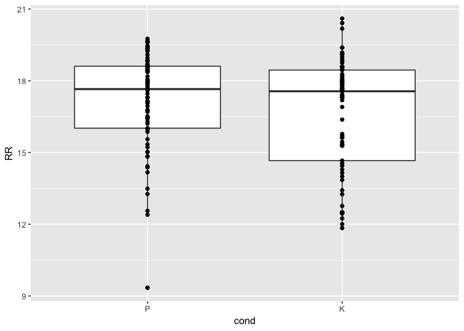
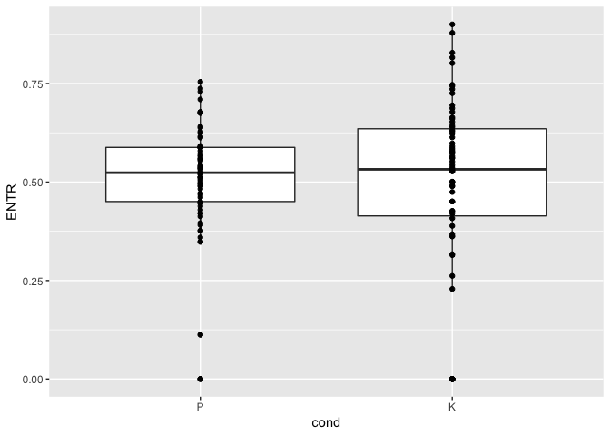
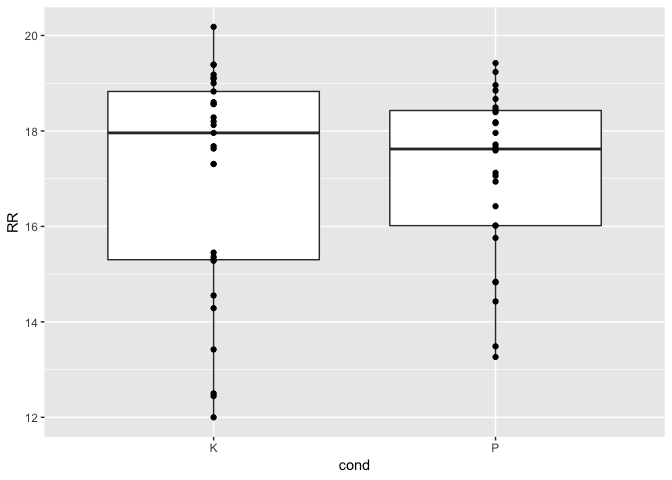
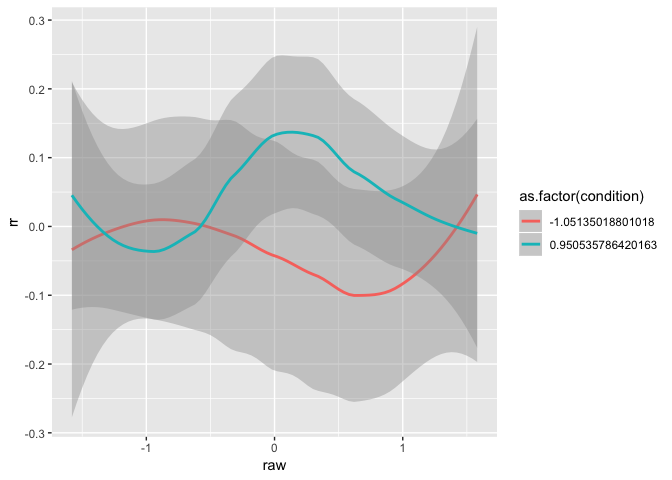
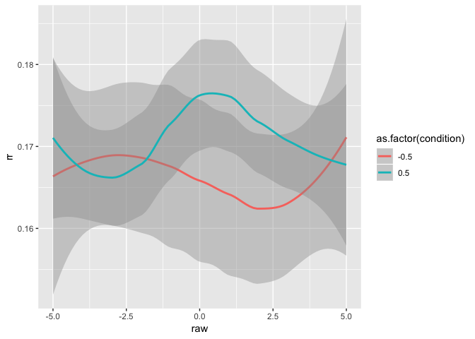
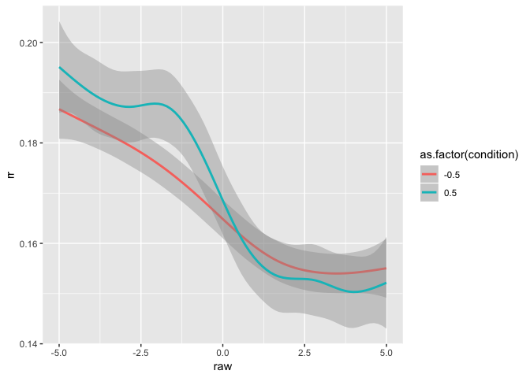
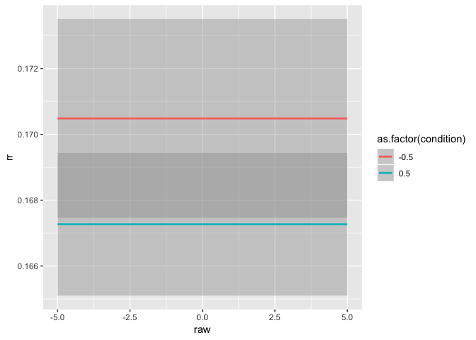
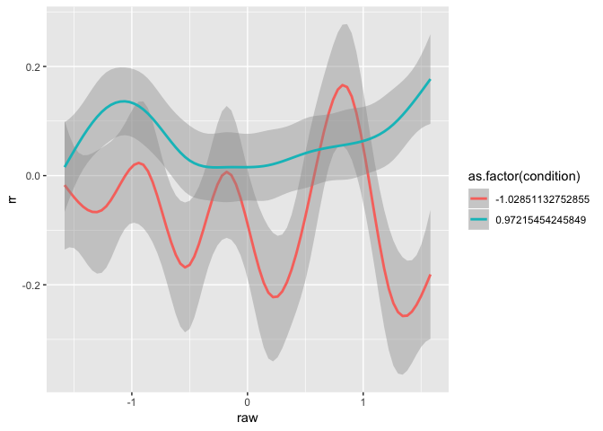
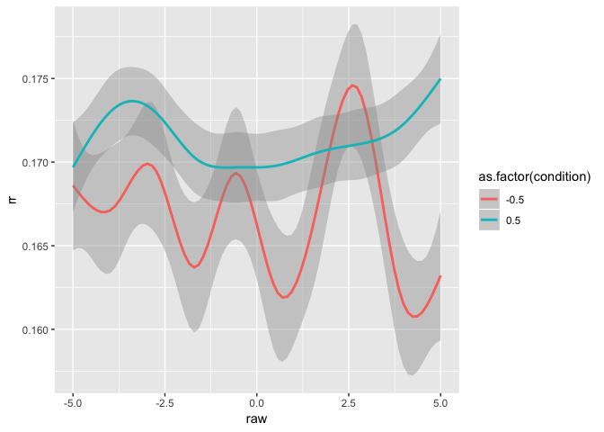

This R markdown provides the data preparation for our forthcoming manuscript.

To run this from scratch, you will need the following files:

* [This is where a description of the data setup goes]
* `./scripts/bc-libraries_and_functions.r`: Loads in necessary libraries and
creates new functions for our analyses.

**Code written by**: L. C. Mueller-Frommeyer (Technische Universitaet
Braunschweig) & A. Paxton (University of Connecticut)

**Date last modified**: 18 June 2019


***

# Preliminaries


```r
# clear everything
rm(list=ls())

# load libraries and add new functions
source('./scripts/bc-libraries_and_functions.r')
```

***

# Hypothesis 1

***

## Data preparation

***

### Recurrence quantification analysis: Monologues


```r
# read in all monologue files
mon_files = list.files('./data/LIWC-results/RQA/Monologues',
                       pattern = ".txt", full.names = TRUE)
mon_dfs = plyr::ldply(mon_files,
                      read.table, sep="\t", dec = ",", header=TRUE) #added decimal to get numbers instead of characters
```


```r
# prepare monologues for RQA
mon_dfs = mon_dfs %>%
  
  # separate 'Filename' column into separate columns
  tidyr::separate(Filename,
                  into = c("dyad_id", "dyad_position", "speaker_code"),
                  sep = '_',
                  remove = FALSE,
                  extra = "drop",
                  fill = "warn") %>%
  
  # extract speaker number ID and conversation type from variable
  mutate(cond = gsub("[[:digit:]]+","",dyad_id)) %>%
  
  # create new variable function_contrast with all 0 replaced by -1
  dplyr::rename(function_words = function.) %>%
  mutate(function_contrast = dplyr::if_else(function_words==0,
                                            -1,
                                            function_words)) %>%
  
  #add new variable specifying conversation type
  mutate(conv.type = "M")
```


```r
# split dataframe by monologue
split_mon = split(mon_dfs, list(mon_dfs$Filename))

# cycle through the individual monologues
crqa_mon = data.frame()
for (next_mon in split_mon){
  
  # run (auto-)recurrence
  rqa_for_mon = crqa(ts1=next_mon$function_words,
                     ts2=next_mon$function_contrast,
                     delay=1,
                     embed=1,
                     r=0.1,
                     normalize=0,
                     rescale=0,
                     mindiagline=2,
                     minvertline=2,
                     tw=1, # exclude line of identity
                     whiteline=FALSE,
                     recpt=FALSE)
  
  # save plot-level information to dataframe
  dyad_id = unique(next_mon$dyad_id)
  speaker_code = unique(next_mon$speaker_code)
  cond = NA   #changed it to NA as there was no condition in the monologue
  conv.type = unique(next_mon$conv.type)
  next_data_line = data.frame(dyad_id,  
                              speaker_code,
                              conv.type,
                              cond,
                              rqa_for_mon[1:9])
  crqa_mon = rbind.data.frame(crqa_mon,next_data_line)
  
  # save the RPs
  png(filename = paste0('./figures/h1-rqa/rp-speaker_',speaker_code,'-monologue.png'))
  plotRP(rqa_for_mon$RP, 
         list(unit = 2, labelx = "Speaker A", labely = "Speaker A", 
              cols = "black", pcex = .5))
  dev.off()
}
```

***

### Recurrrence quantification analysis: Conversations


```r
# read in all conversation files
conv_files = list.files('./data/LIWC-results/RQA/Conversations-1',
                        pattern = ".txt", full.names = TRUE)
conv_dfs = plyr::ldply(conv_files,
                       read.table, sep="\t", dec = ",", header=TRUE)
```


```r
# prepare conversations for RQA
conv_dfs = conv_dfs %>%
  
  # separate 'Filename' column into separate columns
  tidyr::separate(Filename,
                  into = c("dyad_id", "dyad_position", "speaker_code"),
                  sep = '_',
                  remove = FALSE,
                  extra = "drop",
                  fill = "warn") %>%
  
  # extract speaker number ID and conversation type from variable
  mutate(cond = gsub("[[:digit:]]+","",dyad_id)) %>%
  
  # create new variable function_contrast with all 0 replaced by -1
  dplyr::rename(function_words = function.) %>%
  mutate(function_contrast = dplyr::if_else(function_words==0,
                                            -1,
                                            function_words)) %>%
  
  # add new variable specifying conversation type
  mutate(conv.type = "C")
```


```r
# split dataframe by conversation
split_conv = split(conv_dfs, list(conv_dfs$Filename))

# cycle through the individual conversations
crqa_conv = data.frame()
for (next_conv in split_conv){
  
  # run cross-recurrence
  rqa_for_conv = crqa(ts1=next_conv$function_words,
                      ts2=next_conv$function_contrast,
                      delay=1,
                      embed=1,
                      r=0.1,
                      normalize=0,
                      rescale=0,
                      mindiagline=2,
                      minvertline=2,
                      tw=1, # exclude line of identity
                      whiteline=FALSE,
                      recpt=FALSE)
  
  # save plot-level information to dataframe
  dyad_id = unique(next_conv$dyad_id)
  speaker_code = unique(next_conv$speaker_code)
  conv.type = unique(next_conv$conv.type)
  cond = unique(next_conv$cond)
  next_data_line = data.frame(dyad_id,  
                              speaker_code,
                              conv.type,
                              cond,
                              rqa_for_conv[1:9])
  crqa_conv = rbind.data.frame(crqa_conv,next_data_line)
  
  # save the RPs
  png(filename = paste0('./figures/h1-rqa/rp-speaker_',speaker_code,'-conversation.png'))
  plotRP(rqa_for_conv$RP, 
         list(unit = 2, labelx = "Speaker A", labely = "Speaker A", 
              cols = "black", pcex = .5))
  dev.off()
}
```

***

### Create dataframe for H1


```r
# bring together the monologue and conversation data
h1_data = rbind(crqa_mon, crqa_conv)

#save results to file
write.table(h1_data,'./data/h1_data.csv',sep=",")
```

***

## Baseline

***

### Create sample-wise shuffled baseline for monologues


```r
# split all data by participant
split_mon = split(mon_dfs, list(mon_dfs$speaker_code))
monologue_baseline = data.frame()
for (next_mon in split_mon){
  
  # only progress if we have data for this conversation type
  if (dim(next_mon)[1] > 1){
    
    # preserve the original dataframe
    next_mon_real = next_mon
    
    # permute 10 times for baseline
    permuted_mon_df = data.frame()
    for (run in c(1:5)){
      next_shuffle = next_mon_real %>%
        
        # shuffle each person's linguistic contributions
        mutate(sur_fw = gtools::permute(function_words),
               sur_fw_contrast = gtools::permute(function_contrast)) %>%
        
        # drop unneeded variables
        select(-function_words, -function_contrast,
               -WC) %>%
        
        # add a marker for what run we're on and datatype
        mutate(run = run) %>%
        mutate(data_type = 'surrogate')
      
      # add it to our dataframe
      permuted_mon_df = rbind.data.frame(permuted_mon_df,
                                         next_shuffle)
    }
    
    # bind the next surrogate's data to the dataframe
    monologue_baseline = rbind.data.frame(monologue_baseline, permuted_mon_df)}
}
```

***

### Create sample-wise shuffled baseline for conversations


```r
# split all data by participant
split_conv = split(conv_dfs, list(conv_dfs$speaker_code))
conversation_baseline = data.frame()
for (next_conv in split_conv){
  
  # only progress if we have data for this conversation type
  if (dim(next_conv)[1] > 1){
    
    # preserve the original dataframe
    next_conv_real = next_conv
    
    # permute 10 times for baseline
    permuted_conv_df = data.frame()
    for (run in c(1:5)){
      next_shuffle = next_conv_real %>%
        
        # shuffle each person's linguistic contributions
        mutate(sur_fw = gtools::permute(function_words),
               sur_fw_contrast = gtools::permute(function_contrast)) %>%
        
        # drop unneeded variables
        select(-function_words, -function_contrast,
               -WC) %>%
        
        # add a marker for what run we're on and datatype
        mutate(run = run) %>%
        mutate(data_type = 'surrogate')
      
      # add it to our dataframe
      permuted_conv_df = rbind.data.frame(permuted_conv_df,
                                          next_shuffle)
    }
    
    # bind the next surrogate's data to the dataframe
    conversation_baseline = rbind.data.frame(conversation_baseline, permuted_conv_df)}
}
```

***

### RQA: Surrogate monologue


```r
# cycle through all the dyads
speaker_list = unique(monologue_baseline$speaker_code)
crqa_mon_sur = data.frame()
for (next_speaker in speaker_list){
  
  # get the next participant's data
  next_speaker_df = monologue_baseline %>%
    dplyr::filter(speaker_code == next_speaker)
  
  # cycle through all sample-wise shuffle runs
  for (run_no in 1:max(next_speaker_df$run)) {
    
    # get next Speaker A and B's data
    temp_AB = next_speaker_df %>% ungroup() %>%
      dplyr::filter(run == run_no) %>%
      select(dyad_id, speaker_code, cond, conv.type, sur_fw, sur_fw_contrast, run)
    
    # run (auto-)recurrence
    rqa_sample_mon = crqa(ts1=temp_AB$sur_fw,
                          ts2=temp_AB$sur_fw_contrast,
                          delay=1,
                          embed=1,
                          r=0.1,
                          normalize=0,
                          rescale=0,
                          mindiagline=2,
                          minvertline=2,
                          tw=1, # exclude line of identity
                          whiteline=FALSE,
                          recpt=FALSE)
    
    # save plot-level information to dataframe
    dyad_id = unique(temp_AB$dyad_id)
    speaker_code = unique(temp_AB$speaker_code)
    cond = unique(temp_AB$cond)   # changed it to NA as there was no condition in the monologue
    conv.type = unique(temp_AB$conv.type)
    run_id = unique(temp_AB$run)
    next_data_line = data.frame(dyad_id,  
                                speaker_code,
                                conv.type,
                                cond,
                                run_id,
                                rqa_sample_mon[1:9])
    crqa_mon_sur = rbind.data.frame(crqa_mon_sur,next_data_line)
  }
}
```


***

### RQA: Surrogate conversation


```r
# cycle through all the dyads
speaker_list = unique(conversation_baseline$speaker_code)
crqa_conv_sur = data.frame()
for (next_speaker in speaker_list){
  
  # get the next participant's data
  next_speaker_df = conversation_baseline %>%
    dplyr::filter(speaker_code == next_speaker)
  
  # cycle through all sample-wise shuffle runs
  for (run_no in 1:max(next_speaker_df$run)) {
    
    # get next Speaker A and B's data
    temp_AB = next_speaker_df %>% ungroup() %>%
      dplyr::filter(run == run_no) %>%
      select(dyad_id, speaker_code, cond, conv.type, sur_fw, sur_fw_contrast, run)
    
    # run (auto-)recurrence
    rqa_sample_con = crqa(ts1=temp_AB$sur_fw,
                          ts2=temp_AB$sur_fw_contrast,
                          delay=1,
                          embed=1,
                          r=0.1,
                          normalize=0,
                          rescale=0,
                          mindiagline=2,
                          minvertline=2,
                          tw=1, # exclude line of identity
                          whiteline=FALSE,
                          recpt=FALSE)
    
    # save plot-level information to dataframe
    dyad_id = unique(temp_AB$dyad_id)
    speaker_code = unique(temp_AB$speaker_code)
    cond = unique(temp_AB$cond)   # changed it to NA as there was no condition in the monologue
    conv.type = unique(temp_AB$conv.type)
    run_id = unique(temp_AB$run)
    next_data_line = data.frame(dyad_id,  
                                speaker_code,
                                conv.type,
                                cond,
                                run_id,
                                rqa_sample_con[1:9])
    crqa_conv_sur = rbind.data.frame(crqa_conv_sur,next_data_line)
  }
}
```

***

### Create surrogate dataframe


```r
# add surrogate DET to h1_data
h1_data_sur = rbind(crqa_mon_sur, crqa_conv_sur)

#save results to file
write.table(h1_data_sur,'./data/h1_data-surrogate.csv',sep=",")
```

***

## Data analysis

Here, we perform a linear mixed-effects model to analyze how conversation
type---whether a monologue (M) or conversation (C)---changes a person's
language style, specifically looking at their use of function words (often a
measure of syntactic complexity and structure).

We attempted to analyze the data using maximal random effects structures and
an uncorrelated random intercept within the random slope, but both models
failed to converge. As a result, we use only the random intercept in our model.


```r
# does linguistic style change based on the conversational context?
h1_analyses <- lmer(RR ~ conv.type + (1|speaker_code), data = h1_data, REML = FALSE)
```


***

### Post-hoc analysis: Changes by conversation type

Next, we will do a post-hoc analysis to see how language style differs from the
monologues based on each condition (i.e., cooperative versus conflict).


```r
#Preparing data for Post-hoc analyses - Bring data into wide format to calculate Diff_DET
crqa_mon_post = crqa_mon %>%
  dplyr::rename(conv.type_m = conv.type,
                RR_m = RR,
                DET_m = DET,
                NRLINE_m = NRLINE,
                maxL_m = maxL,
                L_m = L,
                ENTR_m = ENTR,
                rENTR_m = rENTR,
                LAM_m = LAM,
                TT_m = TT) 
crqa_conv_post = crqa_conv  %>%
  dplyr::rename(conv.type_c = conv.type,
                cond_c = cond,
                RR_c = RR,
                DET_c = DET,
                NRLINE_c = NRLINE,
                maxL_c = maxL,
                L_c = L,
                ENTR_c = ENTR,
                rENTR_c = rENTR,
                LAM_c = LAM,
                TT_c = TT) 
h1_post = full_join(crqa_mon_post, crqa_conv_post,
                    by=c("dyad_id", "speaker_code"))
```

```
## Warning: Column `speaker_code` joining factors with different levels,
## coercing to character vector
```

```r
# Calculate Diff_DET
h1_post_hoc = h1_post %>%
  mutate(Diff_DET = DET_m - DET_c)
```


```r
#Preparing data for Post-hoc analyses - Bring data into wide format to calculate Diff_DET
crqa_mon_sur_post = crqa_mon_sur %>%
  dplyr::rename(conv.type_m = conv.type,
                RR_m = RR,
                DET_m = DET,
                NRLINE_m = NRLINE,
                maxL_m = maxL,
                L_m = L,
                ENTR_m = ENTR,
                rENTR_m = rENTR,
                LAM_m = LAM,
                TT_m = TT) 
crqa_conv_sur_post = crqa_conv_sur  %>%
  dplyr::rename(conv.type_c = conv.type,
                cond_c = cond,
                RR_c = RR,
                DET_c = DET,
                NRLINE_c = NRLINE,
                maxL_c = maxL,
                L_c = L,
                ENTR_c = ENTR,
                rENTR_c = rENTR,
                LAM_c = LAM,
                TT_c = TT) 
h1_post_sur = full_join(crqa_mon_sur_post, crqa_conv_sur_post,
                        by=c("dyad_id", "speaker_code"))
```

```
## Warning: Column `speaker_code` joining factors with different levels,
## coercing to character vector
```

```r
# Calculate Diff_DET
h1_post_hoc_sur = h1_post_sur %>%
  mutate(Diff_DET = DET_m - DET_c)
```


```r
# do changes in linguistic style between monologues and dialogues
# differ by conversation type?
h1_analyses_post = lm(Diff_DET ~ cond_c, data = h1_post_hoc)
h1_analyses_post_sur = lm(Diff_DET ~ cond_c, data = h1_post_hoc_sur)
```


We find a trend toward an effect of condition, but it does not 
reach statistical significance. Let's take a look at the data.


It looks as though there might be outliers in the data. Let's confirm with
a boxplot.


How might the model change if we remove the outliers?


```r
# remove outliers based on boxplot
h1_post_no_outliers = h1_post_hoc %>% 
  dplyr::filter(Diff_DET > -40 & Diff_DET < 20)
```


```r
# do changes in linguistic style between monologues and dialogues
# differ by conversation type?
h1_analyses_post_no_outliers = lm(Diff_DET ~ cond_c, data = h1_post_no_outliers)
```


It appears that---with 3 outlying datapoints removed---we now find an effect
of conversation type. This suggests that there may, indeed, be systematic
changes in speakers' linguistic styles from monologues to conversations
based on the type of conversation that they're having. However, the results
here are tentative and must be further investigated in future work.

***

# Hypothesis 2

***

## Data preparation

***

### Data cleaning: Speaker A


```r
# get list of Conversation files for Speaker A
A_files = list.files('./data/LIWC-results/cRQA/SpeakerA',
                     pattern = ".txt", full.names = TRUE)
A_dfs = plyr::ldply(A_files,
                    read.table, sep="\t", dec = ",", header=TRUE) #added decimal to get numbers instead of characters
```


```r
# prepare conversations Speaker A for CRQA
A_dfs = A_dfs %>% ungroup() %>%
  
  # separate 'Filename' column into separate columns
  tidyr::separate(Filename,
                  into = c("dyad_id", "dyad_position",  "speaker_code", "cond", "conver"),
                  sep = '_',
                  remove = FALSE,
                  extra = "drop",
                  fill = "warn") %>%
  
  # extract conversation number from variable conver
  mutate(conv.no = gsub(".txt","",conver)) %>%
  
  # rename function. to function_words
  dplyr::rename(function_words = function.) %>%
  
  # group by participant to cut quantiles
  group_by(Filename) %>%
  
  # recode quartiles
  mutate(fw_quantiles = as.numeric(
    gtools::quantcut(function_words,
                     q=4,
                     na.rm = TRUE))
  ) %>% ungroup()  %>%
  
  # recode anytime there is 0 function word use
  mutate(fw_quantiles = dplyr::if_else(function_words==0,
                                       0,
                                       fw_quantiles)) %>%
  
  # specify these data are real
  mutate(data_type = 'real') %>%
  
  # rename to specify speaker A contributions
  dplyr::rename(function_words_A = function_words,
                fw_quantiles_A = fw_quantiles,
                speaker_A = speaker_code,
                wc_A = WC) %>%
  dplyr::select(dyad_id, speaker_A, Segment, cond, 
                function_words_A, fw_quantiles_A, wc_A, conv.no, data_type )
```

***

### Data cleaning: Speaker B


```r
# get list of Conversation files for Speaker B
B_files = list.files('./data/LIWC-results/cRQA/SpeakerB',
                     pattern = ".txt", full.names = TRUE)
B_dfs = plyr::ldply(B_files,
                    read.table, sep="\t", dec = ",", header=TRUE) #added decimal to get numbers instead of characters
```


```r
# prepare conversations Speaker B for CRQA
B_dfs = B_dfs %>% ungroup() %>%
  
  # separate 'Filename' column into separate columns
  tidyr::separate(Filename,
                  into = c("dyad_id", "dyad_position",  "speaker_code", "cond", "conver"),
                  sep = '_',
                  remove = FALSE,
                  extra = "drop",
                  fill = "warn") %>%
  
  # extract conversation number from variable conver
  mutate(conv.no = gsub(".txt","",conver)) %>%
  
  # rename function. to function_words
  dplyr::rename(function_words = function.) %>%
  
  # group by participant to cut quantiles
  group_by(Filename) %>%
  
  # recode quartiles
  mutate(fw_quantiles = as.numeric(
    gtools::quantcut(function_words,
                     q=4,
                     na.rm = TRUE))
  ) %>% ungroup() %>%
  
  # recode anytime there is 0 function word use
  mutate(fw_quantiles = dplyr::if_else(function_words==0,
                                       -1,
                                       fw_quantiles)) %>%
  
  # specify these data are real
  mutate(data_type = 'real') %>%
  
  # rename to specify speaker A contributions
  dplyr::rename(function_words_B = function_words,
                fw_quantiles_B = fw_quantiles,
                speaker_B = speaker_code,
                wc_B = WC) %>%
  dplyr::select(dyad_id, speaker_B, Segment, cond, 
                function_words_B, fw_quantiles_B, wc_B, conv.no, data_type)
```

***

### Create dataframe for H2

Before we run CRQA, we must first combine the Speaker A and Speaker B
dataframes. This requires truncating the data so that both speakers have the
same number of turns in each conversation and converting from longform data
(i.e., creating columns for speaker identifier [A vs. B], function words, and
turn) to wideform data (i.e., creating columns for Speaker A function words,
Speaker B function words, and turn).


```r
# merge Speaker A and Speaker B together
h2_data = full_join(A_dfs, B_dfs,
                    by = c("dyad_id", "Segment", "cond", "data_type", "conv.no")) %>%
  
  # because any missing values are filled with `NA`,
  # we can truncate turns simply by dropping `NA`
  tidyr::drop_na()
```


***

## Creation of baselines

***

### Partner-wise shuffled baseline

This form of surrogate time series estimating overall RR (or %REC) that might
be expected by chance. Due to how time-intensive this process is, we keep this
as `eval=FALSE` and read in a CSV of the file.


```r
# specify real partners
partner_wise_baseline = h2_data %>% 
  
  # choose only conversation 1 and variables that we need
  dplyr::filter(conv.no == 1) %>%
  select(dyad_id, speaker_A, speaker_B, cond) %>%
  distinct() %>%
  dplyr::rename(dyad_id_real = dyad_id,
                speaker_B_real = speaker_B)

# cycle through for 5 baselines
for (runs in c(1:5)){
  
  # generate a potential paired set value
  temp_df = partner_wise_baseline %>% ungroup() %>%
    group_by(cond) %>% 
    mutate(!!paste0("speaker_B_run", runs) := gtools::permute(speaker_B_real)) %>%
    ungroup()
  
  # keep resampling if we get any overlap from the real data or other pairs
  while (length(unique(apply(temp_df,1,function(x) sum(!duplicated(x))))) != 1) {
    temp_df = partner_wise_baseline %>% ungroup() %>%
      group_by(cond) %>%
      mutate(!!paste0("speaker_B_run", runs) := gtools::permute(speaker_B_real)) %>%
      ungroup()
  }
  
  # save the final option
  partner_wise_baseline = temp_df
}

# convert to wideform
partner_wise_baseline = partner_wise_baseline %>%
  tidyr::gather(key = "shuffle_run",
                value = "fake_speaker_B",
                -speaker_A,
                -dyad_id_real,
                -cond) %>%
  
  mutate(shuffle_run = gsub("speaker_B_","",shuffle_run)) %>%
  dplyr::filter(shuffle_run != "real")

# save results to file
write.table(partner_wise_baseline, 
            './scripts/partner_wise_baseline-partner_IDs.csv', sep=",")
```


```r
# read in the shuffled pairings that we've already created
partner_wise_baseline = read.csv('./scripts/partner_wise_baseline-partner_IDs.csv', 
                                 header = TRUE, sep=",")
```

***

### Sample-wise shuffled baseline

This form of surrogate time series will be used for the DRPs, but it is not
suitable for estimating overall RR (or %REC) that might be expected by chance.
This is because the individual points are retained, meaning that the overall
amount of recurrence will stay the same, although the exact structure of the
recurrence (e.g., DRPs, mean line length, percent determinism) will be altered.


```r
# split all dyads by dyad ID
split_h2 = split(h2_data, list(h2_data$dyad_id, h2_data$conv.no)) 
sample_wise_baseline = data.frame()
for (next_conv in split_h2){
  
  # only progress if we have data for this conversation type and dyad
  if (dim(next_conv)[1] > 1){
    
    # preserve the original dataframe
    next_conv_real = next_conv
    
    # permute 5 times for baseline
    permuted_df = data.frame()
    for (run in c(1:5)){
      next_shuffle = next_conv_real %>%
        
        # shuffle each person's linguistic contributions
        group_by(dyad_id) %>%
        mutate(sur_fw_quantiles_A = gtools::permute(fw_quantiles_A)) %>%
        mutate(sur_fw_quantiles_B = gtools::permute(fw_quantiles_B)) %>%
        ungroup() %>%
        
        # drop unneeded variables
        select(-fw_quantiles_A, -fw_quantiles_B,
               -contains('wc_'), -contains('function_words')) %>%
        
        # add a marker for what run we're on and datatype
        mutate(run = run) %>%
        mutate(data_type = 'surrogate')
      
      # add it to our dataframe
      permuted_df = rbind.data.frame(permuted_df, next_shuffle)
    }
    
    # bind the next surrogate's data to the dataframe
    sample_wise_baseline = rbind.data.frame(sample_wise_baseline, permuted_df)}
}
```

***

## Cross-recurrence quantification analysis

***

### For real data


```r
# split dataframe by dyad ID
split_conv = split(h2_data, list(h2_data$dyad_id, 
                                 h2_data$conv.no))

# cycle through the individual conversations
crqa_real = data.frame()
for (next_conv in split_conv){
  
  # only proceed if we have data for this conversation
  if (dim(next_conv)[1]>1){
    
    # run cross-recurrence
    crqa_for_conv = crqa(ts1=next_conv$fw_quantiles_A,
                         ts2=next_conv$fw_quantiles_B,
                         delay=1,
                         embed=1,
                         r=0.1,
                         normalize=0,
                         rescale=0,
                         mindiagline=2,
                         minvertline=2,
                         tw=0,
                         whiteline=FALSE,
                         recpt=FALSE)
    
    # save plot-level information to dataframe -- confirm that we don't need anything else here
    dyad_id = unique(next_conv$dyad_id)
    cond = unique(next_conv$cond) 
    conv.no = unique(next_conv$conv.no) #conv.no
    next_data_line = data.frame(dyad_id,  
                                cond,
                                conv.no,
                                crqa_for_conv[1:9])
    crqa_real = rbind.data.frame(crqa_real,next_data_line)
    
    # plot the CRPs
    png(filename = paste0('./figures/h2-crqa/crp-dyad_',dyad_id,'-cond_',cond,'.png'))
    plotRP(crqa_for_conv$RP, 
           list(unit = 2, labelx = "Speaker A", labely = "Speaker B", 
                cols = "black", pcex = .5))
    dev.off()
    
  }
}
```

<!-- -->


```
## Warning: Removed 2 rows containing non-finite values (stat_boxplot).
```

```
## Warning: Removed 2 rows containing missing values (geom_point).
```

<!-- -->

<!-- -->

Need to note in the manuscript that we dropped anyone with fewer than 10
talk-turns from the DRP analyses.


```r
# split dataframe by dyad ID
split_h2 = split(h2_data, 
                 list(h2_data$dyad_id, h2_data$conv.no))

# cycle through all dyads
drp_real = data.frame()
for (next_conv in split_h2) {
  
  # only proceed if we have data for this conversation
  if (dim(next_conv)[1]>9){
    
    # calculate diagonal recurrence profile using categorical recurrence
    drp_for_conv = drpdfromts(next_conv$fw_quantiles_A, 
                              next_conv$fw_quantiles_B,
                              ws = wsz, 
                              datatype="categorical")
    
    # save plot-level information to dataframe
    dyad_id = unique(next_conv$dyad_id)
    cond = unique(next_conv$cond)
    data_type = unique(next_conv$data_type)
    conv.no = unique(next_conv$conv.no)
    drps = data.frame(raw = timeVals$raw,
                      ot1 = timeVals$ot1,
                      ot2  = timeVals$ot2,
                      rr = drp_for_conv$profile) %>%
      mutate(dyad_id = dyad_id,
             cond = cond,
             conv.no = conv.no,
             data_type = data_type)
    
    # get the mean RR for the left side of the plot
    mean_left_rr = drps %>%
      dplyr::filter(raw < 0) %>%
      summarize(mean_rr = mean(rr)) %>%
      .$mean_rr
    
    # get the mean RR for the right side of the plot
    mean_right_rr = drps %>%
      dplyr::filter(raw > 0) %>%
      summarize(mean_rr = mean(rr)) %>%
      .$mean_rr
    
    # flip arrangement if leader is not on left
    if (mean_left_rr < mean_right_rr) {
      drps = drps %>%
        mutate(rr = rev(rr))
    }
    
    # append to dataframe
    drp_real = rbind.data.frame(drp_real, drps)
    
  }
}
```

***

### For partner-wise shuffled baseline


```r
# CRQA for partner-wise baseline
crqa_partner_shuffle = data.frame()

# cycle through all the pseudopartners
for (fake_dyad in 1:nrow(partner_wise_baseline)) {
  for (next_conv in 1:max(h2_data$conv.no)) {
    
    #double-check the no. of pairings
    
    # get next Speaker A data
    temp_A = h2_data %>% ungroup() %>%
      dplyr::filter(speaker_A==partner_wise_baseline$speaker_A[fake_dyad], conv.no == next_conv) %>% 
      select(speaker_A, cond, fw_quantiles_A, Segment, conv.no)
    
    # get only the data we need for Fake Partner B
    temp_B = h2_data %>% ungroup() %>%
      dplyr::filter(speaker_B==partner_wise_baseline$fake_speaker_B[fake_dyad]) %>%
      select(speaker_B, cond, fw_quantiles_B, Segment, conv.no)
    
    # join them together to make sure only compare equal turns
    temp_data=full_join(temp_A, temp_B,
                        by = c("cond", "Segment", "conv.no")) %>%
      tidyr::drop_na()
    
    # run CRQA only for a minimum of 10 observations 
    if(nrow(temp_data)>9){
      
      crqa_for_sur = crqa(ts1=temp_data$fw_quantiles_A,
                          ts2=temp_data$fw_quantiles_B,
                          delay=1,
                          embed=1,
                          r=0.1,
                          normalize=0,
                          rescale=0,
                          mindiagline=2,
                          minvertline=2,
                          tw=0,
                          whiteline=FALSE,
                          recpt=FALSE)
      
      # save plot-level information to dataframe
      speaker_A = unique(temp_data$speaker_A)
      speaker_B = unique(temp_data$speaker_B)
      cond = unique(temp_data$cond)
      conv.no = unique(temp_data$conv.no)
      next_data_line = data.frame(speaker_A,
                                  speaker_B,
                                  cond,
                                  conv.no,
                                  crqa_for_sur[1:9])
      crqa_partner_shuffle = rbind.data.frame(crqa_partner_shuffle,next_data_line)
    }
  }
}
```

Need to note in the manuscript that we dropped anyone with fewer than 10
talk-turns from the DRP analyses.


```r
# cycle through all the shuffled partners
drp_partner = data.frame()
for (fake_dyad in 1:nrow(partner_wise_baseline)){ 
  for (next_conv in 1:max(h2_data$conv.no)) {
    
    # get next Speaker A data
    temp_A = h2_data %>% ungroup() %>%
      dplyr::filter(speaker_A==partner_wise_baseline$speaker_A[fake_dyad], conv.no == next_conv) %>%
      select(speaker_A, cond, fw_quantiles_A, Segment)
    
    # get only the data we need for Fake Partner B
    temp_B = h2_data %>% ungroup() %>%
      dplyr::filter(speaker_B==partner_wise_baseline$fake_speaker_B[fake_dyad]) %>%
      select(speaker_B, cond, fw_quantiles_B, Segment)
    
    # join them together to make sure only compare equal turns
    temp_data=full_join(temp_A, temp_B,
                        by = c("cond", "Segment")) %>%
      tidyr::drop_na()
    
    # run DRP if we have enough talk-turns
    if (dim(temp_data)[1]>9){
      
      # calculate diagonal recurrence profile using categorical recurrence
      drp_for_partner = drpdfromts(ts1= temp_data$fw_quantiles_A, 
                                   ts2= temp_data$fw_quantiles_B,
                                   ws = wsz, 
                                   datatype="categorical")
      
      # save plot-level information to dataframe
      speaker_A = unique(temp_data$speaker_A)
      speaker_B = unique(temp_data$speaker_B)
      cond = unique(temp_data$cond)
      next_data = data.frame(raw = timeVals$raw,
                             ot1 = timeVals$ot1,
                             ot2  = timeVals$ot2,
                             rr = drp_for_partner$profile) %>%
        mutate(speaker_A = speaker_A,
               speaker_B = speaker_B,
               cond = cond,
               conv.no = next_conv)
      
      # get the mean RR for the left side of the plot
      mean_left_rr = next_data %>%
        dplyr::filter(raw < 0) %>%
        summarize(mean_rr = mean(rr)) %>%
        .$mean_rr
      
      # get the mean RR for the right side of the plot
      mean_right_rr = next_data %>%
        dplyr::filter(raw > 0) %>%
        summarize(mean_rr = mean(rr)) %>%
        .$mean_rr
      
      # flip arrangement if leader is not on left
      if (mean_left_rr < mean_right_rr) {
        next_data = next_data %>%
          mutate(rr = rev(rr))
      }
      
      # save to overall dataframe
      drp_partner = rbind.data.frame(drp_partner, next_data)
    }
  }
}
```

***

### For sample-wise shuffled baseline


```r
# cycle through all the dyads
dyad_list = unique(sample_wise_baseline$dyad_id)
drp_sample = data.frame()
for (next_dyad in dyad_list){
  for (next_conv in 1:max(h2_data$conv.no)) {
    
    # get the next participant's data
    next_dyad_df = sample_wise_baseline %>%
      dplyr::filter(dyad_id == next_dyad, conv.no == next_conv)
    
    # cycle through all sample-wise shuffle runs
    for (run in 1:max(next_dyad_df$run)) {
      
      # get next Speaker A data
      temp_AB = next_dyad_df %>% ungroup() %>%
        dplyr::filter(run == run) %>%
        select(speaker_A, speaker_B, cond, 
               sur_fw_quantiles_A, sur_fw_quantiles_B, run, conv.no)
      
      # run DRP if we have enough talk-turns
      if (dim(temp_AB)[1]>9){
        
        # calculate diagonal recurrence profile using categorical recurrence
        drp_for_sample = drpdfromts(ts1 = temp_AB$sur_fw_quantiles_A, 
                                    ts2 = temp_AB$sur_fw_quantiles_B,
                                    ws = wsz, 
                                    datatype = "categorical")
        
        # save plot-level information to dataframe
        cond = unique(temp_AB$cond)
        next_data = data.frame(raw = timeVals$raw,
                               ot1 = timeVals$ot1,
                               ot2  = timeVals$ot2,
                               rr = drp_for_sample$profile) %>%
          mutate(cond = cond,
                 run = run,
                 conv.no = next_conv, 
                 dyad = next_dyad)
        
        # get the mean RR for the left side of the plot
        mean_left_rr = next_data %>%
          dplyr::filter(raw < 0) %>%
          summarize(mean_rr = mean(rr)) %>%
          .$mean_rr
        
        # get the mean RR for the right side of the plot
        mean_right_rr = next_data %>%
          dplyr::filter(raw > 0) %>%
          summarize(mean_rr = mean(rr)) %>%
          .$mean_rr
        
        # flip arrangement if leader is not on left
        if (mean_left_rr < mean_right_rr) {
          next_data = next_data %>%
            mutate(rr = rev(rr))
        }
        
        # save to overall dataframe
        drp_sample = rbind.data.frame(drp_sample, next_data)
      }
    }
  }
}
```

***

## Data analysis

***

### Prepare binary and categorical variables


```r
# prepare real data dataframe
drp_real = drp_real %>% ungroup() %>%
  plyr::rename(.,
               c("cond"="condition")) %>%
  
  # recode "condition" values to be -.5 and +.5
  mutate(condition = dplyr::if_else(condition=="P",
                                    -.5,      # personal = -.5
                                    .5)) %>%  # conflict = .5
  
  # first-order polynomials
  mutate(condition.ot1 = condition * ot1) %>%
  
  # second-order polynomials
  mutate(condition.ot2 = condition * ot2) %>%
  
  # polynomial interactions
  mutate(ot1.ot2 = ot1 * ot2) %>%
  mutate(condition.ot1.ot2 = condition * ot1 * ot2) %>%
  
  # convert condition to factor
  mutate(condition = as.factor(condition))
```


```r
# prepare partner-wise baseline dataframe
drp_partner = drp_partner %>% ungroup() %>%
  plyr::rename(.,
               c("cond"="condition")) %>%
  
  # recode "condition" values to be -.5 and +.5
  mutate(condition = dplyr::if_else(condition=="P",
                                    -.5,      # personal = -.5
                                    .5)) %>%  # conflict = .5
  
  # first-order polynomials
  mutate(condition.ot1 = condition * ot1) %>%
  
  # second-order polynomials
  mutate(condition.ot2 = condition * ot2) %>%
  
  # polynomial interactions
  mutate(ot1.ot2 = ot1 * ot2) %>%
  mutate(condition.ot1.ot2 = condition * ot1 * ot2) %>%
  
  # convert to speakers to factors for appropriate numeric transform
  mutate(speaker_A = as.numeric(as.factor(speaker_A))) %>%
  mutate(speaker_B = as.numeric(as.factor(speaker_B))) %>%
  
  # convert condition to factor
  mutate(condition = as.factor(condition))
```


```r
# prepare sample-wise baseline dataframe
drp_sample = drp_sample %>% ungroup() %>%
  plyr::rename(.,
               c("cond"="condition")) %>%
  
  # recode "condition" values to be -.5 and +.5
  mutate(condition = dplyr::if_else(condition=="P",
                                    -.5,      # personal = -.5
                                    .5)) %>%  # conflict = .5
  
  # first-order polynomials
  mutate(condition.ot1 = condition * ot1) %>%
  
  # second-order polynomials
  mutate(condition.ot2 = condition * ot2) %>%
  
  # polynomial interactions
  mutate(ot1.ot2 = ot1 * ot2) %>%
  mutate(condition.ot1.ot2 = condition * ot1 * ot2) %>%
  
  # convert condition to factor
  mutate(condition = as.factor(condition))
```

***

### Create standardized dataframes

Let's create new dataframe with all standardized variables. This allows us 
to interpret the resulting model estimates as effect sizes (see Keith, 2005, 
*Multiple regression and beyond*).


```r
# standardize all variables
drp_real_st = mutate_each(drp_real, 
                          funs(as.numeric(scale(as.numeric(.))))) %>%
  mutate(dyad_id = as.factor(dyad_id))
```

```
## Warning: funs() is soft deprecated as of dplyr 0.8.0
## please use list() instead
## 
##   # Before:
##   funs(name = f(.))
## 
##   # After: 
##   list(name = ~ f(.))
## This warning is displayed once per session.
```

```
## Warning in scale(as.numeric(data_type)): NAs introduced by coercion
```

```r
drp_partner_st = mutate_each(drp_partner, 
                             funs(as.numeric(scale(as.numeric(.))))) %>%
  mutate(speaker_A = as.factor(speaker_A),
         speaker_B = as.factor(speaker_B))

drp_sample_st = mutate_each(drp_sample,
                            funs(as.numeric(scale(as.numeric(.))))) %>%
  mutate(dyad_id = as.factor(dyad_id))
```

***

### Analyses of plot-level CRQA metrics

First, do we see differences in the overall amount of recurrence in the plot
based on conversational context (when accounting for conversation number)?


```r
# does linguistic style matching change based on the conversational context?
h2_analyses <- lm(RR ~ cond + conv.no, 
                  data = crqa_real)
```


```
## 
## Call:
## lm(formula = RR ~ cond + conv.no, data = crqa_real)
## 
## Residuals:
##     Min      1Q  Median      3Q     Max 
## -7.5514 -1.3995  0.6324  1.6092  4.2556 
## 
## Coefficients:
##             Estimate Std. Error t value            Pr(>|t|)    
## (Intercept)  17.4009     0.3273  53.172 <0.0000000000000002 ***
## condK        -0.5455     0.3703  -1.473               0.143    
## conv.no2     -0.5062     0.3701  -1.368               0.174    
## ---
## Signif. codes:  0 '***' 0.001 '**' 0.01 '*' 0.05 '.' 0.1 ' ' 1
## 
## Residual standard error: 2.194 on 139 degrees of freedom
## Multiple R-squared:  0.02579,	Adjusted R-squared:  0.01177 
## F-statistic:  1.84 on 2 and 139 DF,  p-value: 0.1627
```


|     &nbsp;      | Estimate | Std..Error | t.value |   p    | p_adj  | sig |
|:---------------:|:--------:|:----------:|:-------:|:------:|:------:|:---:|
| **(Intercept)** |   17.4   |   0.3273   |  53.17  | 0.0001 | 0.0001 | *** |
|    **condK**    | -0.5455  |   0.3703   | -1.473  | 0.143  | 0.174  |     |
|  **conv.no2**   | -0.5062  |   0.3701   | -1.368  | 0.174  | 0.174  |     |

We don't see a difference by overall amounts of recurrence, but what about
differences in the structure of the recurrence? From looking at the 
cross-recurrence plots, there are vastly different visual "textures" by
conversation. To quantify these differences, let's look at three metrics:
the number of lines on the plot (`NRLINE`), normalized entropy (`rENTR`,
which accounts for the number of lines in the plot), and percent determinism 
(`DET`).


```r
# does the structure of language style matching change by context?
h2_analyses_nrline <- lm(NRLINE ~ cond + conv.no, 
                         data = crqa_real)
```


```
## 
## Call:
## lm(formula = NRLINE ~ cond + conv.no, data = crqa_real)
## 
## Residuals:
##     Min      1Q  Median      3Q     Max 
## -181.78  -64.54  -27.90   27.47  798.22 
## 
## Coefficients:
##             Estimate Std. Error t value             Pr(>|t|)    
## (Intercept)   189.78      18.87  10.059 < 0.0000000000000002 ***
## condK        -112.38      21.35  -5.265          0.000000521 ***
## conv.no2      -43.95      21.34  -2.060               0.0413 *  
## ---
## Signif. codes:  0 '***' 0.001 '**' 0.01 '*' 0.05 '.' 0.1 ' ' 1
## 
## Residual standard error: 126.5 on 139 degrees of freedom
## Multiple R-squared:  0.1781,	Adjusted R-squared:  0.1662 
## F-statistic: 15.06 on 2 and 139 DF,  p-value: 0.000001205
```


|     &nbsp;      | Estimate | Std..Error | t.value |   p    | p_adj  | sig |
|:---------------:|:--------:|:----------:|:-------:|:------:|:------:|:---:|
| **(Intercept)** |  189.8   |   18.87    |  10.06  | 0.0001 | 0.0001 | *** |
|    **condK**    |  -112.4  |   21.35    | -5.265  | 0.0001 | 0.0001 | *** |
|  **conv.no2**   |  -43.95  |   21.34    |  -2.06  | 0.041  | 0.041  |  *  |


```r
# does the heterogeneity of structure of LSM change by context?
h2_analyses_entropy <- lm(rENTR ~ cond + conv.no, 
                          data = crqa_real)
```


```
## 
## Call:
## lm(formula = rENTR ~ cond + conv.no, data = crqa_real)
## 
## Residuals:
##      Min       1Q   Median       3Q      Max 
## -0.31421 -0.08840 -0.02783  0.06902  0.40472 
## 
## Coefficients:
##             Estimate Std. Error t value             Pr(>|t|)    
## (Intercept)  0.44768    0.01983  22.574 < 0.0000000000000002 ***
## condK        0.07891    0.02317   3.406             0.000884 ***
## conv.no2     0.02885    0.02308   1.250             0.213648    
## ---
## Signif. codes:  0 '***' 0.001 '**' 0.01 '*' 0.05 '.' 0.1 ' ' 1
## 
## Residual standard error: 0.1307 on 127 degrees of freedom
##   (12 observations deleted due to missingness)
## Multiple R-squared:  0.08874,	Adjusted R-squared:  0.07439 
## F-statistic: 6.184 on 2 and 127 DF,  p-value: 0.002737
```


|     &nbsp;      | Estimate | Std..Error | t.value |   p    | p_adj  | sig |
|:---------------:|:--------:|:----------:|:-------:|:------:|:------:|:---:|
| **(Intercept)** |  0.4477  |  0.01983   |  22.57  | 0.0001 | 0.0001 | *** |
|    **condK**    | 0.07891  |  0.02317   |  3.406  | 0.001  | 0.001  | **  |
|  **conv.no2**   | 0.02885  |  0.02308   |  1.25   | 0.214  | 0.214  |     |


```r
# does the proportion of recurrent structures in LSM change by context?
h2_analyses_det <- lm(DET ~ cond + conv.no, 
                      data = crqa_real)
```


```
## 
## Call:
## lm(formula = DET ~ cond + conv.no, data = crqa_real)
## 
## Residuals:
##     Min      1Q  Median      3Q     Max 
## -20.110  -2.876   0.427   3.669  13.751 
## 
## Coefficients:
##             Estimate Std. Error t value            Pr(>|t|)    
## (Intercept)  31.0218     0.8691  35.694 <0.0000000000000002 ***
## condK        -0.2903     0.9882  -0.294               0.769    
## conv.no2     -0.6218     0.9873  -0.630               0.530    
## ---
## Signif. codes:  0 '***' 0.001 '**' 0.01 '*' 0.05 '.' 0.1 ' ' 1
## 
## Residual standard error: 5.812 on 137 degrees of freedom
##   (2 observations deleted due to missingness)
## Multiple R-squared:  0.003277,	Adjusted R-squared:  -0.01127 
## F-statistic: 0.2252 on 2 and 137 DF,  p-value: 0.7986
```


|     &nbsp;      | Estimate | Std..Error | t.value |   p    | p_adj  | sig |
|:---------------:|:--------:|:----------:|:-------:|:------:|:------:|:---:|
| **(Intercept)** |  31.02   |   0.8691   |  35.69  | 0.0001 | 0.0001 | *** |
|    **condK**    | -0.2903  |   0.9882   | -0.2938 |  0.77  |  0.77  |     |
|  **conv.no2**   | -0.6218  |   0.9873   | -0.6298 |  0.53  |  0.77  |     |

***

### Analyses of diagonal recurrence profiles

We now create a linear mixed-effects model to gauge how linear lag (`ot1`) and
quadratic lag (`ot2`) interact with condition (`condition`) to influence 
Language Style Matching (`rr`). We present both standardized and raw models below.


```r
# standardized maximal random-effects model
H2_st = lmer(
  rr ~ condition + conv.no + ot1 + ot2 + 
    ot1.ot2 + condition.ot1 + condition.ot2 + condition.ot1.ot2 +
    (1 | dyad_id), 
  data=drp_real_st)
```


```
## Linear mixed model fit by REML. t-tests use Satterthwaite's method [
## lmerModLmerTest]
## Formula: rr ~ condition + conv.no + ot1 + ot2 + ot1.ot2 + condition.ot1 +  
##     condition.ot2 + condition.ot1.ot2 + (1 | dyad_id)
##    Data: drp_real_st
## 
## REML criterion at convergence: 4237.6
## 
## Scaled residuals: 
##     Min      1Q  Median      3Q     Max 
## -3.3602 -0.6438 -0.0513  0.5422  4.6537 
## 
## Random effects:
##  Groups   Name        Variance Std.Dev.
##  dyad_id  (Intercept) 0.08679  0.2946  
##  Residual             0.86482  0.9300  
## Number of obs: 1529, groups:  dyad_id, 71
## 
## Fixed effects:
##                      Estimate  Std. Error          df t value
## (Intercept)          0.002111    0.042357   70.304096   0.050
## condition           -0.030669    0.024255 1490.369885  -1.264
## conv.no             -0.058804    0.024027 1471.266214  -2.447
## ot1                 -0.267134    0.034382 1450.681911  -7.770
## ot2                 -0.002588    0.023821 1450.681911  -0.109
## ot1.ot2              0.078520    0.034382 1450.681911   2.284
## condition.ot1       -0.009094    0.034382 1450.681911  -0.264
## condition.ot2        0.022602    0.023821 1450.681911   0.949
## condition.ot1.ot2   -0.038841    0.034382 1450.681911  -1.130
##                             Pr(>|t|)    
## (Intercept)                   0.9604    
## condition                     0.2063    
## conv.no                       0.0145 *  
## ot1               0.0000000000000148 ***
## ot2                           0.9135    
## ot1.ot2                       0.0225 *  
## condition.ot1                 0.7914    
## condition.ot2                 0.3429    
## condition.ot1.ot2             0.2588    
## ---
## Signif. codes:  0 '***' 0.001 '**' 0.01 '*' 0.05 '.' 0.1 ' ' 1
## 
## Correlation of Fixed Effects:
##             (Intr) condtn conv.n ot1    ot2    ot1.t2 cndt.1 cndt.2
## condition    0.006                                                 
## conv.no     -0.002  0.092                                          
## ot1          0.000  0.000  0.000                                   
## ot2          0.000  0.000  0.000  0.000                            
## ot1.ot2      0.000  0.000  0.000 -0.721  0.000                     
## conditin.t1  0.000  0.000  0.000  0.050  0.000 -0.036              
## conditin.t2  0.000  0.000  0.000  0.000  0.050  0.000  0.000       
## cndtn.t1.t2  0.000  0.000  0.000 -0.036  0.000  0.050 -0.721  0.000
```


|        &nbsp;         | Estimate  | Std..Error |  df  | t.value |   p    | p_adj  | sig |
|:---------------------:|:---------:|:----------:|:----:|:-------:|:------:|:------:|:---:|
|    **(Intercept)**    | 0.002111  |  0.04236   | 70.3 | 0.04984 |  0.96  |  0.96  |     |
|     **condition**     | -0.03067  |  0.02426   | 1490 | -1.264  | 0.206  |  0.46  |     |
|      **conv.no**      |  -0.0588  |  0.02403   | 1471 | -2.447  | 0.014  | 0.065  |  .  |
|        **ot1**        |  -0.2671  |  0.03438   | 1451 |  -7.77  | 0.0001 | 0.0001 | *** |
|        **ot2**        | -0.002588 |  0.02382   | 1451 | -0.1086 |  0.91  |  0.96  |     |
|      **ot1.ot2**      |  0.07852  |  0.03438   | 1451 |  2.284  | 0.022  | 0.068  |  .  |
|   **condition.ot1**   | -0.009094 |  0.03438   | 1451 | -0.2645 |  0.79  |  0.96  |     |
|   **condition.ot2**   |  0.0226   |  0.02382   | 1451 | 0.9489  |  0.34  |  0.51  |     |
| **condition.ot1.ot2** | -0.03884  |  0.03438   | 1451 |  -1.13  |  0.26  |  0.47  |     |


```
## `geom_smooth()` using method = 'loess' and formula 'y ~ x'
```

<!-- -->


```r
# raw maximal random-effects model
H2_raw = lmer(rr ~ conv.no + condition * ot1 * ot2 + (1 | dyad_id), 
              data=drp_real, REML=FALSE)
```


```
## Linear mixed model fit by maximum likelihood . t-tests use
##   Satterthwaite's method [lmerModLmerTest]
## Formula: rr ~ conv.no + condition * ot1 * ot2 + (1 | dyad_id)
##    Data: drp_real
## 
##      AIC      BIC   logLik deviance df.resid 
##  -4428.7  -4370.1   2225.4  -4450.7     1518 
## 
## Scaled residuals: 
##     Min      1Q  Median      3Q     Max 
## -3.3700 -0.6444 -0.0511  0.5421  4.6645 
## 
## Random effects:
##  Groups   Name        Variance  Std.Dev.
##  dyad_id  (Intercept) 0.0002993 0.01730 
##  Residual             0.0030226 0.05498 
## Number of obs: 1529, groups:  dyad_id, 71
## 
## Fixed effects:
##                         Estimate  Std. Error          df t value
## (Intercept)             0.173719    0.003232  195.486117  53.752
## conv.no2               -0.006970    0.002840 1479.460283  -2.454
## condition0.5           -0.003643    0.002870 1498.872921  -1.269
## ot1                    -0.050718    0.009288 1458.649951  -5.461
## ot2                    -0.004951    0.006435 1458.649951  -0.769
## condition0.5:ot1       -0.003575    0.013479 1458.649951  -0.265
## condition0.5:ot2        0.008885    0.009338 1458.649951   0.951
## ot1:ot2                 0.062467    0.025151 1458.649951   2.484
## condition0.5:ot1:ot2   -0.041347    0.036500 1458.649951  -1.133
##                                  Pr(>|t|)    
## (Intercept)          < 0.0000000000000002 ***
## conv.no2                           0.0142 *  
## condition0.5                       0.2045    
## ot1                          0.0000000557 ***
## ot2                                0.4418    
## condition0.5:ot1                   0.7909    
## condition0.5:ot2                   0.3415    
## ot1:ot2                            0.0131 *  
## condition0.5:ot1:ot2               0.2575    
## ---
## Signif. codes:  0 '***' 0.001 '**' 0.01 '*' 0.05 '.' 0.1 ' ' 1
## 
## Correlation of Fixed Effects:
##             (Intr) cnv.n2 cnd0.5 ot1    ot2    cn0.5:1 c0.5:2 ot1:t2
## conv.no2    -0.482                                                  
## conditin0.5 -0.458  0.092                                           
## ot1          0.000  0.000  0.000                                    
## ot2          0.000  0.000  0.000  0.000                             
## cndtn0.5:t1  0.000  0.000  0.000 -0.689  0.000                      
## cndtn0.5:t2  0.000  0.000  0.000  0.000 -0.689  0.000               
## ot1:ot2      0.000  0.000  0.000 -0.721  0.000  0.497   0.000       
## cndt0.5:1:2  0.000  0.000  0.000  0.497  0.000 -0.721   0.000 -0.689
```


|          &nbsp;          | Estimate  | Std..Error |  df   | t.value |   p    | p_adj  | sig |
|:------------------------:|:---------:|:----------:|:-----:|:-------:|:------:|:------:|:---:|
|     **(Intercept)**      |  0.1737   |  0.003232  | 195.5 |  53.75  | 0.0001 | 0.0001 | *** |
|       **conv.no2**       | -0.00697  |  0.00284   | 1479  | -2.454  | 0.014  | 0.032  |  *  |
|     **condition0.5**     | -0.003643 |  0.00287   | 1499  | -1.269  | 0.204  |  0.37  |     |
|         **ot1**          | -0.05072  |  0.009288  | 1459  | -5.461  | 0.0001 | 0.0001 | *** |
|         **ot2**          | -0.004951 |  0.006435  | 1459  | -0.7694 |  0.44  |  0.5   |     |
|   **condition0.5:ot1**   | -0.003575 |  0.01348   | 1459  | -0.2652 |  0.79  |  0.79  |     |
|   **condition0.5:ot2**   | 0.008885  |  0.009338  | 1459  | 0.9515  |  0.34  |  0.44  |     |
|       **ot1:ot2**        |  0.06247  |  0.02515   | 1459  |  2.484  | 0.013  | 0.032  |  *  |
| **condition0.5:ot1:ot2** | -0.04135  |   0.0365   | 1459  | -1.133  |  0.26  |  0.39  |     |


```
## `geom_smooth()` using method = 'loess' and formula 'y ~ x'
```

<!-- -->


```r
# standardized maximal random-effects model
H2_partner_st = lmer(
  rr ~ condition + conv.no + ot1 + ot2 + 
    ot1.ot2 + condition.ot1 + condition.ot2 + condition.ot1.ot2 +
    (1 | speaker_A) + (1 | speaker_B), 
  data=drp_partner_st, REML=FALSE
)

#LMF: I added speaker_A  and speaker_B instead of dyad_id as random effect, but wasn't sure about it.     
## AP: Perfect!
```


```
## Linear mixed model fit by maximum likelihood . t-tests use
##   Satterthwaite's method [lmerModLmerTest]
## Formula: rr ~ condition + conv.no + ot1 + ot2 + ot1.ot2 + condition.ot1 +  
##     condition.ot2 + condition.ot1.ot2 + (1 | speaker_A) + (1 |  
##     speaker_B)
##    Data: drp_partner_st
## 
##      AIC      BIC   logLik deviance df.resid 
##  13958.1  14036.5  -6967.0  13934.1     5103 
## 
## Scaled residuals: 
##     Min      1Q  Median      3Q     Max 
## -3.4064 -0.6253 -0.0171  0.5725  7.3757 
## 
## Random effects:
##  Groups    Name        Variance Std.Dev.
##  speaker_B (Intercept) 0.06352  0.2520  
##  speaker_A (Intercept) 0.03432  0.1853  
##  Residual              0.85632  0.9254  
## Number of obs: 5115, groups:  speaker_B, 71; speaker_A, 69
## 
## Fixed effects:
##                       Estimate   Std. Error           df t value
## (Intercept)         -0.0008819    0.0398493   93.6615226  -0.022
## condition            0.0186804    0.0167006 3197.3253424   1.119
## conv.no             -0.0598029    0.0151211 4247.3671554  -3.955
## ot1                 -0.2669335    0.0187306 4967.9919871 -14.251
## ot2                  0.0278353    0.0129769 4967.9919871   2.145
## ot1.ot2              0.0761172    0.0187306 4967.9919871   4.064
## condition.ot1       -0.0462420    0.0187306 4967.9919871  -2.469
## condition.ot2       -0.0072079    0.0129769 4967.9919871  -0.555
## condition.ot1.ot2    0.0141474    0.0187306 4967.9919871   0.755
##                               Pr(>|t|)    
## (Intercept)                     0.9824    
## condition                       0.2634    
## conv.no                      0.0000778 ***
## ot1               < 0.0000000000000002 ***
## ot2                             0.0320 *  
## ot1.ot2                      0.0000490 ***
## condition.ot1                   0.0136 *  
## condition.ot2                   0.5786    
## condition.ot1.ot2               0.4501    
## ---
## Signif. codes:  0 '***' 0.001 '**' 0.01 '*' 0.05 '.' 0.1 ' ' 1
## 
## Correlation of Fixed Effects:
##             (Intr) condtn conv.n ot1    ot2    ot1.t2 cndt.1 cndt.2
## condition    0.009                                                 
## conv.no      0.046  0.213                                          
## ot1          0.000  0.000  0.000                                   
## ot2          0.000  0.000  0.000  0.000                            
## ot1.ot2      0.000  0.000  0.000 -0.721  0.000                     
## conditin.t1  0.000  0.000  0.000  0.075  0.000 -0.054              
## conditin.t2  0.000  0.000  0.000  0.000  0.075  0.000  0.000       
## cndtn.t1.t2  0.000  0.000  0.000 -0.054  0.000  0.075 -0.721  0.000
```


|        &nbsp;         |  Estimate  | Std..Error |  df   | t.value  |   p    | p_adj  | sig |
|:---------------------:|:----------:|:----------:|:-----:|:--------:|:------:|:------:|:---:|
|    **(Intercept)**    | -0.0008819 |  0.03985   | 93.66 | -0.02213 |  0.98  |  0.98  |     |
|     **condition**     |  0.01868   |   0.0167   | 3197  |  1.119   |  0.26  |  0.4   |     |
|      **conv.no**      |  -0.0598   |  0.01512   | 4247  |  -3.955  | 0.0001 | 0.0002 | *** |
|        **ot1**        |  -0.2669   |  0.01873   | 4968  |  -14.25  | 0.0001 | 0.0001 | *** |
|        **ot2**        |  0.02784   |  0.01298   | 4968  |  2.145   | 0.032  | 0.058  |  .  |
|      **ot1.ot2**      |  0.07612   |  0.01873   | 4968  |  4.064   | 0.0001 | 0.0002 | *** |
|   **condition.ot1**   |  -0.04624  |  0.01873   | 4968  |  -2.469  | 0.014  | 0.031  |  *  |
|   **condition.ot2**   | -0.007208  |  0.01298   | 4968  | -0.5554  |  0.58  |  0.65  |     |
| **condition.ot1.ot2** |  0.01415   |  0.01873   | 4968  |  0.7553  |  0.45  |  0.58  |     |


```
## `geom_smooth()` using method = 'gam' and formula 'y ~ s(x, bs = "cs")'
```

<!-- -->


```r
# raw maximal random-effects model
H2_partner_raw = lmer(
  rr ~ conv.no + condition * ot1 * ot2 +
    (1 | speaker_A) + (1 | speaker_B), 
  data=drp_partner, REML=FALSE
)
```


```
## Linear mixed model fit by maximum likelihood . t-tests use
##   Satterthwaite's method [lmerModLmerTest]
## Formula: rr ~ conv.no + condition * ot1 * ot2 + (1 | speaker_A) + (1 |  
##     speaker_B)
##    Data: drp_partner
## 
##      AIC      BIC   logLik deviance df.resid 
## -13789.7 -13711.2   6906.9 -13813.7     5103 
## 
## Scaled residuals: 
##     Min      1Q  Median      3Q     Max 
## -3.4064 -0.6253 -0.0171  0.5725  7.3757 
## 
## Random effects:
##  Groups    Name        Variance  Std.Dev.
##  speaker_B (Intercept) 0.0002799 0.01673 
##  speaker_A (Intercept) 0.0001512 0.01230 
##  Residual              0.0037730 0.06142 
## Number of obs: 5115, groups:  speaker_B, 71; speaker_A, 69
## 
## Fixed effects:
##                         Estimate  Std. Error          df t value
## (Intercept)             0.178871    0.004094  430.375071  43.691
## conv.no                -0.008865    0.002242 4247.367153  -3.955
## condition0.5            0.002487    0.002223 3197.325342   1.119
## ot1                    -0.048581    0.005607 4967.991987  -8.664
## ot2                     0.007714    0.003885 4967.991987   1.986
## condition0.5:ot1       -0.020358    0.008246 4967.991987  -2.469
## condition0.5:ot2       -0.003173    0.005713 4967.991987  -0.555
## ot1:ot2                 0.036941    0.015185 4967.991987   2.433
## condition0.5:ot1:ot2    0.016867    0.022331 4967.991987   0.755
##                                  Pr(>|t|)    
## (Intercept)          < 0.0000000000000002 ***
## conv.no                         0.0000778 ***
## condition0.5                       0.2634    
## ot1                  < 0.0000000000000002 ***
## ot2                                0.0471 *  
## condition0.5:ot1                   0.0136 *  
## condition0.5:ot2                   0.5786    
## ot1:ot2                            0.0150 *  
## condition0.5:ot1:ot2               0.4501    
## ---
## Signif. codes:  0 '***' 0.001 '**' 0.01 '*' 0.05 '.' 0.1 ' ' 1
## 
## Correlation of Fixed Effects:
##             (Intr) conv.n cnd0.5 ot1    ot2    cn0.5:1 c0.5:2 ot1:t2
## conv.no     -0.723                                                  
## conditin0.5 -0.394  0.213                                           
## ot1          0.000  0.000  0.000                                    
## ot2          0.000  0.000  0.000  0.000                             
## cndtn0.5:t1  0.000  0.000  0.000 -0.680  0.000                      
## cndtn0.5:t2  0.000  0.000  0.000  0.000 -0.680  0.000               
## ot1:ot2      0.000  0.000  0.000 -0.721  0.000  0.490   0.000       
## cndt0.5:1:2  0.000  0.000  0.000  0.490  0.000 -0.721   0.000 -0.680
```


|          &nbsp;          | Estimate  | Std..Error |  df   | t.value |   p    | p_adj  | sig |
|:------------------------:|:---------:|:----------:|:-----:|:-------:|:------:|:------:|:---:|
|     **(Intercept)**      |  0.1789   |  0.004094  | 430.4 |  43.69  | 0.0001 | 0.0001 | *** |
|       **conv.no**        | -0.008865 |  0.002242  | 4247  | -3.955  | 0.0001 | 0.0002 | *** |
|     **condition0.5**     | 0.002487  |  0.002223  | 3197  |  1.119  |  0.26  |  0.34  |     |
|         **ot1**          | -0.04858  |  0.005607  | 4968  | -8.664  | 0.0001 | 0.0001 | *** |
|         **ot2**          | 0.007714  |  0.003885  | 4968  |  1.986  | 0.047  | 0.071  |  .  |
|   **condition0.5:ot1**   | -0.02036  |  0.008246  | 4968  | -2.469  | 0.014  | 0.027  |  *  |
|   **condition0.5:ot2**   | -0.003173 |  0.005713  | 4968  | -0.5554 |  0.58  |  0.58  |     |
|       **ot1:ot2**        |  0.03694  |  0.01518   | 4968  |  2.433  | 0.015  | 0.027  |  *  |
| **condition0.5:ot1:ot2** |  0.01687  |  0.02233   | 4968  | 0.7553  |  0.45  |  0.51  |     |


```
## `geom_smooth()` using method = 'gam' and formula 'y ~ s(x, bs = "cs")'
```

<!-- -->


```r
# standardized maximal random-effects model
H2_sample_st = lmer(
  rr ~ condition + conv.no + ot1 + ot2 + 
    ot1.ot2 + condition.ot1 + condition.ot2 + condition.ot1.ot2 + 
    (1 | dyad_id), data=drp_sample_st, REML=FALSE
)
```


```
## `geom_smooth()` using method = 'gam' and formula 'y ~ s(x, bs = "cs")'
```

<!-- -->


```r
# raw maximal random-effects model
H2_sample_raw = lmer(
  rr ~ conv.no + condition * ot1 * ot2 + 
    (1 | dyad_id), 
  data=drp_sample, REML=FALSE
)

## AP: Getting `lengths differ` error for `dyad_id`
```


```
## `geom_smooth()` using method = 'gam' and formula 'y ~ s(x, bs = "cs")'
```

<!-- -->

