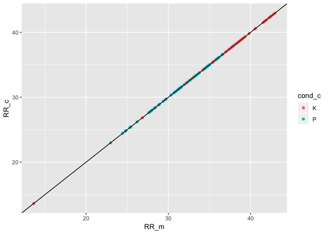
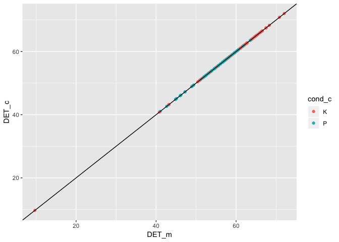
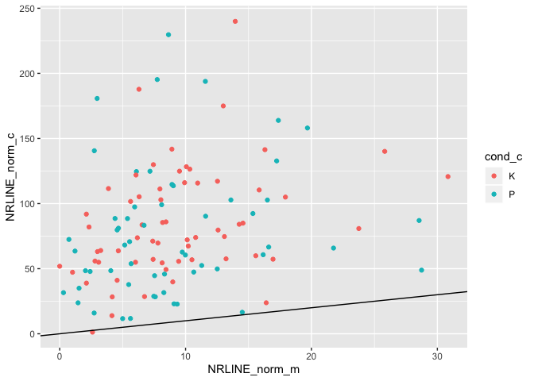
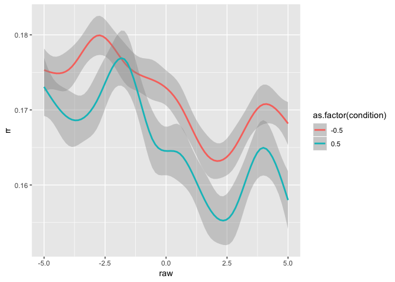

This R markdown provides the data preparation for our forthcoming manuscript.

To run this from scratch, you will need the following files:

* [This is where a description of the data setup goes]
* `./scripts/bc-libraries_and_functions.r`: Loads in necessary libraries and
creates new functions for our analyses.

**Code written by**: L. C. Mueller-Frommeyer (Technische Universitaet
Braunschweig) & A. Paxton (University of Connecticut)

**Date last modified**: 18 June 2019


***

# Preliminaries


```r
# clear everything
rm(list=ls())

# load libraries and add new functions
source('./scripts/bc-libraries_and_functions.r')
```

***

# Hypothesis 1

***

## Data preparation

***

### Recurrence quantification analysis: Monologues


```r
# read in all monologue files
mon_files = list.files('./data/LIWC-results/RQA/Monologues',
                       pattern = ".txt", full.names = TRUE)
mon_dfs = plyr::ldply(mon_files,
                      read.table, sep="\t", dec = ",", header=TRUE) #added decimal to get numbers instead of characters
```


```r
# prepare monologues for RQA
mon_dfs = mon_dfs %>%
  
  # separate 'Filename' column into separate columns
  tidyr::separate(Filename,
                  into = c("dyad_id", "dyad_position", "speaker_code"),
                  sep = '_',
                  remove = FALSE,
                  extra = "drop",
                  fill = "warn") %>%
  
  # extract speaker number ID and conversation type from variable
  mutate(cond = gsub("[[:digit:]]+","",dyad_id)) %>%
  
  # create new variable function_contrast with all 0 replaced by -1
  dplyr::rename(function_words = function.) %>%
  mutate(function_contrast = dplyr::if_else(function_words==0,
                                            -1,
                                            function_words)) %>%
  
  #add new variable specifying conversation type
  mutate(conv.type = "M")
```


```r
# split dataframe by monologue
split_mon = split(mon_dfs, list(mon_dfs$Filename))

# cycle through the individual monologues
rqa_mon = data.frame()
for (next_mon in split_mon){
  
  # run (auto-)recurrence
  rqa_for_mon = crqa(ts1=next_mon$function_words,
                     ts2=next_mon$function_contrast,
                     delay=1,
                     embed=1,
                     r=0.1,
                     normalize=0,
                     rescale=0,
                     mindiagline=2,
                     minvertline=2,
                     tw=1, # exclude line of identity
                     whiteline=FALSE,
                     recpt=FALSE)
  
  # save plot-level information to dataframe
  dyad_id = unique(next_mon$dyad_id)
  speaker_code = unique(next_mon$speaker_code)
  cond = NA   #changed it to NA as there was no condition in the monologue
  conv.type = unique(next_mon$conv.type)
  next_data_line = data.frame(dyad_id,  
                              speaker_code,
                              conv.type,
                              cond,
                              rqa_for_mon[1:9]) %>%
    mutate(NRLINE_norm = NRLINE / dim(next_mon)[1]) # normalize NRLINE by number of words
  rqa_mon = rbind.data.frame(rqa_mon,next_data_line)
  
  # # save the RPs -- including LOI/LOS for plotting (commenting for time/speed)
  # rqa_for_mon = crqa(ts1=next_mon$function_words,
  #                    ts2=next_mon$function_contrast,
  #                    delay=1,
  #                    embed=1,
  #                    r=0.1,
  #                    normalize=0,
  #                    rescale=0,
  #                    mindiagline=2,
  #                    minvertline=2,
  #                    tw=0, # include LOI/LOS
  #                    whiteline=FALSE,
  #                    recpt=FALSE)
  # png(filename = paste0('./figures/h1-rqa/rp-speaker_',speaker_code,'-monologue.png'))
  # plotRP(rqa_for_mon$RP,
  #        list(unit = 2, labelx = "Speaker A", labely = "Speaker A",
  #             cols = "black", pcex = .5))
  # dev.off()
}

# clean up what we don't need
rm(split_mon, next_mon, rqa_for_mon,
   dyad_id, speaker_code, cond, conv.type, next_data_line)
```

***

### Recurrrence quantification analysis: Conversations


```r
# read in all conversation files
conv_files = list.files('./data/LIWC-results/RQA/Conversations-1',
                        pattern = ".txt", full.names = TRUE)
conv_dfs = plyr::ldply(conv_files,
                       read.table, sep="\t", dec = ",", header=TRUE)
```


```r
# prepare conversations for RQA
conv_dfs = conv_dfs %>%
  
  # separate 'Filename' column into separate columns
  tidyr::separate(Filename,
                  into = c("dyad_id", "dyad_position", "speaker_code"),
                  sep = '_',
                  remove = FALSE,
                  extra = "drop",
                  fill = "warn") %>%
  
  # extract speaker number ID and conversation type from variable
  mutate(cond = gsub("[[:digit:]]+","",dyad_id)) %>%
  
  # create new variable function_contrast with all 0 replaced by -1
  dplyr::rename(function_words = function.) %>%
  mutate(function_contrast = dplyr::if_else(function_words==0,
                                            -1,
                                            function_words)) %>%
  
  # add new variable specifying conversation type
  mutate(conv.type = "C")
```


```r
# split dataframe by conversation
split_conv = split(conv_dfs, list(conv_dfs$Filename))

# cycle through the individual conversations
rqa_conv = data.frame()
for (next_conv in split_conv){
  
  # run recurrence
  rqa_for_conv = crqa(ts1=next_conv$function_words,
                      ts2=next_conv$function_contrast,
                      delay=1,
                      embed=1,
                      r=0.1,
                      normalize=0,
                      rescale=0,
                      mindiagline=2,
                      minvertline=2,
                      tw=1, # exclude line of identity
                      whiteline=FALSE,
                      recpt=FALSE)
  
  # save plot-level information to dataframe
  dyad_id = unique(next_conv$dyad_id)
  speaker_code = unique(next_conv$speaker_code)
  conv.type = unique(next_conv$conv.type)
  cond = unique(next_conv$cond)
  next_data_line = data.frame(dyad_id,  
                              speaker_code,
                              conv.type,
                              cond,
                              rqa_for_conv[1:9]) %>%
    mutate(NRLINE_norm = NRLINE / dim(next_conv)[1]) # normalize NRLINE by number of words
  rqa_conv = rbind.data.frame(rqa_conv,next_data_line)
  
  # # plot the RPs -- include LOI/LOS (removing for speed/time)
  # rqa_for_conv = crqa(ts1=next_conv$function_words,
  #                     ts2=next_conv$function_contrast,
  #                     delay=1,
  #                     embed=1,
  #                     r=0.1,
  #                     normalize=0,
  #                     rescale=0,
  #                     mindiagline=2,
  #                     minvertline=2,
  #                     tw=0, # retain LOI for plotting only
  #                     whiteline=FALSE,
  #                     recpt=FALSE)
  # png(filename = paste0('./figures/h1-rqa/rp-speaker_',speaker_code,'-conversation.png'))
  # plotRP(rqa_for_conv$RP,
  #        list(unit = 2, labelx = "Speaker A", labely = "Speaker A",
  #             cols = "black", pcex = .5))
  # dev.off()
}

# clean up what we don't need
rm(split_conv, next_conv, rqa_for_conv,
   dyad_id, speaker_code, conv.type, cond, next_data_line)
```

***

### Create dataframe for H1


```r
# bring together the monologue and conversation data
h1_data = rbind(rqa_mon, rqa_conv)

#save results to file
write.table(h1_data,'./data/h1_data.csv',sep=",")
```

***

## Data analysis

***

### Planned analysis

Here, we perform a linear mixed-effects model to analyze how conversation
type---whether a monologue (M) or conversation (C)---changes a person's
language style, specifically looking at their use of function words (often a
measure of syntactic complexity and structure).

We attempted to analyze the data using maximal random effects structures and
an uncorrelated random intercept within the random slope, but both models
failed to converge. As a result, we use only the random intercept in our model.


```r
# does linguistic style change based on the conversational context?
h1_analyses <- lmer(RR ~ conv.type + (1|speaker_code),
                    data = h1_data, REML = FALSE)
```


```
## Linear mixed model fit by maximum likelihood . t-tests use
##   Satterthwaite's method [lmerModLmerTest]
## Formula: RR ~ conv.type + (1 | speaker_code)
##    Data: h1_data
## 
##      AIC      BIC   logLik deviance df.resid 
##   1469.1   1483.0   -730.6   1461.1      232 
## 
## Scaled residuals: 
##     Min      1Q  Median      3Q     Max 
## -3.6500 -0.5747 -0.0145  0.6198  2.6340 
## 
## Random effects:
##  Groups       Name        Variance Std.Dev.
##  speaker_code (Intercept)  5.697   2.387   
##  Residual                 23.464   4.844   
## Number of obs: 236, groups:  speaker_code, 118
## 
## Fixed effects:
##             Estimate Std. Error       df t value             Pr(>|t|)    
## (Intercept)  29.3813     0.4971 227.3241  59.104 < 0.0000000000000002 ***
## conv.typeC    4.6582     0.6306 117.9998   7.387      0.0000000000234 ***
## ---
## Signif. codes:  0 '***' 0.001 '**' 0.01 '*' 0.05 '.' 0.1 ' ' 1
## 
## Correlation of Fixed Effects:
##            (Intr)
## conv.typeC -0.634
```


|     &nbsp;      | Estimate | Std..Error |  df   | t.value |   p    | p_adj  | sig |
|:---------------:|:--------:|:----------:|:-----:|:-------:|:------:|:------:|:---:|
| **(Intercept)** |  29.38   |   0.4971   | 227.3 |  59.1   | 0.0001 | 0.0001 | *** |
| **conv.typeC**  |  4.658   |   0.6306   |  118  |  7.387  | 0.0001 | 0.0001 | *** |

As predicted, we do see a difference in linguistic style between conversations
and monologues. Specifically, we find that conversations tend to have more
structure in their use of function words than monologues do.

Next, we'll do some post-hoc analyses to explore whether these changes depend
on the kind of conversation that participants have (i.e., personal
versus conflict).

***

### Post-hoc analyses: Data preparation

First, we'll need to prepare the data by converting it from long- to wide-form.


```r
# Preparing data for Post-hoc analyses - Bring data into wide format
rqa_mon_post = rqa_mon %>%
  dplyr::rename(conv.type_m = conv.type,
                RR_m = RR,
                DET_m = DET,
                NRLINE_m = NRLINE,
                maxL_m = maxL,
                L_m = L,
                ENTR_m = ENTR,
                rENTR_m = rENTR,
                LAM_m = LAM,
                TT_m = TT,
                NRLINE_norm_m = NRLINE_norm)
rqa_conv_post = rqa_conv  %>%
  dplyr::rename(conv.type_c = conv.type,
                cond_c = cond,
                RR_c = RR,
                DET_c = DET,
                NRLINE_c = NRLINE,
                maxL_c = maxL,
                L_c = L,
                ENTR_c = ENTR,
                rENTR_c = rENTR,
                LAM_c = LAM,
                TT_c = TT,
                NRLINE_norm_c = NRLINE_norm)

# Calculate difference scores
h1_post_hoc = full_join(rqa_mon_post, rqa_conv_post,
                        by=c("dyad_id", "speaker_code")) %>%
  mutate(Diff_RR = RR_m - RR_c,           # positive means higher RR in mon
         Diff_DET = DET_m - DET_c,        # positive means more DET in mon
         Diff_rENTR = rENTR_m - rENTR_c,  # positive means more line diversity in mon
         Diff_NRLINE_norm = NRLINE_norm_m - NRLINE_norm_c)

# clean up what we don't need
rm(rqa_mon_post, rqa_conv_post)
```

***

### Post-hoc analysis: Recurrence rate


```r
# do changes in linguistic style between monologues and dialogues differ by
# conversation type?
h1_analyses_post_RR = lm(Diff_RR ~ cond_c,
                         data = h1_post_hoc)
```


```
## 
## Call:
## lm(formula = Diff_RR ~ cond_c, data = h1_post_hoc)
## 
## Residuals:
##      Min       1Q   Median       3Q      Max 
## -23.1390  -4.1330   0.7717   4.3963  16.6707 
## 
## Coefficients:
##             Estimate Std. Error t value            Pr(>|t|)    
## (Intercept)  -7.2987     0.8021  -9.100 0.00000000000000304 ***
## cond_cP       5.5638     1.1643   4.779 0.00000521049786764 ***
## ---
## Signif. codes:  0 '***' 0.001 '**' 0.01 '*' 0.05 '.' 0.1 ' ' 1
## 
## Residual standard error: 6.315 on 116 degrees of freedom
## Multiple R-squared:  0.1645,	Adjusted R-squared:  0.1573 
## F-statistic: 22.84 on 1 and 116 DF,  p-value: 0.00000521
```


|     &nbsp;      | Estimate | Std..Error | t.value |   p    | p_adj  | sig |
|:---------------:|:--------:|:----------:|:-------:|:------:|:------:|:---:|
| **(Intercept)** |  -7.299  |   0.8021   |  -9.1   | 0.0001 | 0.0001 | *** |
|   **cond_cP**   |  5.564   |   1.164    |  4.779  | 0.0001 | 0.0001 | *** |

We do see that there are significant effects in the change in the overall
amount of recurrence (RR) by conversation: The change in language style from
monologues to conversation is significantly *greater* when having a friendly
conversation about personal topics (compared to having a conflict conversation
about political topics). In other words, people are *more likely* to change their
langauge style when having a friendly conversation as compared to an argument.

<!-- -->

***

### Post-hoc analysis: Determinism


```r
# do changes in structure of linguistic style between monologues and dialogues
# differ by conversation type?
h1_analyses_post_DET = lm(Diff_DET ~ cond_c,
                          data = h1_post_hoc)
```


```
## 
## Call:
## lm(formula = Diff_DET ~ cond_c, data = h1_post_hoc)
## 
## Residuals:
##     Min      1Q  Median      3Q     Max 
## -33.125  -7.437  -0.201   7.657  33.981 
## 
## Coefficients:
##             Estimate Std. Error t value         Pr(>|t|)    
## (Intercept)  -11.300      1.479  -7.640 0.00000000000705 ***
## cond_cP        4.236      2.138   1.982           0.0499 *  
## ---
## Signif. codes:  0 '***' 0.001 '**' 0.01 '*' 0.05 '.' 0.1 ' ' 1
## 
## Residual standard error: 11.55 on 115 degrees of freedom
##   (1 observation deleted due to missingness)
## Multiple R-squared:  0.03302,	Adjusted R-squared:  0.02461 
## F-statistic: 3.926 on 1 and 115 DF,  p-value: 0.04992
```


|     &nbsp;      | Estimate | Std..Error | t.value |   p    | p_adj  | sig |
|:---------------:|:--------:|:----------:|:-------:|:------:|:------:|:---:|
| **(Intercept)** |  -11.3   |   1.479    |  -7.64  | 0.0001 | 0.0001 | *** |
|   **cond_cP**   |  4.236   |   2.138    |  1.982  |  0.05  |  0.05  |  .  |

We also see that there are significant effects in the change in the determinism
(DET) by conversation---in other words, the structure in the patterns of
recurrence. Specifically, we see that the change in language style structure
from monologues to conversation is significantly *greater* when followed by a
friendly conversation (compared to a conflict conversation). In other words,
people are *more likely* to change the structure in their langauge style when
having a friendly conversation as compared to an argumentative one---consistent
with the results found in the post-hoc analysis of RR.


```
## Warning: Removed 1 rows containing missing values (geom_point).
```

<!-- -->

***

### Post-hoc analysis: Normalized entropy


```r
# do changes in uniformity of structure of linguistic style between monologues
# and dialogues differ by conversation type?
h1_analyses_post_rENTR = lm(Diff_rENTR ~ cond_c,
                            data = h1_post_hoc)
```


```
## 
## Call:
## lm(formula = Diff_rENTR ~ cond_c, data = h1_post_hoc)
## 
## Residuals:
##      Min       1Q   Median       3Q      Max 
## -0.30919 -0.08640 -0.01154  0.06985  0.60921 
## 
## Coefficients:
##             Estimate Std. Error t value Pr(>|t|)  
## (Intercept)  0.01842    0.01786   1.032    0.304  
## cond_cP      0.04657    0.02582   1.804    0.074 .
## ---
## Signif. codes:  0 '***' 0.001 '**' 0.01 '*' 0.05 '.' 0.1 ' ' 1
## 
## Residual standard error: 0.1383 on 113 degrees of freedom
##   (3 observations deleted due to missingness)
## Multiple R-squared:  0.02798,	Adjusted R-squared:  0.01938 
## F-statistic: 3.253 on 1 and 113 DF,  p-value: 0.07395
```


|     &nbsp;      | Estimate | Std..Error | t.value |   p   | p_adj | sig |
|:---------------:|:--------:|:----------:|:-------:|:-----:|:-----:|:---:|
| **(Intercept)** | 0.01842  |  0.01786   |  1.032  |  0.3  |  0.3  |     |
|   **cond_cP**   | 0.04657  |  0.02582   |  1.804  | 0.074 | 0.148 |     |

Unlike RR and DET, we do not see a difference in normalized entropy by
conversation type. Normalized entropy essentially captures the degree to which
the structure of the line lengths are uniform (i.e., lower variety in line
lengths means lower `rENTR`) or more heterogenous (i.e., higher variety in line
lengths means higher `rENTR`).


```
## Warning: Removed 3 rows containing missing values (geom_point).
```

<!-- -->

***

### Post-hoc analysis: Number of lines (normalized)


```r
# do changes in amount of structure of linguistic style between monologues and
# dialogues differ by conversation type?
h1_analyses_post_NRLINE = lm(Diff_NRLINE_norm ~ cond_c,
                             data = h1_post_hoc)
```


```
## 
## Call:
## lm(formula = Diff_NRLINE_norm ~ cond_c, data = h1_post_hoc)
## 
## Residuals:
##     Min      1Q  Median      3Q     Max 
## -152.12  -22.44   10.98   30.91   76.61 
## 
## Coefficients:
##             Estimate Std. Error t value            Pr(>|t|)    
## (Intercept)  -75.269      5.767 -13.053 <0.0000000000000002 ***
## cond_cP        6.337      8.371   0.757               0.451    
## ---
## Signif. codes:  0 '***' 0.001 '**' 0.01 '*' 0.05 '.' 0.1 ' ' 1
## 
## Residual standard error: 45.41 on 116 degrees of freedom
## Multiple R-squared:  0.004917,	Adjusted R-squared:  -0.003661 
## F-statistic: 0.5732 on 1 and 116 DF,  p-value: 0.4505
```


|     &nbsp;      | Estimate | Std..Error | t.value |   p    | p_adj  | sig |
|:---------------:|:--------:|:----------:|:-------:|:------:|:------:|:---:|
| **(Intercept)** |  -75.27  |   5.767    | -13.05  | 0.0001 | 0.0001 | *** |
|   **cond_cP**   |  6.337   |   8.371    | 0.7571  |  0.45  |  0.45  |     |

<!-- -->

***

# Hypothesis 2

***

## Data preparation

***

### Data cleaning: Speaker A


```r
# get list of Conversation files for Speaker A
A_files = list.files('./data/LIWC-results/cRQA/SpeakerA',
                     pattern = ".txt", full.names = TRUE)
A_dfs = plyr::ldply(A_files,
                    read.table, sep="\t", dec = ",", header=TRUE) #added decimal to get numbers instead of characters
```


```r
# prepare conversations Speaker A for CRQA
A_dfs = A_dfs %>% ungroup() %>%
  
  # separate 'Filename' column into separate columns
  tidyr::separate(Filename,
                  into = c("dyad_id", "dyad_position",  "speaker_code", "cond", "conver"),
                  sep = '_',
                  remove = FALSE,
                  extra = "drop",
                  fill = "warn") %>%
  
  # extract conversation number from variable conver
  mutate(conv.no = gsub(".txt","",conver)) %>%
  
  # rename function. to function_words
  dplyr::rename(function_words = function.) %>%
  
  # group by participant to cut quantiles
  group_by(Filename) %>%
  
  # recode quartiles
  mutate(fw_quantiles = as.numeric(
    gtools::quantcut(function_words,
                     q=4,
                     na.rm = TRUE))
  ) %>% ungroup()  %>%
  
  # recode anytime there is 0 function word use
  mutate(fw_quantiles = dplyr::if_else(function_words==0,
                                       0,
                                       fw_quantiles)) %>%
  
  # specify these data are real
  mutate(data_type = 'real') %>%
  
  # rename to specify speaker A contributions
  dplyr::rename(function_words_A = function_words,
                fw_quantiles_A = fw_quantiles,
                speaker_A = speaker_code,
                wc_A = WC) %>%
  dplyr::select(dyad_id, speaker_A, Segment, cond,
                function_words_A, fw_quantiles_A, wc_A, conv.no, data_type)
```

```
## Warning: Expected 5 pieces. Missing pieces filled with `NA` in 56 rows
## [3226, 3227, 3228, 3229, 3230, 3231, 3232, 3233, 3234, 3235, 3236, 3237,
## 3238, 3239, 3240, 3241, 3242, 3243, 3244, 3245, ...].
```

***

### Data cleaning: Speaker B


```r
# get list of Conversation files for Speaker B
B_files = list.files('./data/LIWC-results/cRQA/SpeakerB',
                     pattern = ".txt", full.names = TRUE)
B_dfs = plyr::ldply(B_files,
                    read.table, sep="\t", dec = ",", header=TRUE) #added decimal to get numbers instead of characters
```


```r
# prepare conversations Speaker B for CRQA
B_dfs = B_dfs %>% ungroup() %>%
  
  # separate 'Filename' column into separate columns
  tidyr::separate(Filename,
                  into = c("dyad_id", "dyad_position",  "speaker_code", "cond", "conver"),
                  sep = '_',
                  remove = FALSE,
                  extra = "drop",
                  fill = "warn") %>%
  
  # extract conversation number from variable conver
  mutate(conv.no = gsub(".txt","",conver)) %>%
  
  # rename function. to function_words
  dplyr::rename(function_words = function.) %>%
  
  # group by participant to cut quantiles
  group_by(Filename) %>%
  
  # recode quartiles
  mutate(fw_quantiles = as.numeric(
    gtools::quantcut(function_words,
                     q=4,
                     na.rm = TRUE))
  ) %>% ungroup() %>%
  
  # recode anytime there is 0 function word use
  mutate(fw_quantiles = dplyr::if_else(function_words==0,
                                       -1,
                                       fw_quantiles)) %>%
  
  # specify these data are real
  mutate(data_type = 'real') %>%
  
  # rename to specify speaker A contributions
  dplyr::rename(function_words_B = function_words,
                fw_quantiles_B = fw_quantiles,
                speaker_B = speaker_code,
                wc_B = WC) %>%
  dplyr::select(dyad_id, speaker_B, Segment, cond,
                function_words_B, fw_quantiles_B, wc_B, conv.no, data_type)
```

```
## Warning: Expected 5 pieces. Missing pieces filled with `NA` in 124 rows
## [951, 952, 953, 954, 955, 956, 957, 958, 959, 960, 961, 962, 963, 964, 965,
## 966, 967, 968, 969, 970, ...].
```

***

### Create dataframe for H2

Before we run CRQA, we must first combine the Speaker A and Speaker B
dataframes. This requires truncating the data so that both speakers have the
same number of turns in each conversation and converting from longform data
(i.e., creating columns for speaker identifier [A vs. B], function words, and
turn) to wideform data (i.e., creating columns for Speaker A function words,
Speaker B function words, and turn).


```r
# merge Speaker A and Speaker B together
h2_data = full_join(A_dfs, B_dfs,
                    by = c("dyad_id", "Segment", "cond", "data_type", "conv.no")) %>%
  
  # because any missing values are filled with `NA`,
  # we can truncate turns simply by dropping `NA`
  tidyr::drop_na()
```


***

## Creation of baselines

***

### CRQA: Partner-wise shuffled baseline

This form of surrogate time series estimating overall RR (or %REC) that might
be expected by chance. Due to how time-intensive this process is, we keep this
as `eval=FALSE` and read in a CSV of the file.


```r
# specify real partners
partner_wise_baseline = h2_data %>%
  
  # choose only conversation 1 and variables that we need
  dplyr::filter(conv.no == 1) %>%
  select(dyad_id, speaker_A, speaker_B, cond) %>%
  distinct() %>%
  dplyr::rename(dyad_id_real = dyad_id,
                speaker_B_real = speaker_B)

# cycle through for 5 baselines
for (runs in c(1:5)){
  
  # generate a potential paired set value
  temp_df = partner_wise_baseline %>% ungroup() %>%
    group_by(cond) %>%
    mutate(!!paste0("speaker_B_run", runs) := gtools::permute(speaker_B_real)) %>%
    ungroup()
  
  # keep resampling if we get any overlap from the real data or other pairs
  while (length(unique(apply(temp_df,1,function(x) sum(!duplicated(x))))) != 1) {
    temp_df = partner_wise_baseline %>% ungroup() %>%
      group_by(cond) %>%
      mutate(!!paste0("speaker_B_run", runs) := gtools::permute(speaker_B_real)) %>%
      ungroup()
  }
  
  # save the final option
  partner_wise_baseline = temp_df
}

# convert to wideform
partner_wise_baseline = partner_wise_baseline %>%
  tidyr::gather(key = "shuffle_run",
                value = "fake_speaker_B",
                -speaker_A,
                -dyad_id_real,
                -cond) %>%
  
  mutate(shuffle_run = gsub("speaker_B_","",shuffle_run)) %>%
  dplyr::filter(shuffle_run != "real")

# save results to file
write.table(partner_wise_baseline,
            './scripts/partner_wise_baseline-partner_IDs.csv', sep=",")

# clean up what we don't need
rm(runs, temp_df)
```


```r
# read in the shuffled pairings that we've already created
partner_wise_baseline = read.csv('./scripts/partner_wise_baseline-partner_IDs.csv',
                                 header = TRUE, sep=",")
```

***

### DRP: Sample-wise shuffled baseline

This form of surrogate time series will be used for the DRPs, but it is not
suitable for estimating overall RR (or %REC) that might be expected by chance.
This is because the individual points are retained, meaning that the overall
amount of recurrence will stay the same, although the exact structure of the
recurrence (e.g., DRPs, mean line length, percent determinism) will be altered.


```r
# split all dyads by dyad ID
split_h2 = split(h2_data, list(h2_data$dyad_id, h2_data$conv.no))
sample_wise_baseline = data.frame()
for (next_conv in split_h2){
  
  # only progress if we have data for this conversation type and dyad
  if (dim(next_conv)[1] > 1){
    
    # permute 5 times for baseline
    permuted_df = data.frame()
    for (run in c(1:5)){
      next_shuffle = next_conv %>%
        
        # shuffle each person's linguistic contributions
        group_by(dyad_id) %>%
        mutate(sur_fw_quantiles_A = gtools::permute(fw_quantiles_A)) %>%
        mutate(sur_fw_quantiles_B = gtools::permute(fw_quantiles_B)) %>%
        ungroup() %>%
        
        # drop unneeded variables
        select(-fw_quantiles_A, -fw_quantiles_B,
               -contains('wc_'), -contains('function_words')) %>%
        
        # add a marker for what run we're on and datatype
        mutate(run = run) %>%
        mutate(data_type = 'surrogate')
      
      # add it to our dataframe
      permuted_df = rbind.data.frame(permuted_df, next_shuffle)
    }
    
    # bind the next surrogate's data to the dataframe
    sample_wise_baseline = rbind.data.frame(sample_wise_baseline, permuted_df)}
}

# clean up what we don't need
rm(next_conv, next_shuffle, permuted_df)
```

***

## Cross-recurrence quantification analysis and diagonal recurrence profiles

***

### CRQA: Real data


```r
# split dataframe by dyad ID
split_conv = split(h2_data, list(h2_data$dyad_id,
                                 h2_data$conv.no))

# cycle through the individual conversations
crqa_real = data.frame()
for (next_conv in split_conv){
  
  # only proceed if we have data for this conversation
  if (dim(next_conv)[1]>1){
    
    # run cross-recurrence
    crqa_for_conv = crqa(ts1=next_conv$fw_quantiles_A,
                         ts2=next_conv$fw_quantiles_B,
                         delay=1,
                         embed=1,
                         r=0.1,
                         normalize=0,
                         rescale=0,
                         mindiagline=2,
                         minvertline=2,
                         tw=0,
                         whiteline=FALSE,
                         recpt=FALSE)
    
    # save plot-level information to dataframe
    dyad_id = unique(next_conv$dyad_id)
    speaker_A = unique(next_conv$speaker_A)
    speaker_B = unique(next_conv$speaker_B)
    cond = unique(next_conv$cond)
    conv.no = unique(next_conv$conv.no)
    next_data_line = data.frame(dyad_id,
                                speaker_A,
                                speaker_B,
                                cond,
                                conv.no,
                                crqa_for_conv[1:9]) %>%
      mutate(NRLINE_norm = NRLINE / dim(next_conv)[1]) # normalize NRLINE by number of turns
    crqa_real = rbind.data.frame(crqa_real,next_data_line)
    
    # plot the CRPs
    png(filename = paste0('./figures/h2-crqa/crp-dyad_',dyad_id,'-cond_',cond,'.png'))
    plotRP(crqa_for_conv$RP,
           list(unit = 2, labelx = "Speaker A", labely = "Speaker B",
                cols = "black", pcex = .5))
    dev.off()
    
  }
}

# clean up what we don't need
rm(next_conv, crqa_for_conv,
   dyad_id, speaker_A, speaker_B, cond, conv.no, next_data_line)
```

***

### CRQA: Partner-wise shuffled baseline


```r
# CRQA for partner-wise baseline
crqa_partner_shuffle = data.frame()

# cycle through all the pseudopartners
for (fake_dyad in 1:nrow(partner_wise_baseline)) {
  for (next_conv in 1:max(h2_data$conv.no)) {
    
    #double-check the no. of pairings
    
    # get next Speaker A data
    temp_A = h2_data %>% ungroup() %>%
      dplyr::filter(speaker_A==partner_wise_baseline$speaker_A[fake_dyad], conv.no == next_conv) %>%
      select(speaker_A, cond, fw_quantiles_A, Segment, conv.no)
    
    # get only the data we need for Fake Partner B
    temp_B = h2_data %>% ungroup() %>%
      dplyr::filter(speaker_B==partner_wise_baseline$fake_speaker_B[fake_dyad]) %>%
      select(speaker_B, cond, fw_quantiles_B, Segment, conv.no)
    
    # join them together to make sure only compare equal turns
    temp_data=full_join(temp_A, temp_B,
                        by = c("cond", "Segment", "conv.no")) %>%
      tidyr::drop_na()
    
    # run CRQA only for a minimum of 10 observations
    if(nrow(temp_data)>9){
      
      crqa_for_sur = crqa(ts1=temp_data$fw_quantiles_A,
                          ts2=temp_data$fw_quantiles_B,
                          delay=1,
                          embed=1,
                          r=0.1,
                          normalize=0,
                          rescale=0,
                          mindiagline=2,
                          minvertline=2,
                          tw=0,
                          whiteline=FALSE,
                          recpt=FALSE)
      
      # save plot-level information to dataframe
      speaker_A = unique(temp_data$speaker_A)
      speaker_B = unique(temp_data$speaker_B)
      cond = unique(temp_data$cond)
      conv.no = unique(temp_data$conv.no)
      next_data_line = data.frame(speaker_A,
                                  speaker_B,
                                  cond,
                                  conv.no,
                                  crqa_for_sur[1:9]) %>%
        mutate(NRLINE_norm = NRLINE / dim(temp_data)[1]) # normalize NRLINE by number of turns
      crqa_partner_shuffle = rbind.data.frame(crqa_partner_shuffle,next_data_line)
    }
  }
}

# clean up what we don't need
rm(fake_dyad, next_conv,
   temp_A, temp_B, temp_data, crqa_for_sur,
   speaker_A, speaker_B, cond, conv.no, next_data_line)
```

***

### DRP: Real data

Because of the chosen window size, we drop all pairs who did not have at
least 9 turns per participant.


```r
# split dataframe by dyad ID
split_h2 = split(h2_data,
                 list(h2_data$dyad_id, h2_data$conv.no))

# cycle through all dyads
drp_real = data.frame()
for (next_conv in split_h2) {
  
  # only proceed if we have data for this conversation
  if (dim(next_conv)[1]>9){
    
    # calculate diagonal recurrence profile using categorical recurrence
    drp_for_conv = drpdfromts(next_conv$fw_quantiles_A,
                              next_conv$fw_quantiles_B,
                              ws = wsz,
                              datatype="categorical")
    
    # save plot-level information to dataframe
    dyad_id = unique(next_conv$dyad_id)
    cond = unique(next_conv$cond)
    data_type = unique(next_conv$data_type)
    conv.no = unique(next_conv$conv.no)
    drps = data.frame(raw = timeVals$raw,
                      ot1 = timeVals$ot1,
                      ot2  = timeVals$ot2,
                      rr = drp_for_conv$profile) %>%
      mutate(dyad_id = dyad_id,
             cond = cond,
             conv.no = conv.no,
             data_type = data_type)
    
    # get the mean RR for the left side of the plot
    mean_left_rr = drps %>%
      dplyr::filter(raw < 0) %>%
      summarize(mean_rr = mean(rr)) %>%
      .$mean_rr
    
    # get the mean RR for the right side of the plot
    mean_right_rr = drps %>%
      dplyr::filter(raw > 0) %>%
      summarize(mean_rr = mean(rr)) %>%
      .$mean_rr
    
    # flip arrangement if leader is not on left
    if (mean_left_rr < mean_right_rr) {
      drps = drps %>%
        mutate(rr = rev(rr))
    }
    
    # append to dataframe
    drp_real = rbind.data.frame(drp_real, drps)
    
  }
}
```

***

### DRP: Sample-wise shuffled baseline


```r
# cycle through all the dyads
dyad_list = unique(sample_wise_baseline$dyad_id)
drp_sample_shuffle = data.frame()
for (next_dyad in dyad_list){
  for (next_conv in 1:max(h2_data$conv.no)) {
    
    # get the next participant's data
    next_dyad_df = sample_wise_baseline %>%
      dplyr::filter(dyad_id == next_dyad, conv.no == next_conv)
    if (dim(next_dyad_df)[1] > 0){
      
      # cycle through all sample-wise shuffle runs
      for (run in 1:max(next_dyad_df$run)) {
        
        # get next Speaker A data
        temp_AB = next_dyad_df %>% ungroup() %>%
          dplyr::filter(run == run) %>%
          select(speaker_A, speaker_B, cond,
                 sur_fw_quantiles_A, sur_fw_quantiles_B, run, conv.no)
        
        # run DRP if we have enough talk-turns
        if (dim(temp_AB)[1]>9){
          
          # calculate diagonal recurrence profile using categorical recurrence
          drp_for_sample = drpdfromts(ts1 = temp_AB$sur_fw_quantiles_A,
                                      ts2 = temp_AB$sur_fw_quantiles_B,
                                      ws = wsz,
                                      datatype = "categorical")
          
          # save plot-level information to dataframe
          cond = unique(temp_AB$cond)
          next_data = data.frame(raw = timeVals$raw,
                                 ot1 = timeVals$ot1,
                                 ot2  = timeVals$ot2,
                                 rr = drp_for_sample$profile) %>%
            mutate(cond = cond,
                   run = run,
                   conv.no = next_conv,
                   dyad_id = next_dyad)
          
          # get the mean RR for the left side of the plot
          mean_left_rr = next_data %>%
            dplyr::filter(raw < 0) %>%
            summarize(mean_rr = mean(rr)) %>%
            .$mean_rr
          
          # get the mean RR for the right side of the plot
          mean_right_rr = next_data %>%
            dplyr::filter(raw > 0) %>%
            summarize(mean_rr = mean(rr)) %>%
            .$mean_rr
          
          # flip arrangement if leader is not on left
          if (mean_left_rr < mean_right_rr) {
            next_data = next_data %>%
              mutate(rr = rev(rr))
          }
          
          # save to overall dataframe
          drp_sample_shuffle = rbind.data.frame(drp_sample_shuffle, next_data)
        }}
    }
  }
}
```

***

## Data analysis

***

### Data preparation: CRQA models

We'll need to do some recoding of variables before running the models using
CRQA metrics.


```r
# prepare real data dataframe
crqa_real = crqa_real %>% ungroup() %>%
  
  # recode "condition" values to be -.5 and +.5
  dplyr::rename(condition = cond) %>%
  mutate(condition = dplyr::if_else(condition=="P",
                                    -.5,      # personal = -.5
                                    .5)) %>%  # conflict = .5
  
  # convert variables to factor
  mutate(condition = as.factor(condition),
         dyad_id = as.factor(dyad_id),
         conv.no = as.factor(conv.no),
         data = "real")

# prepare baseline dataframe
crqa_partner_shuffle = crqa_partner_shuffle %>% ungroup() %>%
  
  # recode "condition" values to be -.5 and +.5
  dplyr::rename(condition = cond) %>%
  mutate(condition = dplyr::if_else(condition=="P",
                                    -.5,      # personal = -.5
                                    .5)) %>%  # conflict = .5
  
  # convert variables to factor
  mutate(condition = as.factor(condition),
         dyad_id = paste0(speaker_A, '_', speaker_B),
         conv.no = as.factor(conv.no))
```

***

### Data preparation: DRP models

We'll also need prepare for the models using diagonal recurrence profiles.


```r
# prepare real data dataframe
drp_real = drp_real %>% ungroup() %>%
  
  # recode "condition" values to be -.5 and +.5
  dplyr::rename(condition = cond) %>%
  mutate(condition = dplyr::if_else(condition=="P",
                                    -.5,      # personal = -.5
                                    .5)) %>%  # conflict = .5
  
  # convert variables to factor
  mutate(condition = as.factor(condition),
         dyad_id = as.factor(dyad_id),
         conv.no = as.factor(conv.no))
```


```r
# prepare sample-wise baseline dataframe
drp_sample_shuffle = drp_sample_shuffle %>% ungroup() %>%
  
  # recode "condition" values to be -.5 and +.5
  dplyr::rename(condition = cond) %>%
  mutate(condition = dplyr::if_else(condition=="P",
                                    -.5,      # personal = -.5
                                    .5)) %>%  # conflict = .5
  
  # convert variables to factor
  mutate(condition = as.factor(condition),
         dyad_id = as.factor(dyad_id),
         conv.no = as.factor(conv.no))
```

***

### CRQA: Analyses of system-level dynamics

First, do we see differences in the overall amount of recurrence in the plot
based on conversational context (when accounting for conversation number)?


```r
# does linguistic style matching change based on the conversational context?
h2_analyses_rr <- lm(RR ~ condition + conv.no,
                     data = crqa_real)
```


```
## 
## Call:
## lm(formula = RR ~ condition + conv.no, data = crqa_real)
## 
## Residuals:
##     Min      1Q  Median      3Q     Max 
## -7.5758 -1.4323  0.7145  1.6119  4.2871 
## 
## Coefficients:
##              Estimate Std. Error t value Pr(>|t|)    
## (Intercept)   17.4488     0.3361  51.915   <2e-16 ***
## condition0.5  -0.6013     0.3755  -1.601    0.112    
## conv.no2      -0.5296     0.3755  -1.410    0.161    
## ---
## Signif. codes:  0 '***' 0.001 '**' 0.01 '*' 0.05 '.' 0.1 ' ' 1
## 
## Residual standard error: 2.2 on 136 degrees of freedom
## Multiple R-squared:  0.02936,	Adjusted R-squared:  0.01509 
## F-statistic: 2.057 on 2 and 136 DF,  p-value: 0.1318
```


|      &nbsp;      | Estimate | Std..Error | t.value |   p    | p_adj  | sig |
|:----------------:|:--------:|:----------:|:-------:|:------:|:------:|:---:|
| **(Intercept)**  |  17.45   |   0.3361   |  51.92  | 0.0001 | 0.0001 | *** |
| **condition0.5** | -0.6013  |   0.3755   | -1.601  | 0.112  | 0.161  |     |
|   **conv.no2**   | -0.5296  |   0.3755   |  -1.41  | 0.161  | 0.161  |     |

We don't see a difference by overall amounts of recurrence, but what about
differences in the structure of the recurrence? From looking at the
cross-recurrence plots, there are vastly different visual "textures" by
conversation. To quantify these differences, let's look at three metrics:
the number of lines on the plot (`NRLINE`), normalized entropy (`rENTR`,
which accounts for the number of lines in the plot), and percent determinism
(`DET`, which accounts for the structure of the points in the plot).


```r
# does the structure of language style matching change by context?
h2_analyses_nrline <- lm(NRLINE ~ condition + conv.no,
                         data = crqa_real)
```


```
## 
## Call:
## lm(formula = NRLINE ~ condition + conv.no, data = crqa_real)
## 
## Residuals:
##     Min      1Q  Median      3Q     Max 
## -186.22  -67.07  -27.14   28.43  793.78 
## 
## Coefficients:
##              Estimate Std. Error t value             Pr(>|t|)    
## (Intercept)    194.22      19.45   9.984 < 0.0000000000000002 ***
## condition0.5  -115.08      21.74  -5.294          0.000000467 ***
## conv.no2       -47.21      21.74  -2.172               0.0316 *  
## ---
## Signif. codes:  0 '***' 0.001 '**' 0.01 '*' 0.05 '.' 0.1 ' ' 1
## 
## Residual standard error: 127.4 on 136 degrees of freedom
## Multiple R-squared:  0.1838,	Adjusted R-squared:  0.1718 
## F-statistic: 15.32 on 2 and 136 DF,  p-value: 0.000001003
```


|      &nbsp;      | Estimate | Std..Error | t.value |   p    | p_adj  | sig |
|:----------------:|:--------:|:----------:|:-------:|:------:|:------:|:---:|
| **(Intercept)**  |  194.2   |   19.45    |  9.984  | 0.0001 | 0.0001 | *** |
| **condition0.5** |  -115.1  |   21.74    | -5.294  | 0.0001 | 0.0001 | *** |
|   **conv.no2**   |  -47.21  |   21.74    | -2.172  | 0.032  | 0.032  |  *  |


```r
# does the heterogeneity of structure of LSM change by context?
h2_analyses_entropy <- lm(rENTR ~ condition + conv.no,
                          data = crqa_real)
```


```
## 
## Call:
## lm(formula = rENTR ~ condition + conv.no, data = crqa_real)
## 
## Residuals:
##      Min       1Q   Median       3Q      Max 
## -0.31350 -0.08754 -0.02931  0.06817  0.40261 
## 
## Coefficients:
##              Estimate Std. Error t value             Pr(>|t|)    
## (Intercept)   0.44979    0.02045  22.000 < 0.0000000000000002 ***
## condition0.5  0.08069    0.02359   3.421             0.000846 ***
## conv.no2      0.02604    0.02350   1.108             0.270062    
## ---
## Signif. codes:  0 '***' 0.001 '**' 0.01 '*' 0.05 '.' 0.1 ' ' 1
## 
## Residual standard error: 0.1315 on 124 degrees of freedom
##   (12 observations deleted due to missingness)
## Multiple R-squared:  0.08956,	Adjusted R-squared:  0.07488 
## F-statistic: 6.099 on 2 and 124 DF,  p-value: 0.002975
```


|      &nbsp;      | Estimate | Std..Error | t.value |   p    | p_adj  | sig |
|:----------------:|:--------:|:----------:|:-------:|:------:|:------:|:---:|
| **(Intercept)**  |  0.4498  |  0.02045   |   22    | 0.0001 | 0.0001 | *** |
| **condition0.5** | 0.08069  |  0.02359   |  3.421  | 0.001  | 0.001  | **  |
|   **conv.no2**   | 0.02604  |   0.0235   |  1.108  |  0.27  |  0.27  |     |


```r
# does the proportion of recurrent structures in LSM change by context?
h2_analyses_det <- lm(DET ~ condition + conv.no,
                      data = crqa_real)
```


```
## 
## Call:
## lm(formula = DET ~ condition + conv.no, data = crqa_real)
## 
## Residuals:
##      Min       1Q   Median       3Q      Max 
## -19.9545  -2.9406   0.4042   3.6430  13.0856 
## 
## Coefficients:
##              Estimate Std. Error t value            Pr(>|t|)    
## (Intercept)   31.0406     0.8782  35.348 <0.0000000000000002 ***
## condition0.5  -0.5618     0.9860  -0.570               0.570    
## conv.no2      -0.5242     0.9856  -0.532               0.596    
## ---
## Signif. codes:  0 '***' 0.001 '**' 0.01 '*' 0.05 '.' 0.1 ' ' 1
## 
## Residual standard error: 5.732 on 134 degrees of freedom
##   (2 observations deleted due to missingness)
## Multiple R-squared:  0.004074,	Adjusted R-squared:  -0.01079 
## F-statistic: 0.274 on 2 and 134 DF,  p-value: 0.7607
```


|      &nbsp;      | Estimate | Std..Error | t.value |   p    | p_adj  | sig |
|:----------------:|:--------:|:----------:|:-------:|:------:|:------:|:---:|
| **(Intercept)**  |  31.04   |   0.8782   |  35.35  | 0.0001 | 0.0001 | *** |
| **condition0.5** | -0.5618  |   0.986    | -0.5697 |  0.57  |  0.6   |     |
|   **conv.no2**   | -0.5242  |   0.9856   | -0.5319 |  0.6   |  0.6   |     |

***

### DRP: Analyses of moment-to-moment dynamics

We now create a linear mixed-effects model to gauge how linear lag (`ot1`) and
quadratic lag (`ot2`) interact with condition (`condition`) to influence
Language Style Matching (`rr`).


```r
# maximal random-effects model
H2_drp = lmer(rr ~ conv.no + condition * ot1 * ot2 + (1 | dyad_id),
              data=drp_real, REML=FALSE)
```


```
## Linear mixed model fit by maximum likelihood . t-tests use
##   Satterthwaite's method [lmerModLmerTest]
## Formula: rr ~ conv.no + condition * ot1 * ot2 + (1 | dyad_id)
##    Data: drp_real
## 
##      AIC      BIC   logLik deviance df.resid 
##  -4322.5  -4264.1   2172.2  -4344.5     1485 
## 
## Scaled residuals: 
##     Min      1Q  Median      3Q     Max 
## -3.3450 -0.6385 -0.0522  0.5613  4.6340 
## 
## Random effects:
##  Groups   Name        Variance  Std.Dev.
##  dyad_id  (Intercept) 0.0002961 0.01721 
##  Residual             0.0030440 0.05517 
## Number of obs: 1496, groups:  dyad_id, 71
## 
## Fixed effects:
##                         Estimate  Std. Error          df t value
## (Intercept)             0.173939    0.003306  203.352625  52.618
## conv.no2               -0.006990    0.002903 1466.604475  -2.408
## condition0.5           -0.004114    0.002934 1482.636202  -1.402
## ot1                    -0.050609    0.009451 1425.930939  -5.355
## ot2                    -0.005069    0.006548 1425.930939  -0.774
## condition0.5:ot1       -0.001595    0.013671 1425.930939  -0.117
## condition0.5:ot2        0.009638    0.009471 1425.930939   1.018
## ot1:ot2                 0.063195    0.025593 1425.930939   2.469
## condition0.5:ot1:ot2   -0.042637    0.037020 1425.930939  -1.152
##                                  Pr(>|t|)    
## (Intercept)          < 0.0000000000000002 ***
## conv.no2                           0.0162 *  
## condition0.5                       0.1611    
## ot1                          0.0000000997 ***
## ot2                                0.4390    
## condition0.5:ot1                   0.9071    
## condition0.5:ot2                   0.3090    
## ot1:ot2                            0.0137 *  
## condition0.5:ot1:ot2               0.2496    
## ---
## Signif. codes:  0 '***' 0.001 '**' 0.01 '*' 0.05 '.' 0.1 ' ' 1
## 
## Correlation of Fixed Effects:
##             (Intr) cnv.n2 cnd0.5 ot1    ot2    cn0.5:1 c0.5:2 ot1:t2
## conv.no2    -0.503                                                  
## conditin0.5 -0.470  0.106                                           
## ot1          0.000  0.000  0.000                                    
## ot2          0.000  0.000  0.000  0.000                             
## cndtn0.5:t1  0.000  0.000  0.000 -0.691  0.000                      
## cndtn0.5:t2  0.000  0.000  0.000  0.000 -0.691  0.000               
## ot1:ot2      0.000  0.000  0.000 -0.721  0.000  0.499   0.000       
## cndt0.5:1:2  0.000  0.000  0.000  0.499  0.000 -0.721   0.000 -0.691
```


|          &nbsp;          | Estimate  | Std..Error |  df   | t.value |   p    | p_adj  | sig |
|:------------------------:|:---------:|:----------:|:-----:|:-------:|:------:|:------:|:---:|
|     **(Intercept)**      |  0.1739   |  0.003306  | 203.4 |  52.62  | 0.0001 | 0.0001 | *** |
|       **conv.no2**       | -0.00699  |  0.002903  | 1467  | -2.408  | 0.016  | 0.036  |  *  |
|     **condition0.5**     | -0.004114 |  0.002934  | 1483  | -1.402  | 0.161  |  0.29  |     |
|         **ot1**          | -0.05061  |  0.009451  | 1426  | -5.355  | 0.0001 | 0.0001 | *** |
|         **ot2**          | -0.005069 |  0.006548  | 1426  | -0.7742 |  0.44  |  0.49  |     |
|   **condition0.5:ot1**   | -0.001595 |  0.01367   | 1426  | -0.1167 |  0.91  |  0.91  |     |
|   **condition0.5:ot2**   | 0.009638  |  0.009471  | 1426  |  1.018  |  0.31  |  0.4   |     |
|       **ot1:ot2**        |  0.06319  |  0.02559   | 1426  |  2.469  | 0.014  | 0.036  |  *  |
| **condition0.5:ot1:ot2** | -0.04264  |  0.03702   | 1426  | -1.152  |  0.25  |  0.37  |     |


```
## `geom_smooth()` using method = 'loess' and formula 'y ~ x'
```


```r
# maximal random-effects model
H2_drp_baseline = lmer(
  rr ~ conv.no + condition * ot1 * ot2 +
    (1 | dyad_id),
  data=drp_sample_shuffle, REML=FALSE
)

## AP: Getting `lengths differ` error for `dyad_id`
```


```
## `geom_smooth()` using method = 'gam' and formula 'y ~ s(x, bs = "cs")'
```

<!-- -->
