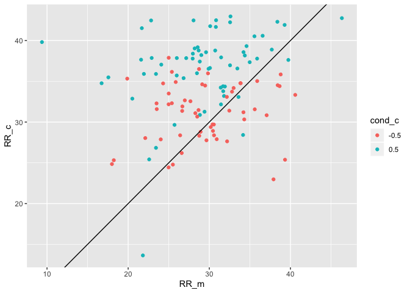
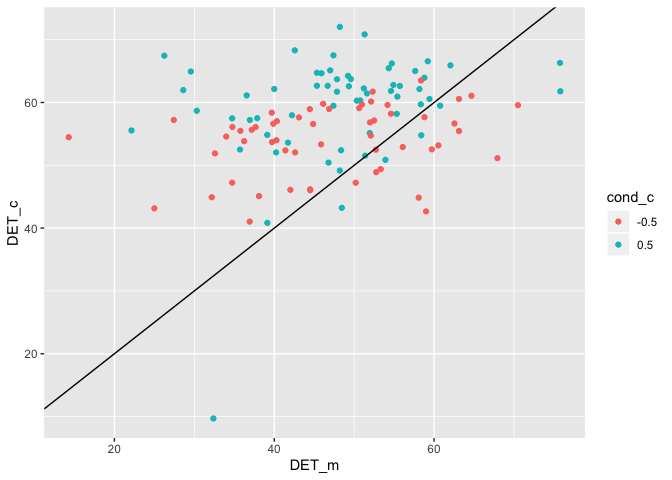
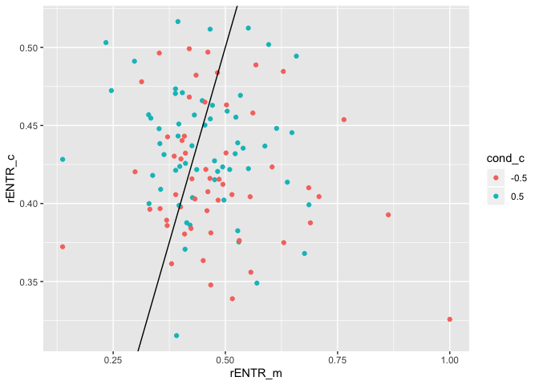
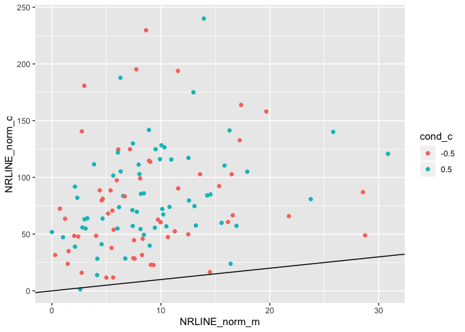

This R markdown provides the data preparation for our forthcoming manuscript.

To run this from scratch, you will need the following files:

* [This is where a description of the data setup goes]
* `./scripts/bc-libraries_and_functions.r`: Loads in necessary libraries and
creates new functions for our analyses.

**Code written by**: L. C. Mueller-Frommeyer (Technische Universitaet
Braunschweig) & A. Paxton (University of Connecticut)

**Date last modified**: 29 June 2019


***

# Preliminaries


```r
# clear everything
rm(list=ls())

# load libraries and add new functions
source('./scripts/bc-libraries_and_functions.r')
```

***

# Data preparation

***

## Recurrence quantification analysis: Monologues


```r
# read in all monologue files
mon_files = list.files('./data/LIWC-results/RQA/Monologues',
                       pattern = ".txt", full.names = TRUE)
mon_dfs = plyr::ldply(mon_files,
                      read.table, sep="\t", dec = ",", header=TRUE) #added decimal to get numbers instead of characters
```


```r
# prepare monologues for RQA
mon_dfs = mon_dfs %>%
  
  # separate 'Filename' column into separate columns
  tidyr::separate(Filename,
                  into = c("dyad_id", "dyad_position", "speaker_code"),
                  sep = '_',
                  remove = FALSE,
                  extra = "drop",
                  fill = "warn") %>%
  
  # extract speaker number ID and conversation type from variable
  mutate(cond = gsub("[[:digit:]]+","",dyad_id)) %>%
  
  # create new variable function_contrast with all 0 replaced by -1
  dplyr::rename(function_words = function.) %>%
  mutate(function_contrast = dplyr::if_else(function_words==0,
                                            -1,
                                            function_words)) %>%
  
  #add new variable specifying conversation type
  mutate(conv.type = "M")
```


```r
# split dataframe by monologue
split_mon = split(mon_dfs, list(mon_dfs$Filename))

# cycle through the individual monologues
rqa_mon = data.frame()
for (next_mon in split_mon){
  
  # run (auto-)recurrence
  rqa_for_mon = crqa(ts1=next_mon$function_words,
                     ts2=next_mon$function_contrast,
                     delay=1,
                     embed=1,
                     r=0.1,
                     normalize=0,
                     rescale=0,
                     mindiagline=2,
                     minvertline=2,
                     tw=1, # exclude line of identity
                     whiteline=FALSE,
                     recpt=FALSE)
  
  # save plot-level information to dataframe
  dyad_id = unique(next_mon$dyad_id)
  speaker_code = unique(next_mon$speaker_code)
  cond = NA   #changed it to NA as there was no condition in the monologue
  conv.type = unique(next_mon$conv.type)
  next_data_line = data.frame(dyad_id,  
                              speaker_code,
                              conv.type,
                              cond,
                              rqa_for_mon[1:9]) %>%
    mutate(NRLINE_norm = NRLINE / dim(next_mon)[1]) # normalize NRLINE by number of words
  rqa_mon = rbind.data.frame(rqa_mon,next_data_line)
  
  # save the RPs -- including LOI/LOS for plotting
  rqa_for_mon = crqa(ts1=next_mon$function_words,
                     ts2=next_mon$function_contrast,
                     delay=1,
                     embed=1,
                     r=0.1,
                     normalize=0,
                     rescale=0,
                     mindiagline=2,
                     minvertline=2,
                     tw=0, # include LOI/LOS
                     whiteline=FALSE,
                     recpt=FALSE)
  png(filename = paste0('./figures/monologue/rp-speaker_',speaker_code,'-monologue.png'))
  plotRP(rqa_for_mon$RP,
         list(unit = 2, labelx = "Speaker A", labely = "Speaker A",
              cols = "black", pcex = .5))
  dev.off()
}

# clean up what we don't need
rm(split_mon, next_mon, rqa_for_mon,
   dyad_id, speaker_code, cond, conv.type, next_data_line)
```

***

## Recurrrence quantification analysis: Conversations


```r
# read in all conversation files
conv_files = list.files('./data/LIWC-results/RQA/Conversations-1',
                        pattern = ".txt", full.names = TRUE)
conv_dfs = plyr::ldply(conv_files,
                       read.table, sep="\t", dec = ",", header=TRUE)
```


```r
# prepare conversations for RQA
conv_dfs = conv_dfs %>%
  
  # separate 'Filename' column into separate columns
  tidyr::separate(Filename,
                  into = c("dyad_id", "dyad_position", "speaker_code"),
                  sep = '_',
                  remove = FALSE,
                  extra = "drop",
                  fill = "warn") %>%
  
  # extract speaker number ID and conversation type from variable
  mutate(cond = gsub("[[:digit:]]+","",dyad_id)) %>%
  
  # create new variable function_contrast with all 0 replaced by -1
  dplyr::rename(function_words = function.) %>%
  mutate(function_contrast = dplyr::if_else(function_words==0,
                                            -1,
                                            function_words)) %>%
  
  # add new variable specifying conversation type
  mutate(conv.type = "C")
```


```r
# split dataframe by conversation
split_conv = split(conv_dfs, list(conv_dfs$Filename))

# cycle through the individual conversations
rqa_conv = data.frame()
for (next_conv in split_conv){
  
  # run recurrence
  rqa_for_conv = crqa(ts1=next_conv$function_words,
                      ts2=next_conv$function_contrast,
                      delay=1,
                      embed=1,
                      r=0.1,
                      normalize=0,
                      rescale=0,
                      mindiagline=2,
                      minvertline=2,
                      tw=1, # exclude line of identity
                      whiteline=FALSE,
                      recpt=FALSE)
  
  # save plot-level information to dataframe
  dyad_id = unique(next_conv$dyad_id)
  speaker_code = unique(next_conv$speaker_code)
  conv.type = unique(next_conv$conv.type)
  cond = unique(next_conv$cond)
  next_data_line = data.frame(dyad_id,  
                              speaker_code,
                              conv.type,
                              cond,
                              rqa_for_conv[1:9]) %>%
    mutate(NRLINE_norm = NRLINE / dim(next_conv)[1]) # normalize NRLINE by number of words
  rqa_conv = rbind.data.frame(rqa_conv,next_data_line)
  
  # plot the RPs -- include LOI/LOS
  rqa_for_conv = crqa(ts1=next_conv$function_words,
                      ts2=next_conv$function_contrast,
                      delay=1,
                      embed=1,
                      r=0.1,
                      normalize=0,
                      rescale=0,
                      mindiagline=2,
                      minvertline=2,
                      tw=0, # retain LOI for plotting only
                      whiteline=FALSE,
                      recpt=FALSE)
  png(filename = paste0('./figures/conversation/rp-speaker_',speaker_code,'-conversation.png'))
  plotRP(rqa_for_conv$RP,
         list(unit = 2, labelx = "Speaker A", labely = "Speaker A",
              cols = "black", pcex = .01))
  dev.off()
}

# clean up what we don't need
rm(split_conv, next_conv, rqa_for_conv,
   dyad_id, speaker_code, conv.type, cond, next_data_line)
```

***

## Create dataframes

We'll need to create two dataframes: an unstandardized dataframe
(`analysis_df`) and a standardized one (`standardized_df`).


```r
# bring together the monologue and conversation data
analysis_df = rbind(rqa_mon, rqa_conv) %>%
  
  # update coding for conversation type and condition
  mutate(conv.type = as.factor(dplyr::if_else(conv.type == "M",
                                              -.5,
                                              .5)),
         cond = as.factor(dplyr::if_else(cond == "P",
                                         -.5,
                                         .5)))

# save dataframe to file
write.table(analysis_df, './data/analysis_df.csv', 
            sep=",", row.names=FALSE, col.names=TRUE)
```


```r
# standardize the analysis dataframe
standardized_df = analysis_df %>%
  
  # convert things as needed to numeric
  mutate(dyad_id = as.numeric(as.factor(dyad_id)),
         speaker_code = as.numeric(as.factor(speaker_code))) %>%
  
  # standardize
  mutate_all(funs(as.numeric(scale(as.numeric(.))))) %>%
  
  # convert to factors as needed
  mutate(dyad_id = as.factor(dyad_id),
         speaker_code = as.factor(speaker_code),
         conv.type = as.factor(conv.type),
         cond = as.factor(cond))
```

```
## Warning: funs() is soft deprecated as of dplyr 0.8.0
## please use list() instead
## 
##   # Before:
##   funs(name = f(.))
## 
##   # After: 
##   list(name = ~ f(.))
## This warning is displayed once per session.
```

```r
# save dataframe to file
write.table(standardized_df, './data/standardized_df.csv', 
            sep=",", row.names=FALSE, col.names=TRUE)
```

***

# Data analysis

***

## Planned analysis

Here, we perform a linear mixed-effects model to analyze how conversation
type---whether a monologue (M) or conversation (C)---changes a person's
language style, specifically looking at their use of function words (often a
measure of syntactic complexity and structure).

We attempted to analyze the data using maximal random effects structures and
an uncorrelated random intercept within the random slope, but both models
failed to converge. As a result, we use only the random intercept in our model.


```r
# raw: does linguistic style change based on the conversational context?
planned_analyses_raw <- lmer(RR ~ conv.type + (1|speaker_code),
                             data = analysis_df, REML = FALSE)
```


```r
# standardized: does linguistic style change based on the conversational context?
planned_analyses_st <- lmer(RR ~ conv.type + (1|speaker_code),
                            data = standardized_df, REML = FALSE)
```


```
## Linear mixed model fit by maximum likelihood . t-tests use
##   Satterthwaite's method [lmerModLmerTest]
## Formula: RR ~ conv.type + (1 | speaker_code)
##    Data: analysis_df
## 
##      AIC      BIC   logLik deviance df.resid 
##   1470.0   1483.8   -731.0   1462.0      232 
## 
## Scaled residuals: 
##     Min      1Q  Median      3Q     Max 
## -3.6419 -0.5827 -0.0083  0.6212  2.6381 
## 
## Random effects:
##  Groups       Name        Variance Std.Dev.
##  speaker_code (Intercept)  5.627   2.372   
##  Residual                 23.621   4.860   
## Number of obs: 236, groups:  speaker_code, 118
## 
## Fixed effects:
##              Estimate Std. Error       df t value Pr(>|t|)    
## (Intercept)   29.3813     0.4979 227.5761  59.015  < 2e-16 ***
## conv.type0.5   4.7168     0.6327 117.9998   7.455 1.65e-11 ***
## ---
## Signif. codes:  0 '***' 0.001 '**' 0.01 '*' 0.05 '.' 0.1 ' ' 1
## 
## Correlation of Fixed Effects:
##             (Intr)
## conv.typ0.5 -0.635
```

Raw model results:


|      &nbsp;      | Estimate | Std..Error |  df   | t.value |   p    | p_adj  | sig |
|:----------------:|:--------:|:----------:|:-----:|:-------:|:------:|:------:|:---:|
| **(Intercept)**  |  29.38   |   0.4979   | 227.6 |  59.01  | 0.0001 | 0.0001 | *** |
| **conv.type0.5** |  4.717   |   0.6327   |  118  |  7.455  | 0.0001 | 0.0001 | *** |

Standardized model results:


|             &nbsp;             | Estimate | Std..Error |  df   | t.value |   p    | p_adj  | sig |
|:------------------------------:|:--------:|:----------:|:-----:|:-------:|:------:|:------:|:---:|
|        **(Intercept)**         | -0.3989  |   0.0842   | 227.6 | -4.737  | 0.0001 | 0.0001 | *** |
| **conv.type0.997879106838302** |  0.7978  |   0.107    |  118  |  7.455  | 0.0001 | 0.0001 | *** |

As predicted, we do see a difference in linguistic style between conversations
and monologues. Specifically, we find that conversations tend to have more
structure in their use of function words than monologues do.

Next, we'll do some post-hoc analyses to explore whether these changes depend
on the kind of conversation that participants have (i.e., personal
versus conflict).

***

# Post-hoc analyses

***

## Data preparation

First, we'll need to prepare the data by converting it from long- to wide-form.


```r
# Preparing data for Post-hoc analyses - Bring data into wide format
rqa_mon_post = rqa_mon %>%
  dplyr::rename(conv.type_m = conv.type,
                RR_m = RR,
                DET_m = DET,
                NRLINE_m = NRLINE,
                maxL_m = maxL,
                L_m = L,
                ENTR_m = ENTR,
                rENTR_m = rENTR,
                LAM_m = LAM,
                TT_m = TT,
                NRLINE_norm_m = NRLINE_norm)
rqa_conv_post = rqa_conv  %>%
  dplyr::rename(conv.type_c = conv.type,
                cond_c = cond,
                RR_c = RR,
                DET_c = DET,
                NRLINE_c = NRLINE,
                maxL_c = maxL,
                L_c = L,
                ENTR_c = ENTR,
                rENTR_c = rENTR,
                LAM_c = LAM,
                TT_c = TT,
                NRLINE_norm_c = NRLINE_norm)

# Calculate difference scores
post_hoc_df = full_join(rqa_mon_post, rqa_conv_post,
                        by=c("dyad_id", "speaker_code")) %>%
  mutate(Diff_RR = RR_m - RR_c,           # positive means higher RR in mon
         Diff_DET = DET_m - DET_c,        # positive means more DET in mon
         Diff_rENTR = rENTR_m - rENTR_c,  # positive means more line diversity in mon
         Diff_NRLINE_norm = NRLINE_norm_m - NRLINE_norm_c)  %>% # positive means more lines in monologue
  
  # drop uninformative variables
  select(-conv.type_c, -conv.type_m, -cond) %>%
  
  # update coding for condition
  mutate(cond_c = as.factor(dplyr::if_else(cond_c == "P",
                                           -.5,
                                           .5)))

# save dataframe to file
write.table(post_hoc_df, './data/post_hoc_df.csv', 
            sep=",", row.names=FALSE, col.names=TRUE)

# clean up what we don't need
rm(rqa_mon_post, rqa_conv_post)
```

We'll then go ahead and create the raw and standardized dataframes.


```r
# standardize the analysis dataframe
post_hoc_standardized_df = post_hoc_df %>%
  
  # convert things as needed to numeric
  mutate(dyad_id = as.numeric(as.factor(dyad_id)),
         speaker_code = as.numeric(as.factor(speaker_code))) %>%
  
  # standardize
  mutate_all(funs(as.numeric(scale(as.numeric(.))))) %>%
  
  # convert to factors as needed
  mutate(dyad_id = as.factor(dyad_id),
         speaker_code = as.factor(speaker_code),
         cond_c = as.factor(cond_c))

# save dataframe to file
write.table(post_hoc_standardized_df, './data/post_hoc_standardized_df.csv', 
            sep=",", row.names=FALSE, col.names=TRUE)
```

***

## Post-hoc analysis: Recurrence rate


```r
# raw: do changes in linguistic style between monologues and dialogues 
#       differ by conversation type?
post_hoc_RR_raw = lm(Diff_RR ~ cond_c,
                     data = post_hoc_df)
```


```r
# standardized: do changes in linguistic style between monologues and dialogues 
#       differ by conversation type?
post_hoc_RR_st = lm(Diff_RR ~ cond_c,
                    data = post_hoc_standardized_df)
```


```
## 
## Call:
## lm(formula = Diff_RR ~ cond_c, data = post_hoc_df)
## 
## Residuals:
##      Min       1Q   Median       3Q      Max 
## -23.0275  -4.1330   0.7886   4.5077  16.6707 
## 
## Coefficients:
##             Estimate Std. Error t value  Pr(>|t|)    
## (Intercept)   -1.735      0.844  -2.056    0.0421 *  
## cond_c0.5     -5.675      1.164  -4.874 0.0000035 ***
## ---
## Signif. codes:  0 '***' 0.001 '**' 0.01 '*' 0.05 '.' 0.1 ' ' 1
## 
## Residual standard error: 6.316 on 116 degrees of freedom
## Multiple R-squared:   0.17,	Adjusted R-squared:  0.1628 
## F-statistic: 23.76 on 1 and 116 DF,  p-value: 0.000003496
```

Raw model results:


|     &nbsp;      | Estimate | Std..Error | t.value |   p    | p_adj  | sig |
|:---------------:|:--------:|:----------:|:-------:|:------:|:------:|:---:|
| **(Intercept)** |  -1.735  |   0.844    | -2.056  | 0.042  | 0.042  |  *  |
|  **cond_c0.5**  |  -5.675  |   1.164    | -4.874  | 0.0001 | 0.0001 | *** |

Standardized model results:


|           &nbsp;            | Estimate | Std..Error | t.value |   p    | p_adj  | sig |
|:---------------------------:|:--------:|:----------:|:-------:|:------:|:------:|:---:|
|       **(Intercept)**       |  0.432   |   0.1223   |  3.533  | 0.001  | 0.001  | **  |
| **cond_c0.946346316347633** | -0.8222  |   0.1687   | -4.874  | 0.0001 | 0.0001 | *** |

We do see that there are significant effects in the change in the overall
amount of recurrence (RR) by conversation: The change in language style from
monologues to conversation is significantly *lower* when having a friendly
conversation about personal topics (compared to having a conflict conversation
about political topics). In other words, people are *less likely* to change their
language style when having a friendly conversation compared to an argument.

<!-- -->

***

## Post-hoc analysis: Determinism


```r
# raw: do changes in structure of linguistic style between monologues and dialogues
#      differ by conversation type?
post_hoc_DET_raw = lm(Diff_DET ~ cond_c,
                      data = post_hoc_df)
```


```r
# standardized: do changes in structure of linguistic style between monologues and dialogues
#      differ by conversation type?
post_hoc_DET_st = lm(Diff_DET ~ cond_c,
                     data = post_hoc_standardized_df)
```


```
## 
## Call:
## lm(formula = Diff_DET ~ cond_c, data = post_hoc_df)
## 
## Residuals:
##     Min      1Q  Median      3Q     Max 
## -33.125  -7.420  -0.410   7.736  34.060 
## 
## Coefficients:
##             Estimate Std. Error t value  Pr(>|t|)    
## (Intercept)   -7.064      1.544  -4.575 0.0000121 ***
## cond_c0.5     -4.315      2.139  -2.018    0.0459 *  
## ---
## Signif. codes:  0 '***' 0.001 '**' 0.01 '*' 0.05 '.' 0.1 ' ' 1
## 
## Residual standard error: 11.56 on 115 degrees of freedom
##   (1 observation deleted due to missingness)
## Multiple R-squared:  0.03419,	Adjusted R-squared:  0.02579 
## F-statistic: 4.071 on 1 and 115 DF,  p-value: 0.04594
```

Raw model results:


|     &nbsp;      | Estimate | Std..Error | t.value |   p    | p_adj  | sig |
|:---------------:|:--------:|:----------:|:-------:|:------:|:------:|:---:|
| **(Intercept)** |  -7.064  |   1.544    | -4.575  | 0.0001 | 0.0001 | *** |
|  **cond_c0.5**  |  -4.315  |   2.139    | -2.018  | 0.046  | 0.046  |  *  |

Standardized model results:


|           &nbsp;            | Estimate | Std..Error | t.value |   p   | p_adj | sig |
|:---------------------------:|:--------:|:----------:|:-------:|:-----:|:-----:|:---:|
|       **(Intercept)**       |  0.1922  |   0.1319   |  1.457  | 0.148 | 0.148 |     |
| **cond_c0.946346316347633** | -0.3686  |   0.1827   | -2.018  | 0.046 | 0.092 |  .  |

We also see that there are significant effects in the change in the determinism
(DET) by conversation---in other words, the structure in the patterns of
recurrence. Specifically, we see that the change in language style structure
from monologues to conversation is significantly *lower* when followed by a
friendly conversation (compared to a conflict conversation). In other words,
people are *less likely* to change the structure in their language style when
having a friendly conversation as compared to an argumentative one---consistent
with the results found in the post-hoc analysis of RR.


```
## Warning: Removed 1 rows containing missing values (geom_point).
```

<!-- -->

***

## Post-hoc analysis: Normalized entropy


```r
# raw: do changes in uniformity of structure of linguistic style between monologues
#       and dialogues differ by conversation type?
post_hoc_rENTR_raw = lm(Diff_rENTR ~ cond_c,
                        data = post_hoc_df)
```


```r
# standardized: do changes in uniformity of structure of linguistic style between monologues
#       and dialogues differ by conversation type?
post_hoc_rENTR_st = lm(Diff_rENTR ~ cond_c,
                       data = post_hoc_standardized_df)
```


```
## 
## Call:
## lm(formula = Diff_rENTR ~ cond_c, data = post_hoc_df)
## 
## Residuals:
##      Min       1Q   Median       3Q      Max 
## -0.30906 -0.08633 -0.01154  0.06998  0.60921 
## 
## Coefficients:
##             Estimate Std. Error t value Pr(>|t|)    
## (Intercept)  0.06499    0.01866   3.484 0.000705 ***
## cond_c0.5   -0.04670    0.02583  -1.808 0.073249 .  
## ---
## Signif. codes:  0 '***' 0.001 '**' 0.01 '*' 0.05 '.' 0.1 ' ' 1
## 
## Residual standard error: 0.1384 on 113 degrees of freedom
##   (3 observations deleted due to missingness)
## Multiple R-squared:  0.02812,	Adjusted R-squared:  0.01952 
## F-statistic: 3.269 on 1 and 113 DF,  p-value: 0.07325
```

Raw model results:


|     &nbsp;      | Estimate | Std..Error | t.value |   p   | p_adj | sig |
|:---------------:|:--------:|:----------:|:-------:|:-----:|:-----:|:---:|
| **(Intercept)** | 0.06499  |  0.01866   |  3.484  | 0.001 | 0.001 | **  |
|  **cond_c0.5**  | -0.0467  |  0.02583   | -1.808  | 0.073 | 0.073 |  .  |

Standardized model results:


|           &nbsp;            | Estimate | Std..Error | t.value |   p   | p_adj | sig |
|:---------------------------:|:--------:|:----------:|:-------:|:-----:|:-----:|:---:|
|       **(Intercept)**       |  0.1744  |   0.1335   |  1.306  | 0.194 | 0.194 |     |
| **cond_c0.946346316347633** | -0.3342  |   0.1848   | -1.808  | 0.073 | 0.146 |     |

Unlike RR and DET, we do not see a difference in normalized entropy by
conversation type. Normalized entropy essentially captures the degree to which
the structure of the line lengths are uniform (i.e., lower variety in line
lengths means lower `rENTR`) or more heterogenous (i.e., higher variety in line
lengths means higher `rENTR`).


```
## Warning: Removed 3 rows containing missing values (geom_point).
```

<!-- -->

***

## Post-hoc analysis: Number of lines (normalized)


```r
# raw: do changes in amount of structure of linguistic style between 
#      monologues and dialogues differ by conversation type?
post_hoc_NRLINE_raw = lm(Diff_NRLINE_norm ~ cond_c,
                         data = post_hoc_df)
```


```r
# standardized: do changes in amount of structure of linguistic style between 
#      monologues and dialogues differ by conversation type?
post_hoc_NRLINE_st = lm(Diff_NRLINE_norm ~ cond_c,
                        data = post_hoc_standardized_df)
```


```
## 
## Call:
## lm(formula = Diff_NRLINE_norm ~ cond_c, data = post_hoc_df)
## 
## Residuals:
##     Min      1Q  Median      3Q     Max 
## -152.12  -22.44   11.07   30.62   76.78 
## 
## Coefficients:
##             Estimate Std. Error t value            Pr(>|t|)    
## (Intercept)  -68.932      6.059 -11.377 <0.0000000000000002 ***
## cond_c0.5     -6.504      8.358  -0.778               0.438    
## ---
## Signif. codes:  0 '***' 0.001 '**' 0.01 '*' 0.05 '.' 0.1 ' ' 1
## 
## Residual standard error: 45.34 on 116 degrees of freedom
## Multiple R-squared:  0.005193,	Adjusted R-squared:  -0.003383 
## F-statistic: 0.6055 on 1 and 116 DF,  p-value: 0.4381
```

Raw model results:


|     &nbsp;      | Estimate | Std..Error | t.value |   p    | p_adj  | sig |
|:---------------:|:--------:|:----------:|:-------:|:------:|:------:|:---:|
| **(Intercept)** |  -68.93  |   6.059    | -11.38  | 0.0001 | 0.0001 | *** |
|  **cond_c0.5**  |  -6.504  |   8.358    | -0.7781 |  0.44  |  0.44  |     |

Standardized model results:


|           &nbsp;            | Estimate | Std..Error | t.value |  p   | p_adj | sig |
|:---------------------------:|:--------:|:----------:|:-------:|:----:|:-----:|:---:|
|       **(Intercept)**       |  0.0755  |   0.1339   | 0.5641  | 0.57 | 0.57  |     |
| **cond_c0.946346316347633** | -0.1437  |   0.1847   | -0.7781 | 0.44 | 0.57  |     |


<!-- -->
