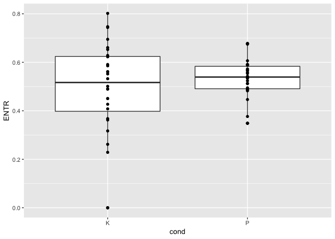
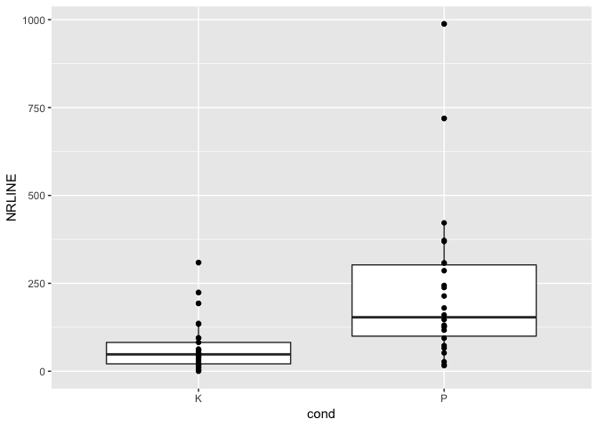
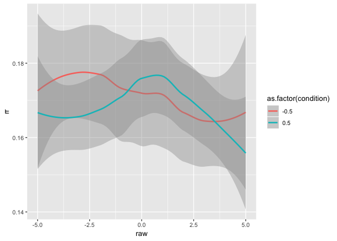

This R markdown provides the data preparation for our forthcoming manuscript.

To run this from scratch, you will need the following files:

* [This is where a description of the data setup goes]
* `./scripts/bc-libraries_and_functions.r`: Loads in necessary libraries and
creates new functions for our analyses.

**Code written by**: L. C. Mueller-Frommeyer (Technische Universitaet
Braunschweig) & A. Paxton (University of Connecticut)

**Date last modified**: 18 June 2019


***

# Preliminaries


```r
# clear everything
rm(list=ls())

# load libraries and add new functions
source('./scripts/bc-libraries_and_functions.r')
```

***

# Hypothesis 1

***

## Data preparation

***

### Recurrence quantification analysis: Monologues


```r
# read in all monologue files
mon_files = list.files('./data/LIWC-results/RQA/Monologues',
                       pattern = ".txt", full.names = TRUE)
mon_dfs = plyr::ldply(mon_files,
                      read.table, sep="\t", dec = ",", header=TRUE) #added decimal to get numbers instead of characters
```


```r
# prepare monologues for RQA
mon_dfs = mon_dfs %>%
  
  # separate 'Filename' column into separate columns
  tidyr::separate(Filename,
                  into = c("dyad_id", "dyad_position", "speaker_code"),
                  sep = '_',
                  remove = FALSE,
                  extra = "drop",
                  fill = "warn") %>%
  
  # extract speaker number ID and conversation type from variable
  mutate(cond = gsub("[[:digit:]]+","",dyad_id)) %>%
  
  # create new variable function_contrast with all 0 replaced by -1
  dplyr::rename(function_words = function.) %>%
  mutate(function_contrast = dplyr::if_else(function_words==0,
                                            -1,
                                            function_words)) %>%
  
  #add new variable specifying conversation type
  mutate(conv.type = "M")
```


```r
# split dataframe by monologue
split_mon = split(mon_dfs, list(mon_dfs$Filename))

# cycle through the individual monologues
crqa_results_mon = data.frame()
for (next_mon in split_mon){
  
  # run (auto-)recurrence
  rqa_for_mon = crqa(ts1=next_mon$function_words,
                     ts2=next_mon$function_contrast,
                     delay=1,
                     embed=1,
                     r=0.1,
                     normalize=0,
                     rescale=0,
                     mindiagline=2,
                     minvertline=2,
                     tw=1, # exclude line of identity
                     whiteline=FALSE,
                     recpt=FALSE)
  
  # save plot-level information to dataframe
  dyad_id = unique(next_mon$dyad_id)
  speaker_code = unique(next_mon$speaker_code)
  cond = NA   #changed it to NA as there was no condition in the monologue
  conv.type = unique(next_mon$conv.type)
  next_data_line = data.frame(dyad_id,  
                              speaker_code,
                              conv.type,
                              cond,
                              rqa_for_mon[1:9])
  crqa_results_mon = rbind.data.frame(crqa_results_mon,next_data_line)
}
```

***

### Recurrrence quantification analysis: Conversations


```r
# read in all conversation files
conv_files = list.files('./data/LIWC-results/RQA/Conversations-1',
                        pattern = ".txt", full.names = TRUE)
conv_dfs = plyr::ldply(conv_files,
                       read.table, sep="\t", dec = ",", header=TRUE)
```


```r
# prepare conversations for RQA
conv_dfs = conv_dfs %>%
  
  # separate 'Filename' column into separate columns
  tidyr::separate(Filename,
                  into = c("dyad_id", "dyad_position", "speaker_code"),
                  sep = '_',
                  remove = FALSE,
                  extra = "drop",
                  fill = "warn") %>%
  
  # extract speaker number ID and conversation type from variable
  mutate(cond = gsub("[[:digit:]]+","",dyad_id)) %>%
  
  # create new variable function_contrast with all 0 replaced by -1
  dplyr::rename(function_words = function.) %>%
  mutate(function_contrast = dplyr::if_else(function_words==0,
                                            -1,
                                            function_words)) %>%
  
  # add new variable specifying conversation type
  mutate(conv.type = "C")
```


```r
# split dataframe by conversation
split_conv = split(conv_dfs, list(conv_dfs$Filename))

# cycle through the individual conversations
crqa_results_conv = data.frame()
for (next_conv in split_conv){
  
  # run cross-recurrence
  rqa_for_conv = crqa(ts1=next_conv$function_words,
                      ts2=next_conv$function_contrast,
                      delay=1,
                      embed=1,
                      r=0.1,
                      normalize=0,
                      rescale=0,
                      mindiagline=2,
                      minvertline=2,
                      tw=0,
                      whiteline=FALSE,
                      recpt=FALSE)
  
  # save plot-level information to dataframe
  dyad_id = unique(next_conv$dyad_id)
  speaker_code = unique(next_conv$speaker_code)
  conv.type = unique(next_conv$conv.type)
  cond = unique(next_conv$cond)
  next_data_line = data.frame(dyad_id,  
                              speaker_code,
                              conv.type,
                              cond,
                              rqa_for_conv[1:9])
  crqa_results_conv = rbind.data.frame(crqa_results_conv,next_data_line)
}
```

***

### Create dataframe for H1


```r
# bring together the monologue and conversation data
h1_data = rbind(crqa_results_mon, crqa_results_conv)

#save results to file
write.table(h1_data,'./data/h1_data.csv',sep=",")
```

***

## Baseline

***

### Create sample-wise shuffled baseline for monologues


```r
# split all data by participant
split_mon = split(mon_dfs, list(mon_dfs$speaker_code))
monologue_baseline = data.frame()
for (next_mon in split_mon){
  
  # only progress if we have data for this conversation type
  if (dim(next_mon)[1] > 1){
    
    # preserve the original dataframe
    next_mon_real = next_mon
    
    # permute 10 times for baseline
    permuted_mon_df = data.frame()
    for (run in c(1:5)){
      next_shuffle = next_mon_real %>%
        
        # shuffle each person's linguistic contributions
        mutate(sur_fw = gtools::permute(function_words),
               sur_fw_contrast = gtools::permute(function_contrast)) %>%
        
        # drop unneeded variables
        select(-function_words, -function_contrast,
               -WC) %>%
        
        # add a marker for what run we're on and datatype
        mutate(run = run) %>%
        mutate(data_type = 'surrogate')
      
      # add it to our dataframe
      permuted_mon_df = rbind.data.frame(permuted_mon_df,
                                         next_shuffle)
    }
    
    # bind the next surrogate's data to the dataframe
    monologue_baseline = rbind.data.frame(monologue_baseline, permuted_mon_df)}
}
```

***

### Create sample-wise shuffled baseline for conversations


```r
# split all data by participant
split_conv = split(conv_dfs, list(conv_dfs$speaker_code))
conversation_baseline = data.frame()
for (next_conv in split_conv){
  
  # only progress if we have data for this conversation type
  if (dim(next_conv)[1] > 1){
    
    # preserve the original dataframe
    next_conv_real = next_conv
    
    # permute 10 times for baseline
    permuted_conv_df = data.frame()
    for (run in c(1:5)){
      next_shuffle = next_conv_real %>%
        
        # shuffle each person's linguistic contributions
        mutate(sur_fw = gtools::permute(function_words),
               sur_fw_contrast = gtools::permute(function_contrast)) %>%
        
        # drop unneeded variables
        select(-function_words, -function_contrast,
               -WC) %>%
        
        # add a marker for what run we're on and datatype
        mutate(run = run) %>%
        mutate(data_type = 'surrogate')
      
      # add it to our dataframe
      permuted_conv_df = rbind.data.frame(permuted_conv_df,
                                          next_shuffle)
    }
    
    # bind the next surrogate's data to the dataframe
    conversation_baseline = rbind.data.frame(conversation_baseline, permuted_conv_df)}
}
```

***

### RQA: Surrogate monologue


***

### RQA: Surrogate conversation


***

### Create surrogate dataframe


```r
# bring together the monologue and conversation surrogate data


#save results to file
```


***

## Data analysis

Here, we perform a linear mixed-effects model to analyze how conversation
type---whether a monologue (M) or conversation (C)---changes a person's
language style, specifically looking at their use of function words (often a
measure of syntactic complexity and structure).

We attempted to analyze the data using maximal random effects structures and
an uncorrelated random intercept within the random slope, but both models
failed to converge. As a result, we use only the random intercept in our model.


```r
# does linguistic style change based on the conversational context?
h1_analyses <- lmer(RR ~ conv.type + (1|speaker_code), data = h1_data, REML = FALSE)
```


***

### Post-hoc analysis: Changes by conversation type

Next, we will do a post-hoc analysis to see how language style differs from the
monologues based on each condition (i.e., cooperative versus conflict).


```r
# Preparing data for Post-hoc analyses - Bring data into wide format to calculate Diff_DET
crqa_results_mon_post = crqa_results_mon %>%
  dplyr::rename(conv.type_m = conv.type,
                RR_m = RR,
                DET_m = DET,
                NRLINE_m = NRLINE,
                maxL_m = maxL,
                L_m = L,
                ENTR_m = ENTR,
                rENTR_m = rENTR,
                LAM_m = LAM,
                TT_m = TT) 
crqa_results_conv_post = crqa_results_conv  %>%
  dplyr::rename(conv.type_c = conv.type,
                cond_c = cond,
                RR_c = RR,
                DET_c = DET,
                NRLINE_c = NRLINE,
                maxL_c = maxL,
                L_c = L,
                ENTR_c = ENTR,
                rENTR_c = rENTR,
                LAM_c = LAM,
                TT_c = TT) 
h1_post = full_join(crqa_results_mon_post, crqa_results_conv_post,
                    by = c("dyad_id", "speaker_code"))

# Calculate Diff_DET
h1_post_hoc = h1_post %>%
  mutate(Diff_DET = DET_m - DET_c)
```


```r
# do changes in linguistic style between monologues and dialogues
# differ by conversation type?
h1_analyses_post = lm(Diff_DET ~ cond_c, data = h1_post_hoc)
```


We find a trend toward an effect of condition, but it does not 
reach statistical significance. Let's take a look at the data.


It looks as though there might be outliers in the data. Let's confirm with
a boxplot.


How might the model change if we remove the outliers?


```r
# remove outliers based on boxplot
h1_post_no_outliers = h1_post_hoc %>% 
  dplyr::filter(Diff_DET > -40 & Diff_DET < 20)
```


```r
# do changes in linguistic style between monologues and dialogues
# differ by conversation type?
h1_analyses_post_no_outliers = lm(Diff_DET ~ cond_c, data = h1_post_no_outliers)
```


It appears that---with 3 outlying datapoints removed---we now find an effect
of conversation type. This suggests that there may, indeed, be systematic
changes in speakers' linguistic styles from monologues to conversations
based on the type of conversation that they're having. However, the results
here are tentative and must be further investigated in future work.

***

# Hypothesis 2

***

## Data preparation

***

### Data cleaning: Speaker A


```r
# get list of Conversation files for Speaker A
A_files = list.files('./data/LIWC-results/cRQA/SpeakerA',
                     pattern = ".txt", full.names = TRUE)
A_dfs = plyr::ldply(A_files,
                    read.table, sep="\t", dec = ",", header=TRUE) #added decimal to get numbers instead of characters
```


```r
# prepare conversations Speaker A for CRQA
A_dfs = A_dfs %>% ungroup() %>%
  
  # separate 'Filename' column into separate columns
  tidyr::separate(Filename,
                  into = c("dyad_id", "dyad_position",  "speaker_code"),
                  sep = '_',
                  remove = FALSE,
                  extra = "drop",
                  fill = "warn") %>%
  
  # extract speaker number ID and conversation type from variable
  mutate(cond = gsub("[[:digit:]]+","",dyad_id)) %>%
  
  # rename function. to function_words
  dplyr::rename(function_words = function.) %>%
  
  # group by participant to cut quantiles
  group_by(Filename) %>%
  
  # recode quartiles
  mutate(fw_quantiles = as.numeric(
    gtools::quantcut(function_words,
                     q=4,
                     na.rm = TRUE))
  ) %>% ungroup()  %>%
  
  # recode anytime there is 0 function word use
  mutate(fw_quantiles = dplyr::if_else(function_words==0,
                                       0,
                                       fw_quantiles)) %>%
  
  # specify these data are real
  mutate(data_type = 'real') %>%
  
  # rename to specify speaker A contributions
  dplyr::rename(function_words_A = function_words,
                fw_quantiles_A = fw_quantiles,
                speaker_A = speaker_code,
                wc_A = WC) %>%
  dplyr::select(-Filename, -dyad_position)
```

***

### Data cleaning: Speaker B


```r
# get list of Conversation files for Speaker B
B_files = list.files('./data/LIWC-results/cRQA/SpeakerB',
                     pattern = ".txt", full.names = TRUE)
B_dfs = plyr::ldply(B_files,
                    read.table, sep="\t", dec = ",", header=TRUE) #added decimal to get numbers instead of characters
```


```r
# prepare conversations Speaker B for CRQA
B_dfs = B_dfs %>% ungroup() %>%
  
  # separate 'Filename' column into separate columns
  tidyr::separate(Filename,
                  into = c("dyad_id", "dyad_position",  "speaker_code"),
                  sep = '_',
                  remove = FALSE,
                  extra = "drop",
                  fill = "warn") %>%
  
  # extract speaker number ID and conversation type from variable
  mutate(cond = gsub("[[:digit:]]+","",dyad_id)) %>%
  
  # rename function. to function_words
  dplyr::rename(function_words = function.) %>%
  
  # group by participant to cut quantiles
  group_by(Filename) %>%
  
  # recode quartiles
  mutate(fw_quantiles = as.numeric(
    gtools::quantcut(function_words,
                     q=4,
                     na.rm = TRUE))
  ) %>% ungroup() %>%
  
  # recode anytime there is 0 function word use
  mutate(fw_quantiles = dplyr::if_else(function_words==0,
                                       -1,
                                       fw_quantiles)) %>%
  
  # specify these data are real
  mutate(data_type = 'real') %>%
  
  # rename to specify speaker A contributions
  dplyr::rename(function_words_B = function_words,
                fw_quantiles_B = fw_quantiles,
                speaker_B = speaker_code,
                wc_B = WC) %>%
  dplyr::select(-Filename, -dyad_position)
```

***

### Create dataframe for H2

Before we run CRQA, we must first combine the Speaker A and Speaker B
dataframes. This requires truncating the data so that both speakers have the
same number of turns in each conversation and converting from longform data
(i.e., creating columns for speaker identifier [A vs. B], function words, and
turn) to wideform data (i.e., creating columns for Speaker A function words,
Speaker B function words, and turn).


```r
# merge Speaker A and Speaker B together
h2_data = full_join(A_dfs, B_dfs,
                    by = c("dyad_id", "Segment", "cond", "data_type")) %>%
  
  # because any missing values are filled with `NA`,
  # we can truncate turns simply by dropping `NA`
  tidyr::drop_na()
```

***

## Creation of baselines

***

### Partner-wise shuffled baseline

This form of surrogate time series estimating overall RR (or %REC) that might
be expected by chance.


```r
# aiming for 10 partner-wise shuffled baselines for each dyad and conversation type

# specify random partners
partner_wise_baseline = h2_data %>%
  
  # narrow down to only the variables we need
  select(dyad_id, speaker_A, speaker_B, cond) %>%
  distinct() %>%
  dplyr::rename(dyad_id_real = dyad_id,
                speaker_B_real = speaker_B)

# cycle through for 10 baselines
for (runs in c(1:5)){
  
  # generate a potential paired set value
  temp_df = partner_wise_baseline %>% ungroup() %>%
    group_by(cond) %>%
    mutate(!!paste0("speaker_B_run", runs) := gtools::permute(speaker_B_real)) %>%
    ungroup()
  
  # keep resampling if we get any overlap from the real data
  # or other pairs
  while (length(unique(apply(temp_df,1,function(x) sum(!duplicated(x))))) != 1) {
    temp_df = partner_wise_baseline %>% ungroup() %>%
      group_by(cond) %>%
      mutate(!!paste0("speaker_B_run", runs) := gtools::permute(speaker_B_real)) %>%
      ungroup()
  }
  
  # save the final option
  partner_wise_baseline = temp_df
}

# convert to wideform
partner_wise_baseline = partner_wise_baseline %>%
  tidyr::gather(key = "shuffle_run",
                value = "fake_speaker_B",
                -speaker_A,
                -dyad_id_real,
                -cond) %>%
  mutate(shuffle_run = gsub("speaker_B_","",shuffle_run)) %>%
  dplyr::filter(shuffle_run != "real")
```


***

### Sample-wise shuffled baseline

This form of surrogate time series will be used for the DRPs, but it is not
suitable for estimating overall RR (or %REC) that might be expected by chance.
This is because the individual points are retained, meaning that the overall
amount of recurrence will stay the same, although the exact structure of the
recurrence (e.g., DRPs, mean line length, percent determinism) will be altered.


```r
# split all dyads by dyad ID
split_h2 = split(h2_data, list(h2_data$dyad_id))
sample_wise_baseline = data.frame()
for (next_conv in split_h2){
  
  # only progress if we have data for this conversation type and dyad
  if (dim(next_conv)[1] > 1){
    
    # preserve the original dataframe
    next_conv_real = next_conv
    
    # permute 10 times for baseline
    permuted_df = data.frame()
    for (run in c(1:5)){
      next_shuffle = next_conv_real %>%
        
        # shuffle each person's linguistic contributions
        group_by(dyad_id) %>%
        mutate(sur_fw_quantiles_A = gtools::permute(fw_quantiles_A)) %>%
        mutate(sur_fw_quantiles_B = gtools::permute(fw_quantiles_B)) %>%
        ungroup() %>%
        
        # drop unneeded variables
        select(-fw_quantiles_A, -fw_quantiles_B,
               -contains('wc_'), -contains('function_words')) %>%
        
        # add a marker for what run we're on and datatype
        mutate(run = run) %>%
        mutate(data_type = 'surrogate')
      
      # add it to our dataframe
      permuted_df = rbind.data.frame(permuted_df, next_shuffle)
    }
    
    # bind the next surrogate's data to the dataframe
    sample_wise_baseline = rbind.data.frame(sample_wise_baseline, permuted_df)}
}
```

***

## Cross-recurrence quantification analysis

***

### For real data


```r
# CRQA for real data

# split dataframe by dyad ID
split_conv = split(h2_data, list(h2_data$dyad_id))

# cycle through the individual conversations
crqa_real = data.frame()
for (next_conv in split_conv){
  
  # only proceed if we have data for this conversation
  if (dim(next_conv)[1]>1){
    
    # run cross-recurrence
    crqa_for_conv = crqa(ts1=next_conv$fw_quantiles_A,
                         ts2=next_conv$fw_quantiles_B,
                         delay=1,
                         embed=1,
                         r=0.1,
                         normalize=0,
                         rescale=0,
                         mindiagline=2,
                         minvertline=2,
                         tw=0,
                         whiteline=FALSE,
                         recpt=FALSE)
    
    # save plot-level information to dataframe -- confirm that we don't need anything else here
    dyad_id = unique(next_conv$dyad_id)
    cond = unique(next_conv$cond)
    next_data_line = data.frame(dyad_id,  
                                cond,
                                crqa_for_conv[1:9])
    crqa_real = rbind.data.frame(crqa_real,next_data_line)}
}
```

<!-- -->


```
## Warning: Removed 1 rows containing non-finite values (stat_boxplot).
```

```
## Warning: Removed 1 rows containing missing values (geom_point).
```

<!-- -->

<!-- -->

Need to note in the manuscript that we dropped anyone with fewer than 10
talk-turns from the DRP analyses.


```r
# split dataframe by dyad ID
split_h2 = split(h2_data, 
                 list(h2_data$dyad_id))

# cycle through all dyads
drp_real = data.frame()
for (next_conv in split_h2) {
  
  # only proceed if we have data for this conversation
  if (dim(next_conv)[1]>9){
    
    # calculate diagonal recurrence profile using categorical recurrence
    drp_for_conv = drpdfromts(next_conv$fw_quantiles_A, 
                              next_conv$fw_quantiles_B,
                              ws = wsz, 
                              datatype="categorical")
    
    # save plot-level information to dataframe
    dyad_id = unique(next_conv$dyad_id)
    cond = unique(next_conv$cond)
    data_type = unique(next_conv$data_type)
    drps = data.frame(raw = timeVals$raw,
                      ot1 = timeVals$ot1,
                      ot2  = timeVals$ot2,
                      rr = drp_for_conv$profile) %>%
      mutate(dyad_id = dyad_id,
             cond = cond,
             data_type = data_type)
    
    drp_real = rbind.data.frame(drp_real, drps)
  }
}
```

***

### For partner-wise shuffled baseline


```r
# CRQA for partner-wise baseline
crqa_partner_shuffle = data.frame()

# cycle through all the pseudopartners
for (fake_dyad in 1:nrow(partner_wise_baseline)){ 
  
  # get next Speaker A data
  temp_A = h2_data %>% ungroup() %>%
    dplyr::filter(speaker_A==partner_wise_baseline$speaker_A[fake_dyad]) %>%
    select(speaker_A, cond, fw_quantiles_A, Segment)
  
  # get only the data we need for Fake Partner B
  temp_B = h2_data %>% ungroup() %>%
    dplyr::filter(speaker_B==partner_wise_baseline$fake_speaker_B[fake_dyad]) %>%
    select(speaker_B, cond, fw_quantiles_B, Segment)
  
  # join them together to make sure only compare equal turns
  temp_data=full_join(temp_A, temp_B,
                      by = c("cond", "Segment")) %>%
    tidyr::drop_na()
  
  # run CRQA as long as we have observed data
  if(nrow(temp_data)>1){
    
    crqa_for_sur = crqa(ts1=temp_data$fw_quantiles_A,
                        ts2=temp_data$fw_quantiles_B,
                        delay=1,
                        embed=1,
                        r=0.1,
                        normalize=0,
                        rescale=0,
                        mindiagline=2,
                        minvertline=2,
                        tw=0,
                        whiteline=FALSE,
                        recpt=FALSE)
    
    # save plot-level information to dataframe
    speaker_A = unique(temp_data$speaker_A)
    speaker_B = unique(temp_data$speaker_B)
    cond = unique(temp_data$cond)
    next_data_line = data.frame(speaker_A,
                                speaker_B,
                                cond,
                                crqa_for_sur[1:9])
    crqa_partner_shuffle = rbind.data.frame(crqa_partner_shuffle,next_data_line)
  }
}
```

Need to note in the manuscript that we dropped anyone with fewer than 10
talk-turns from the DRP analyses.


```r
# cycle through all the shuffled partners
drp_partner_shuffle = data.frame()
for (fake_dyad in 1:nrow(partner_wise_baseline)){ 
  
  # get next Speaker A data
  temp_A = h2_data %>% ungroup() %>%
    dplyr::filter(speaker_A==partner_wise_baseline$speaker_A[fake_dyad]) %>%
    select(speaker_A, cond, fw_quantiles_A, Segment)
  
  # get only the data we need for Fake Partner B
  temp_B = h2_data %>% ungroup() %>%
    dplyr::filter(speaker_B==partner_wise_baseline$fake_speaker_B[fake_dyad]) %>%
    select(speaker_B, cond, fw_quantiles_B, Segment)
  
  # join them together to make sure only compare equal turns
  temp_data=full_join(temp_A, temp_B,
                      by = c("cond", "Segment")) %>%
    tidyr::drop_na()
  
  # run DRP if we have enough talk-turns
  if (dim(temp_data)[1]>9){
    
    # calculate diagonal recurrence profile using categorical recurrence
    drp_for_partner = drpdfromts(ts1= temp_data$fw_quantiles_A, 
                                 ts2= temp_data$fw_quantiles_B,
                                 ws = wsz, 
                                 datatype="categorical")
    
    # save plot-level information to dataframe
    speaker_A = unique(temp_data$speaker_A)
    speaker_B = unique(temp_data$speaker_B)
    cond = unique(temp_data$cond)
    next_data = data.frame(raw = timeVals$raw,
                           ot1 = timeVals$ot1,
                           ot2  = timeVals$ot2,
                           rr = drp_for_partner$profile) %>%
      mutate(speaker_A = speaker_A,
             speaker_B = speaker_B,
             cond = cond)
    
    # save to overall dataframe
    drp_partner_shuffle = rbind.data.frame(drp_partner_shuffle, next_data)
  }
}
```

***

### For sample-wise shuffled baseline


```r
# cycle through all the dyads
dyad_list = unique(sample_wise_baseline$dyad_id)
drp_sample = data.frame()
for (next_dyad in dyad_list){
  
  # get the next participant's data
  next_dyad_df = sample_wise_baseline %>%
    dplyr::filter(dyad_id == next_dyad)
  
  # cycle through all sample-wise shuffle runs
  for (run in 1:max(next_dyad_df$run)) {
    
    # get next Speaker A data
    temp_AB = next_dyad_df %>% ungroup() %>%
      dplyr::filter(run == run) %>%
      select(speaker_A, speaker_B, cond, sur_fw_quantiles_A, sur_fw_quantiles_B, run)
    
    # run DRP if we have enough talk-turns
    if (dim(temp_AB)[1]>9){
      
      # calculate diagonal recurrence profile using categorical recurrence
      drp_for_sample = drpdfromts(ts1 = temp_AB$sur_fw_quantiles_A, 
                                  ts2 = temp_AB$sur_fw_quantiles_B,
                                  ws = wsz, 
                                  datatype = "categorical")
      
      # save plot-level information to dataframe
      speaker_A = unique(temp_AB$speaker_A)
      speaker_B = unique(temp_AB$speaker_B)
      cond = unique(temp_AB$cond)
      next_data = data.frame(raw = timeVals$raw,
                             ot1 = timeVals$ot1,
                             ot2  = timeVals$ot2,
                             rr = drp_for_sample$profile) %>%
        mutate(speaker_A = speaker_A,
               speaker_B = speaker_B,
               cond = cond,
               run = run,
               dyad = next_dyad)
      
      drp_sample = rbind.data.frame(drp_sample, next_data)
    }
  }
}
```

***

## Data analysis


```r
# rename variables and center the binary variables
drp_real = drp_real %>% ungroup() %>%
  plyr::rename(.,
               c("cond"="condition")) %>%
  
  # recode "condition" values to be -.5 and +.5
  mutate(condition = dplyr::if_else(condition=="K",
                                    -.5,
                                    .5))%>%
  
  # first-order polynomials
  mutate(condition.ot1 = condition * ot1) %>%
  
  # second-order polynomials
  mutate(condition.ot2 = condition * ot2) %>%
  
  # polynomial interactions
  mutate(ot1.ot2 = ot1 * ot2) %>%
  mutate(condition.ot1.ot2 = condition * ot1 * ot2)

#repeat for surrogate body
```

***

### Create standardized dataframe

Let's create a new dataframe with all standardized variables. This allows us to interpret the resulting values as effect sizes (see Keith, 2005, *Multiple regression and beyond*).


```r
# standardize all variables
drp_st = mutate_each(drp_real,funs(as.numeric(scale(.))))

## AP: To make sure that you got the scaling correct, you should
## plot the values for several variables in `drp_results` against
## the newly scaled versions in `drp_st` --- if you got the scaling
## right, you'll see a perfect diagonal line with a slope of 1.
## If you didn't, it means that your scaling was off.
## e.g.: plot(drp_st$condition, drp_results$condition)

#repeat for surrogate body
```

***

### Analyses of plot-level CRQA metrics


```r
# does linguistic style matching change based on the conversational context?
h2_analyses <- lm(RR ~ cond, data = crqa_real)
```


```
## 
## Call:
## lm(formula = RR ~ cond, data = crqa_real)
## 
## Residuals:
##    Min     1Q Median     3Q    Max 
## -5.000 -1.593  0.641  1.581  3.182 
## 
## Coefficients:
##             Estimate Std. Error t value Pr(>|t|)    
## (Intercept)  16.9997     0.3930  43.253   <2e-16 ***
## condP         0.0736     0.5716   0.129    0.898    
## ---
## Signif. codes:  0 '***' 0.001 '**' 0.01 '*' 0.05 '.' 0.1 ' ' 1
## 
## Residual standard error: 2.117 on 53 degrees of freedom
## Multiple R-squared:  0.0003127,	Adjusted R-squared:  -0.01855 
## F-statistic: 0.01658 on 1 and 53 DF,  p-value: 0.898
```


|     &nbsp;      | Estimate | Std..Error | t.value |   p    | p_adj  | sig |
|:---------------:|:--------:|:----------:|:-------:|:------:|:------:|:---:|
| **(Intercept)** |    17    |   0.393    |  43.25  | 0.0001 | 0.0001 | *** |
|    **condP**    |  0.0736  |   0.5716   | 0.1288  |  0.9   |  0.9   |     |

We don't see a difference by overall amounts of recurrence, but what about
differences in the structure of the recurrence? Let's look at two metrics:
the number of lines on the plot (`NRLINE`) and entropy (`ENTR`).


```r
# does linguistic style matching change based on the conversational context?
h2_analyses_nrline <- lm(NRLINE ~ cond, data = crqa_real)
```


```
## 
## Call:
## lm(formula = NRLINE ~ cond, data = crqa_real)
## 
## Residuals:
##     Min      1Q  Median      3Q     Max 
## -212.12  -67.94  -26.76   26.74  759.88 
## 
## Coefficients:
##             Estimate Std. Error t value Pr(>|t|)    
## (Intercept)    67.76      29.64   2.286 0.026272 *  
## condP         160.36      43.11   3.720 0.000483 ***
## ---
## Signif. codes:  0 '***' 0.001 '**' 0.01 '*' 0.05 '.' 0.1 ' ' 1
## 
## Residual standard error: 159.6 on 53 degrees of freedom
## Multiple R-squared:  0.207,	Adjusted R-squared:  0.1921 
## F-statistic: 13.84 on 1 and 53 DF,  p-value: 0.0004827
```


|     &nbsp;      | Estimate | Std..Error | t.value |   p   | p_adj | sig |
|:---------------:|:--------:|:----------:|:-------:|:-----:|:-----:|:---:|
| **(Intercept)** |  67.76   |   29.64    |  2.286  | 0.026 | 0.026 |  *  |
|    **condP**    |  160.4   |   43.11    |  3.72   |   0   | 0.001 | **  |


```r
# does linguistic style matching change based on the conversational context?
h2_analyses_entropy <- lm(ENTR ~ cond, data = crqa_real)
```


```
## 
## Call:
## lm(formula = ENTR ~ cond, data = crqa_real)
## 
## Residuals:
##      Min       1Q   Median       3Q      Max 
## -0.48886 -0.04927  0.01071  0.07309  0.31296 
## 
## Coefficients:
##             Estimate Std. Error t value            Pr(>|t|)    
## (Intercept)  0.48886    0.02946   16.60 <0.0000000000000002 ***
## condP        0.04413    0.04245    1.04               0.303    
## ---
## Signif. codes:  0 '***' 0.001 '**' 0.01 '*' 0.05 '.' 0.1 ' ' 1
## 
## Residual standard error: 0.1559 on 52 degrees of freedom
##   (1 observation deleted due to missingness)
## Multiple R-squared:  0.02036,	Adjusted R-squared:  0.001519 
## F-statistic: 1.081 on 1 and 52 DF,  p-value: 0.3034
```


|     &nbsp;      | Estimate | Std..Error | t.value |   p    | p_adj  | sig |
|:---------------:|:--------:|:----------:|:-------:|:------:|:------:|:---:|
| **(Intercept)** |  0.4889  |  0.02946   |  16.6   | 0.0001 | 0.0001 | *** |
|    **condP**    | 0.04413  |  0.04245   |  1.04   |  0.3   |  0.3   |     |

***

### Analyses of diagonal recurrence profiles

We now create a linear mixed-effects model to gauge how linear lag (`ot1`) and quadratic lag (`ot2`) interact with condition (`condition`) to influence Language Style Matching (`rr`). We present both standardized and raw models below.


```r
# raw maximal random-effects model
H2_raw = lmer(rr ~ condition + ot1 + ot2 + ot1.ot2 + condition.ot1 + condition.ot2 + condition.ot1.ot2 +
                (1 | dyad_id),
              data=drp_real, REML=FALSE)

#repeat for surrogate body
```


```
## Linear mixed model fit by maximum likelihood . t-tests use
##   Satterthwaite's method [lmerModLmerTest]
## Formula: 
## rr ~ condition + ot1 + ot2 + ot1.ot2 + condition.ot1 + condition.ot2 +  
##     condition.ot1.ot2 + (1 | dyad_id)
##    Data: drp_real
## 
##      AIC      BIC   logLik deviance df.resid 
##  -1758.3  -1714.4    889.1  -1778.3      584 
## 
## Scaled residuals: 
##     Min      1Q  Median      3Q     Max 
## -3.1637 -0.5860  0.0243  0.5458  3.2176 
## 
## Random effects:
##  Groups   Name        Variance  Std.Dev.
##  dyad_id  (Intercept) 0.0003819 0.01954 
##  Residual             0.0026931 0.05189 
## Number of obs: 594, groups:  dyad_id, 54
## 
## Fixed effects:
##                     Estimate Std. Error         df t value Pr(>|t|)    
## (Intercept)         0.169146   0.003409  54.000000  49.618   <2e-16 ***
## condition          -0.003795   0.006818  54.000000  -0.557    0.580    
## ot1                -0.012965   0.010200 540.000000  -1.271    0.204    
## ot2                -0.008719   0.007067 540.000000  -1.234    0.218    
## ot1.ot2             0.011538   0.027622 540.000000   0.418    0.676    
## condition.ot1       0.028063   0.020400 540.000000   1.376    0.170    
## condition.ot2      -0.011498   0.014134 540.000000  -0.813    0.416    
## condition.ot1.ot2  -0.071574   0.055244 540.000000  -1.296    0.196    
## ---
## Signif. codes:  0 '***' 0.001 '**' 0.01 '*' 0.05 '.' 0.1 ' ' 1
## 
## Correlation of Fixed Effects:
##             (Intr) condtn ot1    ot2    ot1.t2 cndt.1 cndt.2
## condition    0.037                                          
## ot1          0.000  0.000                                   
## ot2          0.000  0.000  0.000                            
## ot1.ot2      0.000  0.000 -0.721  0.000                     
## conditin.t1  0.000  0.000  0.037  0.000 -0.027              
## conditin.t2  0.000  0.000  0.000  0.037  0.000  0.000       
## cndtn.t1.t2  0.000  0.000 -0.027  0.000  0.037 -0.721  0.000
```


|        &nbsp;         | Estimate  | Std..Error | df  | t.value |   p    | p_adj  | sig |
|:---------------------:|:---------:|:----------:|:---:|:-------:|:------:|:------:|:---:|
|    **(Intercept)**    |  0.1691   |  0.003409  | 54  |  49.62  | 0.0001 | 0.0001 | *** |
|     **condition**     | -0.003795 |  0.006818  | 54  | -0.5566 |  0.58  |  0.66  |     |
|        **ot1**        | -0.01297  |   0.0102   | 540 | -1.271  | 0.204  |  0.35  |     |
|        **ot2**        | -0.008719 |  0.007067  | 540 | -1.234  | 0.218  |  0.35  |     |
|      **ot1.ot2**      |  0.01154  |  0.02762   | 540 | 0.4177  |  0.68  |  0.68  |     |
|   **condition.ot1**   |  0.02806  |   0.0204   | 540 |  1.376  |  0.17  |  0.35  |     |
|   **condition.ot2**   |  -0.0115  |  0.01413   | 540 | -0.8135 |  0.42  |  0.56  |     |
| **condition.ot1.ot2** | -0.07157  |  0.05524   | 540 | -1.296  | 0.196  |  0.35  |     |


```
## `geom_smooth()` using method = 'loess' and formula 'y ~ x'
```

<!-- -->

It looks like there might be some strong leader-follower effects, but those
aren't anticipated by an experimental manipulation. What we could do is
simply look for a leader (in either direction) and swap the positioning
so that all "leaders" of the dyads (i.e., the person who has a higher mean RR 
on their side of the DRP) are always on the left-hand side of the plot and 
all "followers" of the dyads (i.e., the person who has a lower mean RR on
their side of the DRP) are on the right-hand side of the plot.

***

# List of next steps

* create baseline surrogate measures for H2
* calculate diagonal recurrence plots for H2
* start code for analyses for H1 and H2


* previous examples
* look over example of using categorical CRQA from emotion dynamics paper:
https://github.com/a-paxton/emotion-dynamics/blob/master/get_rqa_measures.R
* another useful example will be continuous CRQA in dual conversation constraints paper: https://github.com/a-paxton/dual-conversation-constraints/blob/a167f004c71d9637ec30082de13a1ba6283846bb/dual-conversation-constraints.Rmd#L309 (direct link to line)
#for RQA and CRQA, update so that we have all of the variables we need in the
eventual dataframes (compare with the `mon_dfs` and figure out which to
preserve)
#fix CRQA based on fixes to RQA today
#add variable to monologue and dialogue dataframes to specify monologue v.
#dialogue
# add a step to save the eventual table
# add a step to save the eventual table
# start doing categorical CRQA
# create quartiles of function words -- function `quantile` - 'quantcut'
# recode 0 appearances of function words as something else (e.g., 0 for one participant, -1 for the other)
# run categorical CRQA with `tw=0` over all of these


* create baseline surrogate measures for H2
